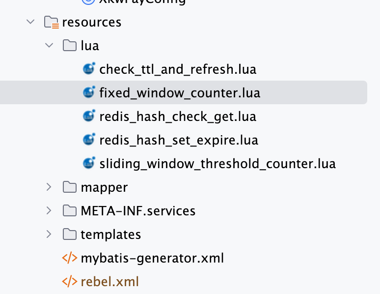

SpringBoot中使用Lua脚本和注意事项

1、在resources 中建立lua脚本文件夹，编写相关lua脚本



滑动窗口计数器

```lua
-- sliding_window_threshold_counter.lua
local count = redis.call('INCR', KEYS[1])
if count == 1 then
    redis.call('EXPIRE', KEYS[1], ARGV[1])
end
if count >= tonumber(ARGV[2]) then
    redis.call('DEL', KEYS[1])  -- 删除键，重置计数器，滑动时间窗口
    return 1
else
    return 0
end
```

固定窗口计数器

```lua
-- fixed_window_counter.lua
local count = redis.call('INCR', KEYS[1])
if count == 1 then
    redis.call('EXPIRE', KEYS[1], ARGV[1])
end
-- 不需要删除键，不需要重置计数器，固定时间窗口，等待窗口时间到期，再进入下一个固定窗口
return count
```

2、在缓存配置中读取脚本相关文件

```Java
package com.xkw.marketing;

@Configuration
@EnableCaching
public class CacheConfig {
    @Bean
    public DefaultRedisScript<Boolean> slidingWindowThresholdCounterScript() {
        DefaultRedisScript<Boolean> script = new DefaultRedisScript<>();
        script.setLocation(new ClassPathResource("lua/sliding_window_threshold_counter.lua"));
        script.setResultType(Boolean.class);
        return script;
    }

    @Bean
    public DefaultRedisScript<Long> fixedWindowCounterScript() {
        DefaultRedisScript<Long> script = new DefaultRedisScript<>();
        script.setLocation(new ClassPathResource("lua/fixed_window_counter.lua"));
        script.setResultType(Long.class);
        return script;
    }
}
```

3、使用lua脚本

```Java
package com.xkw.marketing.cache;

import org.springframework.beans.factory.annotation.Autowired;
import org.springframework.data.redis.core.RedisTemplate;
import org.springframework.data.redis.core.script.RedisScript;
import org.springframework.stereotype.Component;

import java.time.Duration;
import java.util.Arrays;
import java.util.List;

@Component
public class FixedWindowCounter {

    @Autowired
    private RedisTemplate redisTemplate;

    @Autowired
    private RedisScript<Long> fixedWindowCounterScript;

    /**
     * 在固定窗口时间内进行计数
     *
     * @param key
     * @param windowTimes
     * @return 当前次数
     */
    public Long incrementAndGet(String key, Duration windowTimes) {
        List<String> keys = Arrays.asList(key);
        return (Long) redisTemplate.execute(fixedWindowCounterScript, keys, windowTimes.toSeconds());
    }
}
```

```Java
package com.xkw.marketing.cache;

import org.springframework.beans.factory.annotation.Autowired;
import org.springframework.data.redis.core.RedisTemplate;
import org.springframework.data.redis.core.script.RedisScript;
import org.springframework.stereotype.Component;

import java.time.Duration;
import java.util.Arrays;
import java.util.List;

@Component
public class SlidingWindowCounter {

    @Autowired
    private RedisTemplate redisTemplate;

    @Autowired
    private RedisScript<Boolean> slidingWindowThresholdCounterScript;

    /**
     * 在滑动窗口时间内进行计数，达到阈值则返回true
     *
     * @param key 根据业务进行定义
     * @return
     */
    public boolean exceedsThreshold(String key, Duration windowTimes, Long threshold) {
        List<String> keys = Arrays.asList(key);
        return (boolean) redisTemplate.execute(slidingWindowThresholdCounterScript, keys, windowTimes.toSeconds(), threshold);
    }

}
```

4、使用lua脚本注意事项

**4.1）RedisCommandExecutionException: CROSSSLOT Keys in request don't hash to the same slot**

相关key必须是列表，在lua脚本中使用KEYS[下标]（下标从1开始）获取

如果在一个 Lua 脚本中使用了多个 key，但这些 key 没有落在同一个 hash slot （槽）上，会报 “CROSSSLOT Keys in request don't hash to the same slot” 的错误。在 Redis 集群中，所有在一个命令（包括 Lua 脚本）中使用的 key 必须属于同一个 slot。

为了解决这个问题，可以为所有相关的 key 加上同样的 hash 标签（hash tag），比如使用大括号 {} 包裹公共部分。这样 Redis 在计算 hash slot 时，会只取大括号内的内容，从而确保这些 key 被分配到同一个 slot。例如下面的countKey和dataKey。

> 在 Redis 集群中，所有数据都会被分成 16384 个“槽”（slot），每个 key 会通过哈希函数映射到其中一个槽上。集群中的每个节点会负责一部分槽的数据，这样可以实现数据的分片和负载均衡。
>
> 例如，当你存储一个 key 时，Redis 会根据 key 计算一个哈希值，然后对 16384 取模，将结果作为该 key 的槽号。所有位于同一槽中的 key 通常会被存储在同一个节点上。

```lua
local count_key = KEYS[1]
local data_key = KEYS[2]
```

```Java
// 在RedisKey类中存储的Redis相关key模版
public static final String WORKBENCH_SUMMARY_KEY = "workbench_summary_data:{%s}";

public static final String WORKBENCH_SUMMARY_COUNT_KEY = "workbench_summary_count:{%s}";
// 在业务中构建相关具体的key
String sellerId = getCurrentSellerId();
String dataKey = String.format(RedisKey.WORKBENCH_SUMMARY_KEY, sellerId);
String countKey = String.format(RedisKey.WORKBENCH_SUMMARY_COUNT_KEY, sellerId);

// 执行lua脚本
Boolean needRefresh = (Boolean) redisTemplate.execute(checkTtlAndRefreshScript, List.of(countKey, dataKey),
        windowTimes.toSeconds(), windowThreshold, Duration.ofMinutes(5).toSeconds());
```