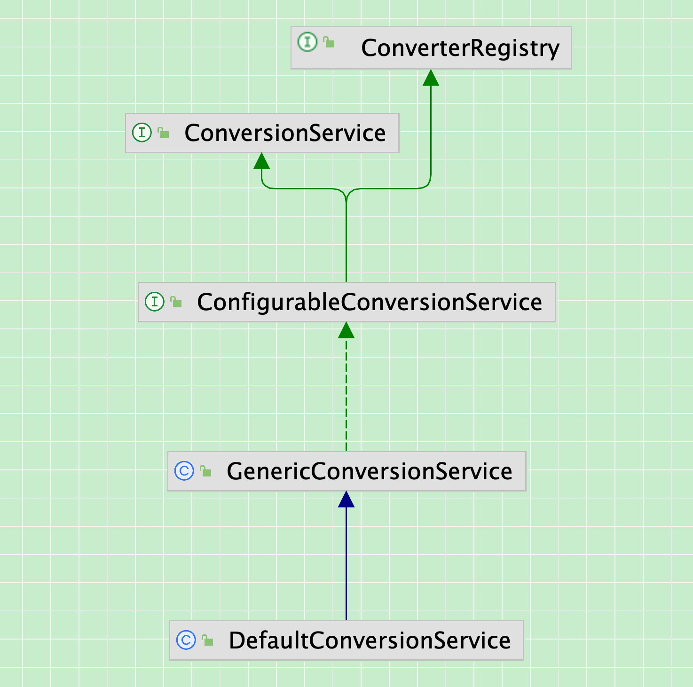
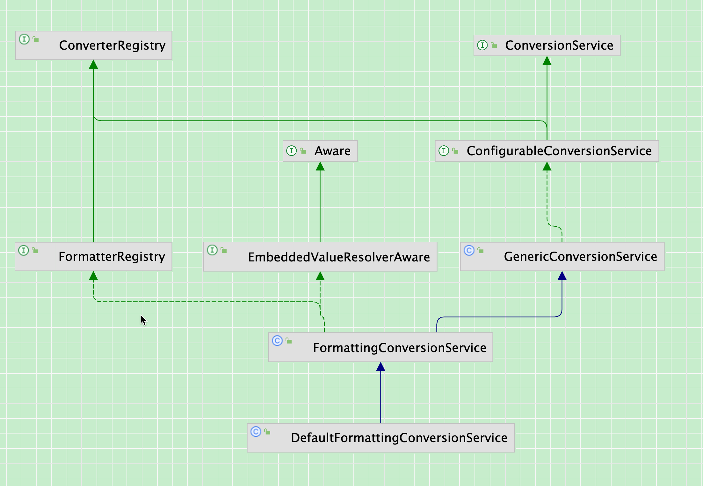
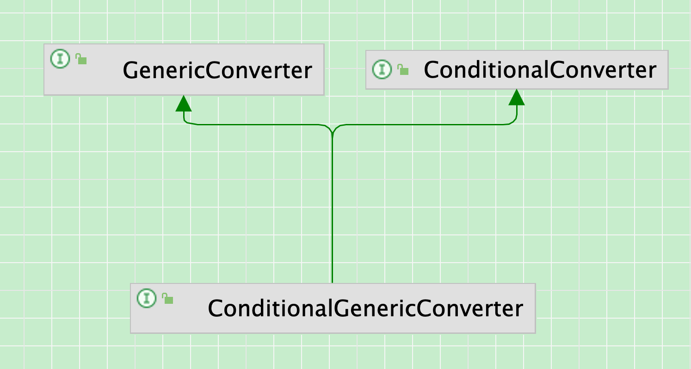

### 一、Spring启动时怎么注入容器

待确认，目前确认的是一定会执行`addDefaultConverters`方法，但这个方法是静态的类方法，并且是公共方法，入口有

1、实例化一个`DefaultConversionService`对象，把所有转换器加入这个对象

2、调用类方法`getSharedInstance`返回一个静态的类变量`DefaultConversionService sharedInstance`

3、直接使用`addDefaultConverters`方法，如`ApplicationConversionService`类，在初始化时，会执行`configure`方法，其中调用`addDefaultConverters`方法

4、通过`FactoryBean`接口的`getObject`方法生成，如`FormattingConversionServiceFactoryBean`和`ConversionServiceFactoryBean`

当前SpringBoot3的ConversionService的类型是WebConversionService

```Java
package org.springframework.core.convert.support;

import java.nio.charset.Charset;
import java.util.Currency;
import java.util.Locale;
import java.util.UUID;

import org.springframework.core.convert.ConversionService;
import org.springframework.core.convert.converter.ConverterRegistry;
import org.springframework.lang.Nullable;

// 这个类的作用是把通用的转换器加入GenericConversionService对象的converts中
public class DefaultConversionService extends GenericConversionService {

    @Nullable
    private static volatile DefaultConversionService sharedInstance;

    public DefaultConversionService() {
       addDefaultConverters(this);
    }


    // 懒加载和双重检查
    public static ConversionService getSharedInstance() {
       DefaultConversionService cs = sharedInstance;
       if (cs == null) {
          synchronized (DefaultConversionService.class) {
             cs = sharedInstance;
             if (cs == null) {
                cs = new DefaultConversionService();
                sharedInstance = cs;
             }
          }
       }
       return cs;
    }

    // 添加对于大部分环境都合适的转换器
    public static void addDefaultConverters(ConverterRegistry converterRegistry) {
       addScalarConverters(converterRegistry);
       addCollectionConverters(converterRegistry);

       converterRegistry.addConverter(new ByteBufferConverter((ConversionService) converterRegistry));
			 ...
    }

    // 添加公共Collection转换器
    public static void addCollectionConverters(ConverterRegistry converterRegistry) {
       ConversionService conversionService = (ConversionService) converterRegistry;

       converterRegistry.addConverter(new ArrayToCollectionConverter(conversionService));
       converterRegistry.addConverter(new CollectionToArrayConverter(conversionService));
			 ...
    }

    private static void addScalarConverters(ConverterRegistry converterRegistry) {
       converterRegistry.addConverterFactory(new NumberToNumberConverterFactory());
       converterRegistry.addConverterFactory(new StringToNumberConverterFactory());
   		 ...
    }

}
```





### 二、SpringBoot Debug流程解析，怎么找到对应的convert转换器

```Java
@SpringBootTest
@Slf4j
public class SpringTest {
    @Autowired
    private ConversionService conversionService;

    @Test
    public void test() {
        log.info("test");
        Integer integer = conversionService.convert("123", Integer.class);
        System.out.println(integer);
        System.out.println(conversionService);
    }
}
```

最重要的是2-3）中如何寻找到对应的转换器

2-1）进入`GenericConversionService`类中的`convert`方法，获取`Object source`的类，转换成`TypeDescriptor`对象，以及将`Class<T> targetType`转换成`TypeDescriptor`对象

```Java
// class GenericConversionService
@Override
@SuppressWarnings("unchecked")
@Nullable
public <T> T convert(@Nullable Object source, Class<T> targetType) {
    Assert.notNull(targetType, "Target type to convert to cannot be null");
    return (T) convert(source, TypeDescriptor.forObject(source), TypeDescriptor.valueOf(targetType));
}
```

a)`TypeDescriptor.forObject`方法

获取到`source`对象的Class，然后通过`valueOf`方法转换为`TypeDescriptor`对象

```Java
// class TypeDescriptor
@Nullable
public static TypeDescriptor forObject(@Nullable Object source) {
    return (source != null ? valueOf(source.getClass()) : null);
}
```

b）`TypeDescriptor.valueOf`方法

将Class对象转换成`TypeDescriptor`对象，其中`commonTypesCache`中包含了所有基本类型的class到`TypeDescriptor`对象的映射，在加载这个类时，通过静态代码块调用这个静态方法`valueOf`放入这个静态类变量map中了，包括8种基本数据类型和他们的包装类，以及`String`和`Object`类

```Java
// class TypeDescriptor
public static TypeDescriptor valueOf(@Nullable Class<?> type) {
    if (type == null) {
       type = Object.class;
    }
    TypeDescriptor desc = commonTypesCache.get(type);
    return (desc != null ? desc : new TypeDescriptor(ResolvableType.forClass(type), null, null));
}
```

c)`ResolvableType.forClass`方法

```Java
// class ResolvableType
public static ResolvableType forClass(@Nullable Class<?> clazz) {
    return new ResolvableType(clazz);
}
// ResolvableType类中的私有构造方法
private ResolvableType(@Nullable Class<?> clazz) {
  this.resolved = (clazz != null ? clazz : Object.class);
  this.type = this.resolved;
  this.typeProvider = null;
  this.variableResolver = null;
  this.componentType = null;
  this.hash = null;
}
```

```Java
// class TypeDescriptor 构造方法，其中AnnotatedElementAdapter是TypeDescriptor的私有内部类，实现了AnnotatedElement接口
// resolvableType.toClass()则返回的是刚刚调用ResolvableType类中的私有构造方法初始化的resolved字段的值
public TypeDescriptor(ResolvableType resolvableType, @Nullable Class<?> type, @Nullable Annotation[] annotations) {
    this.resolvableType = resolvableType;
    this.type = (type != null ? type : resolvableType.toClass());
    this.annotatedElement = new AnnotatedElementAdapter(annotations);
}
```

2-2) 转化成`TypeDescriptor`对象后，进入重载方法，开始具体解析，并进行一些条件判断，首要是找到对应的转换器

```Java
// class GenericConversionService
public Object convert(@Nullable Object source, @Nullable TypeDescriptor sourceType, TypeDescriptor targetType) {
    Assert.notNull(targetType, "Target type to convert to cannot be null");
    if (sourceType == null) {
       Assert.isTrue(source == null, "Source must be [null] if source type == [null]");
       // 如果最终只会返回Optional对象或者null,不会触发基本数据类型报错
       return handleResult(null, targetType, convertNullSource(null, targetType));
    }
  	// source和刚刚解析的source的class对不上，就报错
    if (source != null && !sourceType.getObjectType().isInstance(source)) {
       throw new IllegalArgumentException("Source to convert from must be an instance of [" +
             sourceType + "]; instead it was a [" + source.getClass().getName() + "]");
    }
  	// 最终要的一步，根据给的对象类型和想要转换的对象类型，找到相应的转换器
    GenericConverter converter = getConverter(sourceType, targetType);
    if (converter != null) {
       Object result = ConversionUtils.invokeConverter(converter, source, sourceType, targetType);
       return handleResult(sourceType, targetType, result);
    }
    return handleConverterNotFound(source, sourceType, targetType);
}
```

a) `convertNullSource`方法

```Java
// class GenericConversionService
// 特别判断一下，targetType目标对象是否是Optional类，不是则返回空
// targetType.getObjectType() 则是封装了一下TypeDescriptor对象的getType（）方法，如果返回的基本数据类型，就返回它的包装类
@Nullable
protected Object convertNullSource(@Nullable TypeDescriptor sourceType, TypeDescriptor targetType) {
    if (targetType.getObjectType() == Optional.class) {
       return Optional.empty();
    }
    return null;
}
```

b) `handleResult`方法

```Java
// class GenericConversionService
// 如果result为null的话，检查一下targetType的类型，是基本数据类型的就抛出异常ConversionFailedException
@Nullable
private Object handleResult(@Nullable TypeDescriptor sourceType, TypeDescriptor targetType, @Nullable Object result) {
    if (result == null) {
       assertNotPrimitiveTargetType(sourceType, targetType);
    }
    return result;
}
```

2-3）根据源对象类型和目标对象类型，寻找对应转换器

这里用到了几个内部类：

a)  私有静态内部类 `ConverterCacheKey`，包含2个字段（在`GenericConversionService`类中），缓存

`private final Map<ConverterCacheKey, GenericConverter> converterCache = new ConcurrentReferenceHashMap<>(64);`

```Java
private final TypeDescriptor sourceType;

private final TypeDescriptor targetType;
```

b) 默认内部类 `ConvertiblePair` (在`GenericConverter`接口中)，包含2个字段

```Java
private final Class<?> sourceType;

private final Class<?> targetType;
```

c) 私有静态内部类，`ConvertersForPair`，（在`GenericConversionService`类中），只包含一个队列字段，需要注意的是，存入这个队列的是GenericConverter对象，这跟Converter和ConverterFactory之间没有继承关系，最终是在GenericConversionService中实现了2个内部类，通过适配器模式加入这个队列的

```Java
private final Deque<GenericConverter> converters = new ConcurrentLinkedDeque<>();
```

d) 私有静态内部类，`Converters`，（在`GenericConversionService`类中), `private final Converters converters = new Converters();`,最重要的是这个map映射，其中相当于 Pair -> 转换器队列

```Java
private final Set<GenericConverter> globalConverters = new CopyOnWriteArraySet<>();

private final Map<ConvertiblePair, ConvertersForPair> converters = new ConcurrentHashMap<>(256);
```

具体的执行流程是，组合一个ConverterCacheKey对象，在converterCache对象中查找之前有没有放入缓存map中，没有，就调用私有静态内部类`Converters`对象中的find方法，在find方法中，找到所有源数据和目标数据类型的类实现和继承的类和接口（包括自身），用2个for循环，一一组合成一个ConvertiblePair对象，再调用内部类Converts的getRegisteredConverter方法，在getRegisteredConverter方法中，根据组合成的ConvertiblePair对象，查询内部类`Converters`中的converters字段映射，得到相应的ConvertersForPair对象，这个ConvertersForPair是队列，然后调用静态内部类ConvertersForPair的getConverter方法一一比对队列，是否符合条件，有就返回，没有就返回空，继续下一个组合判断是否符合条件

而GenericConversionService对象的内部类Converters对象存在相应的转换器，是GenericConversionService的子类DefaultConversionService中，第一节提到的静态方法导入的

还有就是需要判断转换器是否实现了ConditionalConverter接口，实现了的话，需要执行matches方法，判断是否符合条件

```Java
// class GenericConversionService
@Nullable
protected GenericConverter getConverter(TypeDescriptor sourceType, TypeDescriptor targetType) {
  	// 私有内部类
    ConverterCacheKey key = new ConverterCacheKey(sourceType, targetType);
    // 第一次都为空
    GenericConverter converter = this.converterCache.get(key);
    if (converter != null) {
       return (converter != NO_MATCH ? converter : null);
    }
		// converters也是私有静态内部类，进入内部类方法
    converter = this.converters.find(sourceType, targetType);
    if (converter == null) {
       converter = getDefaultConverter(sourceType, targetType);
    }

    if (converter != null) {
       this.converterCache.put(key, converter);
       return converter;
    }

    this.converterCache.put(key, NO_MATCH);
    return null;
}
```

```Java
// class GenericConversionService#Converters
private final Set<GenericConverter> globalConverters = new CopyOnWriteArraySet<>();

private final Map<ConvertiblePair, ConvertersForPair> converters = new ConcurrentHashMap<>(256);

@Nullable
public GenericConverter find(TypeDescriptor sourceType, TypeDescriptor targetType) {
    // 找到sourceType和targetType类的所有父类和实现的接口
    List<Class<?>> sourceCandidates = getClassHierarchy(sourceType.getType());
    List<Class<?>> targetCandidates = getClassHierarchy(targetType.getType());
    for (Class<?> sourceCandidate : sourceCandidates) {
       for (Class<?> targetCandidate : targetCandidates) {
          ConvertiblePair convertiblePair = new ConvertiblePair(sourceCandidate, targetCandidate);
         	// 一个个组装ConvertiblePair对象，然后调用getRegisteredConverter方法查找
          GenericConverter converter = getRegisteredConverter(sourceType, targetType, convertiblePair);
          if (converter != null) {
             return converter;
          }
       }
    }
    return null;
}

@Nullable
private GenericConverter getRegisteredConverter(TypeDescriptor sourceType,
       TypeDescriptor targetType, ConvertiblePair convertiblePair) {
    // 根据刚刚组装的ConvertiblePair，在converters中找是否有相关映射
    ConvertersForPair convertersForPair = this.converters.get(convertiblePair);
    if (convertersForPair != null) {
       GenericConverter converter = convertersForPair.getConverter(sourceType, targetType);
       if (converter != null) {
          return converter;
       }
    }
    // Check ConditionalConverters for a dynamic match
    for (GenericConverter globalConverter : this.globalConverters) {
       if (((ConditionalConverter) globalConverter).matches(sourceType, targetType)) {
          return globalConverter;
       }
    }
    return null;
}

// class GenericConversionService#ConvertersForPair
private static class ConvertersForPair {

		private final Deque<GenericConverter> converters = new ConcurrentLinkedDeque<>();

		public void add(GenericConverter converter) {
			this.converters.addFirst(converter);
		}

		@Nullable
		public GenericConverter getConverter(TypeDescriptor sourceType, TypeDescriptor targetType) {
			for (GenericConverter converter : this.converters) {
        // 要么不是ConditionalGenericConverter的子类，要么符合match方法匹配上了
				if (!(converter instanceof ConditionalGenericConverter genericConverter) ||
						genericConverter.matches(sourceType, targetType)) {
					return converter;
				}
			}
			return null;
		}

		@Override
		public String toString() {
			return StringUtils.collectionToCommaDelimitedString(this.converters);
		}
	}
```

2-4）如何找到String -> Integer的转换器

源数据 -> 目标数据的组合是，String -> Number , 根据这个组合找到存储在队列中的StringToNumberConverterFactory对象，再根据Integer类型找到相关方法实现

```Java
package org.springframework.core.convert.support;

import org.springframework.core.convert.converter.Converter;
import org.springframework.core.convert.converter.ConverterFactory;
import org.springframework.lang.Nullable;
import org.springframework.util.NumberUtils;

/**
 * Converts from a String any JDK-standard Number implementation.
 * 一对多，String类型，转换为Number类的任何子类实现（JDK-标准）
 * Byte, Short, Integer, Float, Double, Long, BigInteger, BigDecimal. This class
 */
final class StringToNumberConverterFactory implements ConverterFactory<String, Number> {

    @Override
    public <T extends Number> Converter<String, T> getConverter(Class<T> targetType) {
       return new StringToNumber<>(targetType);
    }


    private static final class StringToNumber<T extends Number> implements Converter<String, T> {

       private final Class<T> targetType;

       public StringToNumber(Class<T> targetType) {
          this.targetType = targetType;
       }

       @Override
       @Nullable
       public T convert(String source) {
          if (source.isEmpty()) {
             return null;
          }
          return NumberUtils.parseNumber(source, this.targetType);
       }
    }

}
```

因为在队列中存储的转换器类型是GenericConverter，而ConverterFactory肯定不符合这个流程，为了加进这个队列，采用适配器模式，将ConverterFactory转换为GenericConversionService的私有内部类ConverterFactoryAdapter，这个类实现了ConditionalGenericConverter接口，从而可以加进ConvertersForPair对象的队列，同时还有另外一种适配器ConverterAdapter，也是定义在GenericConversionService中的私有内部类

```Java
private final class ConverterFactoryAdapter implements ConditionalGenericConverter {

    private final ConverterFactory<Object, Object> converterFactory;

    private final ConvertiblePair typeInfo;

    public ConverterFactoryAdapter(ConverterFactory<?, ?> converterFactory, ConvertiblePair typeInfo) {
       this.converterFactory = (ConverterFactory<Object, Object>) converterFactory;
       this.typeInfo = typeInfo;
    }

    @Override
    public Set<ConvertiblePair> getConvertibleTypes() {
       return Collections.singleton(this.typeInfo);
    }

    @Override
    public boolean matches(TypeDescriptor sourceType, TypeDescriptor targetType) {
       boolean matches = true;
       if (this.converterFactory instanceof ConditionalConverter conditionalConverter) {
          matches = conditionalConverter.matches(sourceType, targetType);
       }
       if (matches) {
          Converter<?, ?> converter = this.converterFactory.getConverter(targetType.getType());
          if (converter instanceof ConditionalConverter conditionalConverter) {
             matches = conditionalConverter.matches(sourceType, targetType);
          }
       }
       return matches;
    }

    @Override
    @Nullable
    public Object convert(@Nullable Object source, TypeDescriptor sourceType, TypeDescriptor targetType) {
       if (source == null) {
          return convertNullSource(sourceType, targetType);
       }
       return this.converterFactory.getConverter(targetType.getObjectType()).convert(source);
    }

    @Override
    public String toString() {
       return this.typeInfo + " : " + this.converterFactory;
    }
}
```



2-5) 调用转换器的convert方法

```Java
abstract class ConversionUtils {

    @Nullable
    public static Object invokeConverter(GenericConverter converter, @Nullable Object source,
          TypeDescriptor sourceType, TypeDescriptor targetType) {

       try {
          return converter.convert(source, sourceType, targetType);
       }
       catch (ConversionFailedException ex) {
          throw ex;
       }
       catch (Throwable ex) {
          throw new ConversionFailedException(sourceType, targetType, source, ex);
       }
    }
}
```

### 三、怎么自定义实现一个Convert，并加入Spring中

需要自定义转换器和自定义配置conversionService

3-1）自定义一个转换器

```Java
package com.xkw.workphone;

import com.xkw.workphone.model.Seller;
import org.springframework.core.convert.converter.Converter;
import org.springframework.stereotype.Component;

@Component
public class StringToSellerConvert implements Converter<String, Seller> {

    @Override
    public Seller convert(String source) {
        if (source == null || source.trim().isEmpty()) {
            return null;
        }
        try {
            Seller seller = new Seller();
            seller.setSellerId(source);
            return seller;
        } catch (NumberFormatException e) {
            throw new IllegalArgumentException("Invalid number format: " + source);
        }
    }

}
```
3-2）如何是SpringBoot，可以直接在转换器上加上@Component注解，会自动配置到容器内，直接使用

```Java
@SpringBootTest
@Slf4j
public class SpringTest  {
    @Autowired
    private ConversionService conversionService;


    @Test
    public void test() {
        Seller sel = conversionService.convert("testSellerId", Seller.class);
        System.out.println(sel);
    }
}
```

或者通过@Configuration和@Bean，手动创建 `ConversionService` 

```Java
import org.springframework.context.annotation.Bean;
import org.springframework.context.annotation.Configuration;
import org.springframework.core.convert.converter.Converter;
import org.springframework.format.support.DefaultFormattingConversionService;

@Configuration
public class ConverterConfig {
  @Bean
  public DefaultFormattingConversionService conversionService() {
      DefaultFormattingConversionService conversionService = new DefaultFormattingConversionService();
      conversionService.addConverter(new StringToSellerConvert());
      return conversionService;
  }
}
```


### 四、相关的类

```Java
package org.springframework.core.convert.converter;

import org.springframework.core.convert.TypeDescriptor;

public interface ConditionalConverter {
		// 如果实现了这个接口，在寻找转换器时，要符合实现的条件
    boolean matches(TypeDescriptor sourceType, TypeDescriptor targetType);

}
```

```Java
package org.springframework.core.convert.converter;

import java.util.Set;

import org.springframework.core.convert.TypeDescriptor;
import org.springframework.lang.Nullable;
import org.springframework.util.Assert;

public interface GenericConverter {

    @Nullable
    Set<ConvertiblePair> getConvertibleTypes();
		// 转换方法，被适配器实现
    @Nullable
    Object convert(@Nullable Object source, TypeDescriptor sourceType, TypeDescriptor targetType);
		// 内部类，存储源数据和目标对象的Class
    final class ConvertiblePair {

       private final Class<?> sourceType;

       private final Class<?> targetType;
    }

}
```

```Java
package org.springframework.core.convert.converter;

import org.springframework.core.convert.TypeDescriptor;

public interface ConditionalGenericConverter extends GenericConverter, ConditionalConverter {

}
```

```Java
package org.springframework.core.convert.converter;
// 添加、删除操作转换器
public interface ConverterRegistry {

    void addConverter(Converter<?, ?> converter);

    <S, T> void addConverter(Class<S> sourceType, Class<T> targetType, Converter<? super S, ? extends T> converter);

    void addConverter(GenericConverter converter);

    void addConverterFactory(ConverterFactory<?, ?> factory);

    void removeConvertible(Class<?> sourceType, Class<?> targetType);

}
```

```Java
package org.springframework.core.convert;

import org.springframework.lang.Nullable;

public interface ConversionService {

    boolean canConvert(@Nullable Class<?> sourceType, Class<?> targetType);

    boolean canConvert(@Nullable TypeDescriptor sourceType, TypeDescriptor targetType);

    @Nullable
    <T> T convert(@Nullable Object source, Class<T> targetType);

    @Nullable
    Object convert(@Nullable Object source, @Nullable TypeDescriptor sourceType, TypeDescriptor targetType);

}
```

```Java
package org.springframework.core.convert.support;

import org.springframework.core.convert.ConversionService;
import org.springframework.core.convert.converter.ConverterRegistry;

public interface ConfigurableConversionService extends ConversionService, ConverterRegistry {

}
```

```Java
public class GenericConversionService implements ConfigurableConversionService {

    private static final GenericConverter NO_OP_CONVERTER = new NoOpConverter("NO_OP");

    private static final GenericConverter NO_MATCH = new NoOpConverter("NO_MATCH");

    private final Converters converters = new Converters();

    private final Map<ConverterCacheKey, GenericConverter> converterCache = new ConcurrentReferenceHashMap<>(64);
}
```

```Java
package org.springframework.core.convert.converter;

import org.springframework.lang.Nullable;
import org.springframework.util.Assert;


@FunctionalInterface
public interface Converter<S, T> {

    @Nullable
    T convert(S source);

    default <U> Converter<S, U> andThen(Converter<? super T, ? extends U> after) {
       Assert.notNull(after, "'after' Converter must not be null");
       return (S s) -> {
          T initialResult = convert(s);
          return (initialResult != null ? after.convert(initialResult) : null);
       };
    }

}
```

```Java
package org.springframework.core.convert.converter;

public interface ConverterFactory<S, R> {

    <T extends R> Converter<S, T> getConverter(Class<T> targetType);

}
```
