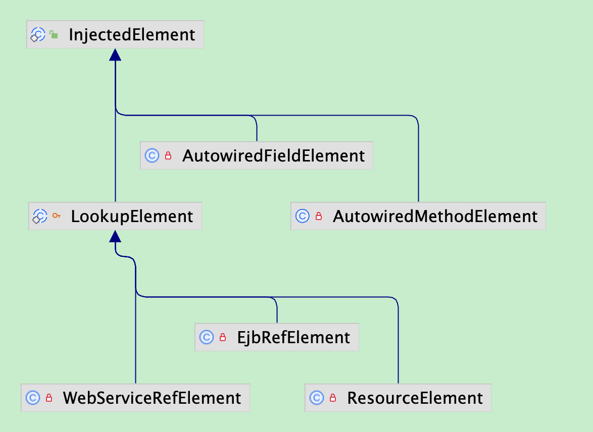
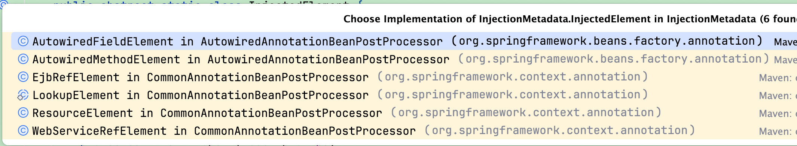

## Spring中几个非常重要的BeanPostProcessor类

### 1、BeanPostProcessor

`postProcessBeforeInitialization`方法：在初始化之前执行，即在`InitializingBean`的#`afterPropertiesSet`方法或者自定义的`init-method`方法之前执行

`postProcessAfterInitialization`方法：在初始化之后执行，即在`InitializingBean`的#`afterPropertiesSet`方法或者自定义的`init-method`方法之后执行

```Java
package org.springframework.beans.factory.config;

import org.springframework.beans.BeansException;
import org.springframework.lang.Nullable;

public interface BeanPostProcessor {
		// 在初始化之前执行
    @Nullable
    default Object postProcessBeforeInitialization(Object bean, String beanName) throws BeansException {
        return bean;
    }
		// 在初始化之后执行
    @Nullable
    default Object postProcessAfterInitialization(Object bean, String beanName) throws BeansException {
        return bean;
    }

}
```

### 2、还有几个基础的继承接口

在继承`BeanPostProcessor`接口的接口中，有三个基础需要特别注意，

1、`MergedBeanDefinitionPostProcessor` 

2、`DestructionAwareBeanPostProcessor` 

3、`InstantiationAwareBeanPostProcessor`和`SmartInstantiationAwareBeanPostProcessor`


### 2-1、`MergedBeanDefinitionPostProcessor` 

`postProcessMergedBeanDefinition`方法：在实例化之后，属性填充之前执行

作用是将一个 `bean` 的配置信息（尤其是注解配置，相关注解有`@PostConstruct、@PreDestroy、@Autowired、@Resource、@Inject、@Value`等等）合并到`BeanDefinition` 对象中，并记录到缓存中，方便在后续的属性填充阶段处理

```Java
package org.springframework.beans.factory.support;

import org.springframework.beans.factory.config.BeanPostProcessor;
import org.springframework.beans.factory.config.RootBeanDefinition;

public interface MergedBeanDefinitionPostProcessor extends BeanPostProcessor {
		// 处理注解，记录到缓存和BeanDefinition对象，方便属性填充阶段处理
    void postProcessMergedBeanDefinition(RootBeanDefinition beanDefinition, Class<?> beanType, String beanName);
		// 一般作用是清理指定beanName的缓存
    default void resetBeanDefinition(String beanName) {
    }

}

```

在`Spring`中的执行顺序如下,实例化Bean之后，填充属性和初始化之前

```Java
protected Object doCreateBean(String beanName, RootBeanDefinition mbd, @Nullable Object[] args)
       throws BeanCreationException {

		// 实例化Bean
    if (instanceWrapper == null) {
       instanceWrapper = createBeanInstance(beanName, mbd, args);
    }

    // 执行注册的postProcessMergedBeanDefinition方法
    synchronized (mbd.postProcessingLock) {
       if (!mbd.postProcessed) {
          applyMergedBeanDefinitionPostProcessors(mbd, beanType, beanName);
          mbd.postProcessed = true;
       }
    }

    // 实例化Bean后填充属性和初始化
    Object exposedObject = bean;
    populateBean(beanName, mbd, instanceWrapper);
    exposedObject = initializeBean(beanName, exposedObject, mbd);
   
}
```

`applyMergedBeanDefinitionPostProcessors`方法：找到所有实现`MergedBeanDefinitionPostProcessor`接口的类，执行`postProcessMergedBeanDefinition`方法

```Java
protected void applyMergedBeanDefinitionPostProcessors(RootBeanDefinition mbd, Class<?> beanType, String beanName) {
  	// 找到所有实现MergedBeanDefinitionPostProcessor接口的类，执行postProcessMergedBeanDefinition方法
    for (MergedBeanDefinitionPostProcessor processor : getBeanPostProcessorCache().mergedDefinition) {
       processor.postProcessMergedBeanDefinition(mbd, beanType, beanName);
    }
}
```

### 2-2、`DestructionAwareBeanPostProcessor`

`DestructionAwareBeanPostProcessor` 的工作原理基于 Spring 的 bean 生命周期管理机制。Spring 容器在销毁 bean 时，会调用所有实现了 `DestructionAwareBeanPostProcessor` 接口的 `postProcessBeforeDestruction` 方法。这些方法会在实际的销毁操作（如调用 `@PreDestroy` 注解的方法或实现 `DisposableBean` 接口的 `destroy` 方法）之前执行

> 使用场景
>
> 资源释放：关闭数据库连接、网络连接、文件句柄等。
>
> 清理任务：删除临时文件、停止后台线程等。
>
> 状态保存：在销毁 bean 之前保存其状态，以便在下次启动时恢复。

```Java
public interface DestructionAwareBeanPostProcessor extends BeanPostProcessor {
		// 在销毁之前执行
    void postProcessBeforeDestruction(Object bean, String beanName) throws BeansException;
		
    default boolean requiresDestruction(Object bean) {
       return true;
    }

}
```

### 2-3、`InstantiationAwareBeanPostProcessor`

`postProcessBeforeInstantiation`: 在 `bean` 实例化之前调用。如果返回非空对象，这个对象将作为 `bean` 实例，跳过 `Spring` 的默认实例化过程。

```Java
@Nullable
default Object postProcessBeforeInstantiation(Class<?> beanClass, String beanName) throws BeansException {
    return null;
}
```

`postProcessAfterInstantiation`: 在 `bean` 实例化之后调用，如果返回 `false`，则跳过依赖注入阶段。

```Java
default boolean postProcessAfterInstantiation(Object bean, String beanName) throws BeansException {
    return true;
}
```

`postProcessProperties`: 在 Spring 填充属性阶段执行，在获取到了需要注入属性的值之后，把获取到的值通过反射注入字段，一般是与注解有关

例如`CommonAnnotationBeanPostProcessor`、`AutowiredAnnotationBeanPostProcessor.class`

```Java
default PropertyValues postProcessProperties(PropertyValues pvs, Object bean, String beanName) throws BeansException {
    return pvs;
}
```

`postProcessPropertyValues`: 废弃方法，效果同`postProcessProperties`方法

```Java
@Deprecated
default PropertyValues postProcessPropertyValues(
    PropertyValues pvs, PropertyDescriptor[] pds, Object bean, String beanName) throws BeansException {
    return pvs;
}
```

### 2-4、`SmartInstantiationAwareBeanPostProcessor`

`predictBeanType`方法：预测 bean 的类型

`determineCandidateConstructors`方法：在实例化`Bean`对象阶段使用，返回一个构造器数组，根据这个指定的构造器数组，实例化`Bean`对象，例如`AutowiredAnnotationBeanPostProcesso`

`getEarlyBeanReference`方法：暴露早期、半成品的对象，跟循环依赖和代理有关

```Java
public interface SmartInstantiationAwareBeanPostProcessor extends InstantiationAwareBeanPostProcessor {
		// 预测 bean 的类型，（可能在注入时使用）
    @Nullable
    default Class<?> predictBeanType(Class<?> beanClass, String beanName) throws BeansException {
       return null;
    }

    @Nullable
    default Constructor<?>[] determineCandidateConstructors(Class<?> beanClass, String beanName)
          throws BeansException {
       return null;
    }

    // 解决循环依赖，在bean 实例创建的早期阶段，Spring容器会调用这个方法，以获取 bean 的早期引用。这对于创建代理对象或解决循环依赖非常有用
    default Object getEarlyBeanReference(Object bean, String beanName) throws BeansException {
       return bean;
    }
}
```


### 3、具体重要的BeanPostProcessor实现类

其中包括，`ApplicationContextAwareProcessor、InitDestroyAnnotationBeanPostProcessor、AutowiredAnnotationBeanPostProcessor、CommonAnnotationBeanPostProcessor、ConfiguraionClassBeanPossProcessor#innerPostProcesser`

<font color="red">通过解析相关BeanPostProcessor，注解处理一般都需要实现MergedBeanDefinitionPostProcessor接口，在实例化之后，把这个类中的注解数据注册到BeanDefinition中，相关注解有@PostConstruct、@PreDestroy、@Autowired、@Resource、@Inject、@Value等等</font>

其中`BeanPostProcess`是在加载资源时，通过`AnnotationConfigUtils`#`registerAnnotationConfigProcessors`方法，把相关的`BeanPostProcess`加到`BeanFactory`的`beanDefinitionMap`中去的：

- `ConfigurationClassPostProcessor.class`
- `AutowiredAnnotationBeanPostProcessor.class`
- `CommonAnnotationBeanPostProcessor.class`
- `PersistenceAnnotationBeanPostProcessor`   // jpa
- `EventListenerMethodProcessor.class`
- `DefaultEventListenerFactory.class`

### 3-1、ApplicationContextAwareProcessor

这个`BeanPostProcess`是在`BeanFactory`的准备工作中，加到容器中的

```Java
protected void prepareBeanFactory(ConfigurableListableBeanFactory beanFactory) {
    beanFactory.addBeanPostProcessor(new ApplicationContextAwareProcessor(this));
    beanFactory.ignoreDependencyInterface(EnvironmentAware.class);
    beanFactory.ignoreDependencyInterface(EmbeddedValueResolverAware.class);
    beanFactory.ignoreDependencyInterface(ResourceLoaderAware.class);
    beanFactory.ignoreDependencyInterface(ApplicationEventPublisherAware.class);
    beanFactory.ignoreDependencyInterface(MessageSourceAware.class);
    beanFactory.ignoreDependencyInterface(ApplicationContextAware.class);
    beanFactory.ignoreDependencyInterface(ApplicationStartupAware.class);
}
```

直接实现`BeanPostProcessor`接口，没有实现第2节中那几个基础的实现类，只实现`postProcessBeforeInitialization`方法，主要是`Aware`接口的具体实现，把容器内的一些基础属性注入到Bean中

- `EnvironmentAware`
- `EmbeddedValueResolverAware`
- `ResourceLoaderAware`
- `ApplicationEventPublisherAware`
- `MessageSourceAware`
- `ApplicationContextAware`
- `ApplicationStartupAware`

```Java
package org.springframework.context.support;

class ApplicationContextAwareProcessor implements BeanPostProcessor {

    private final ConfigurableApplicationContext applicationContext;

    private final StringValueResolver embeddedValueResolver;

    public ApplicationContextAwareProcessor(ConfigurableApplicationContext applicationContext) {
       this.applicationContext = applicationContext;
       this.embeddedValueResolver = new EmbeddedValueResolver(applicationContext.getBeanFactory());
    }

		// 初始化之前执行
    @Override
    @Nullable
    public Object postProcessBeforeInitialization(Object bean, String beanName) throws BeansException {
       if (!(bean instanceof EnvironmentAware || bean instanceof EmbeddedValueResolverAware ||
             bean instanceof ResourceLoaderAware || bean instanceof ApplicationEventPublisherAware ||
             bean instanceof MessageSourceAware || bean instanceof ApplicationContextAware ||
             bean instanceof ApplicationStartupAware)) {
          return bean;
       }

       AccessControlContext acc = null;

       if (System.getSecurityManager() != null) {
          acc = this.applicationContext.getBeanFactory().getAccessControlContext();
       }

       if (acc != null) {
          AccessController.doPrivileged((PrivilegedAction<Object>) () -> {
             invokeAwareInterfaces(bean);
             return null;
          }, acc);
       }
       else {
          invokeAwareInterfaces(bean);
       }

       return bean;
    }

    private void invokeAwareInterfaces(Object bean) {
       if (bean instanceof EnvironmentAware) {
          ((EnvironmentAware) bean).setEnvironment(this.applicationContext.getEnvironment());
       }
       if (bean instanceof EmbeddedValueResolverAware) {
          ((EmbeddedValueResolverAware) bean).setEmbeddedValueResolver(this.embeddedValueResolver);
       }
       if (bean instanceof ResourceLoaderAware) {
          ((ResourceLoaderAware) bean).setResourceLoader(this.applicationContext);
       }
       if (bean instanceof ApplicationEventPublisherAware) {
          ((ApplicationEventPublisherAware) bean).setApplicationEventPublisher(this.applicationContext);
       }
       if (bean instanceof MessageSourceAware) {
          ((MessageSourceAware) bean).setMessageSource(this.applicationContext);
       }
       if (bean instanceof ApplicationStartupAware) {
          ((ApplicationStartupAware) bean).setApplicationStartup(this.applicationContext.getApplicationStartup());
       }
       if (bean instanceof ApplicationContextAware) {
          ((ApplicationContextAware) bean).setApplicationContext(this.applicationContext);
       }
    }

}
```

### 3-2、InitDestroyAnnotationBeanPostProcessor

这个类既实现了`MergedBeanDefinitionPostProcessor`接口，又实现了`DestructionAwareBeanPostProcessor`接口，并且在子类`CommonAnnotationBeanPostProcessor`初始化时，初始化的，在`loadBeanDefinition`时，`CommonAnnotationBeanPostProcessor`被载入容器内，要和3-3一起看

```Java
private static final boolean jsr250Present;
static {
  		// 检测当前环境是否有@Resource注解
  		jsr250Present = ClassUtils.isPresent("javax.annotation.Resource", classLoader);
}
// 有@Resource注解就把CommonAnnotationBeanPostProcessor加到BeanFactory内
if (jsr250Present && !registry.containsBeanDefinition(COMMON_ANNOTATION_PROCESSOR_BEAN_NAME)) {
    RootBeanDefinition def = new RootBeanDefinition(CommonAnnotationBeanPostProcessor.class);
    def.setSource(source);
    beanDefs.add(registerPostProcessor(registry, def, COMMON_ANNOTATION_PROCESSOR_BEAN_NAME));
}
```

这个`BeanPostProcessor`的作用是把要生成的`Bean`中被@`PostConstruct`和@`PreDestory`注解的方法，在实例化之后，填充属性之前，处理这些方法，加到缓存里，在初始化之前执行@`PostConstruct`，在损毁之前执行@`PreDestory`方法

这个类包括了2个重要的私有内部类，`LifecycleElement`：私有静态内部类，`LifecycleMetadata`：私有内部类，其中，`LifecycleElement`是用来存储方法信息，只包括方法对象和方法名，`LifecycleMetadata`对象则是用来存储指定类中的用@`PostConstruct`和@`PreDestory`注解修饰的方法信息，即`LifecycleElement`对象集合

`initAnnotationType`字段和`destroyAnnotationType`字段是在子类`CommonAnnotationBeanPostProcessor`中`set`的

```Java
@Nullable
private Class<? extends Annotation> initAnnotationType;

@Nullable
private Class<? extends Annotation> destroyAnnotationType;
```

`lifecycleMetadataCache`字段则是作为缓存，记录指定类 --> 指定类中被@`PostConstruct`和@`PreDestory`注解修饰的方法信息的映射

```Java
@Nullable
private final transient Map<Class<?>, LifecycleMetadata> lifecycleMetadataCache = new ConcurrentHashMap<>(256);
```

`postProcessMergedBeanDefinition`方法：处理要创建的`Bean`中被@`PostConstruct`和@`PreDestory`修饰的方法，把这些方法数据加到`lifecycleMetadataCache`缓存中，并把这些方法加到在`RootBeanDefinition`中`externallyManagedInitMethods`字段（`init`方法）和`externallyManagedDestroyMethods`（`destroy`方法）字段中

`postProcessBeforeInitialization`方法：在初始化之前执行被@`PostConstruct`修饰的init方法

`postProcessBeforeDestruction`方法：在损毁Bean之前执行被@`PreDestroy`修饰的destroy方法

```Java
package org.springframework.beans.factory.annotation;

@SuppressWarnings("serial")
public class InitDestroyAnnotationBeanPostProcessor
		implements DestructionAwareBeanPostProcessor, MergedBeanDefinitionPostProcessor, PriorityOrdered, Serializable {
	@Nullable
	private Class<? extends Annotation> initAnnotationType;

	@Nullable
	private Class<? extends Annotation> destroyAnnotationType;

	private int order = Ordered.LOWEST_PRECEDENCE;

	@Nullable
	private final transient Map<Class<?>, LifecycleMetadata> lifecycleMetadataCache = new ConcurrentHashMap<>(256);

	// 提前处理被注解标注的方法，把相关方法数据放入缓存和BeanDefinition对象中
	@Override
	public void postProcessMergedBeanDefinition(RootBeanDefinition beanDefinition, Class<?> beanType, String beanName) {
		LifecycleMetadata metadata = findLifecycleMetadata(beanType);
		metadata.checkConfigMembers(beanDefinition);
	}
  
	// 在初始化之前执行@PostConstruct注解标注的方法
	@Override
	public Object postProcessBeforeInitialization(Object bean, String beanName) throws BeansException {
		LifecycleMetadata metadata = findLifecycleMetadata(bean.getClass());
		metadata.invokeInitMethods(bean, beanName);
	}
	
  // 在销毁bean之前执行@PreDestroy注解标注的方法
	@Override
	public void postProcessBeforeDestruction(Object bean, String beanName) throws BeansException {
		LifecycleMetadata metadata = findLifecycleMetadata(bean.getClass());
		metadata.invokeDestroyMethods(bean, beanName);
		
	}
}
```

#### 私有静态内部类LifecycleElement

这个内部类只接受无参数构造方法

```Java
private static class LifecycleElement {

    private final Method method;

    private final String identifier;

    public LifecycleElement(Method method) {
       if (method.getParameterCount() != 0) {
          throw new IllegalStateException("Lifecycle method annotation requires a no-arg method: " + method);
       }
       this.method = method;
       this.identifier = (Modifier.isPrivate(method.getModifiers()) ?
             ClassUtils.getQualifiedMethodName(method) : method.getName());
    }

    public Method getMethod() {
       return this.method;
    }

    public String getIdentifier() {
       return this.identifier;
    }

    public void invoke(Object target) throws Throwable {
       ReflectionUtils.makeAccessible(this.method);
       this.method.invoke(target, (Object[]) null);
    }

    @Override
    public boolean equals(@Nullable Object other) {
       if (this == other) {
          return true;
       }
       if (!(other instanceof LifecycleElement)) {
          return false;
       }
       LifecycleElement otherElement = (LifecycleElement) other;
       return (this.identifier.equals(otherElement.identifier));
    }

    @Override
    public int hashCode() {
       return this.identifier.hashCode();
    }
}
```

#### 私有内部类LifecycleMetadata

```Java
private class LifecycleMetadata {
    private final Class<?> targetClass;

    private final Collection<LifecycleElement> initMethods;

    private final Collection<LifecycleElement> destroyMethods;

    @Nullable
    private volatile Set<LifecycleElement> checkedInitMethods;

    @Nullable
    private volatile Set<LifecycleElement> checkedDestroyMethods;

    public LifecycleMetadata(Class<?> targetClass, Collection<LifecycleElement> initMethods,
                             Collection<LifecycleElement> destroyMethods) {

        this.targetClass = targetClass;
        this.initMethods = initMethods;
        this.destroyMethods = destroyMethods;
    }

    public void checkConfigMembers(RootBeanDefinition beanDefinition) {
        Set<LifecycleElement> checkedInitMethods = new LinkedHashSet<>(this.initMethods.size());
        for (LifecycleElement element : this.initMethods) {
            String methodIdentifier = element.getIdentifier();
            if (!beanDefinition.isExternallyManagedInitMethod(methodIdentifier)) {
                beanDefinition.registerExternallyManagedInitMethod(methodIdentifier);
                checkedInitMethods.add(element);
            }
        }
        Set<LifecycleElement> checkedDestroyMethods = new LinkedHashSet<>(this.destroyMethods.size());
        for (LifecycleElement element : this.destroyMethods) {
            String methodIdentifier = element.getIdentifier();
            if (!beanDefinition.isExternallyManagedDestroyMethod(methodIdentifier)) {
                beanDefinition.registerExternallyManagedDestroyMethod(methodIdentifier);
                checkedDestroyMethods.add(element);
            }
        }
        this.checkedInitMethods = checkedInitMethods;
        this.checkedDestroyMethods = checkedDestroyMethods;
    }

    public void invokeInitMethods(Object target, String beanName) throws Throwable {
        Collection<LifecycleElement> checkedInitMethods = this.checkedInitMethods;
        Collection<LifecycleElement> initMethodsToIterate =
                (checkedInitMethods != null ? checkedInitMethods : this.initMethods);
        if (!initMethodsToIterate.isEmpty()) {
            for (LifecycleElement element : initMethodsToIterate) {
                element.invoke(target);
            }
        }
    }

    public void invokeDestroyMethods(Object target, String beanName) throws Throwable {
        Collection<LifecycleElement> checkedDestroyMethods = this.checkedDestroyMethods;
        Collection<LifecycleElement> destroyMethodsToUse =
                (checkedDestroyMethods != null ? checkedDestroyMethods : this.destroyMethods);
        if (!destroyMethodsToUse.isEmpty()) {
            for (LifecycleElement element : destroyMethodsToUse) {
                element.invoke(target);
            }
        }
    }

    public boolean hasDestroyMethods() {
        Collection<LifecycleElement> checkedDestroyMethods = this.checkedDestroyMethods;
        Collection<LifecycleElement> destroyMethodsToUse =
                (checkedDestroyMethods != null ? checkedDestroyMethods : this.destroyMethods);
        return !destroyMethodsToUse.isEmpty();
    }
}
```

### 3-3、CommonAnnotationBeanPostProcessor

这个`BeanPostProcessor`是用来处理@`Resource`、@`WebServiceRef`、@`EJB`这三个注解的

这个类是在加载资源时，检测是否存在@`Resource`注解，如果存在，就把这个`CommonAnnotationBeanPostProcessor`加到`BeanFactory`中

```Java
private static final boolean jsr250Present;
static {
  		// 检测当前环境是否有@Resource注解
  		jsr250Present = ClassUtils.isPresent("javax.annotation.Resource", classLoader);
}
// 有@Resource注解就把CommonAnnotationBeanPostProcessor加到BeanFactory内
if (jsr250Present && !registry.containsBeanDefinition(COMMON_ANNOTATION_PROCESSOR_BEAN_NAME)) {
    RootBeanDefinition def = new RootBeanDefinition(CommonAnnotationBeanPostProcessor.class);
    def.setSource(source);
    beanDefs.add(registerPostProcessor(registry, def, COMMON_ANNOTATION_PROCESSOR_BEAN_NAME));
}
```

这个类中的字段变量

```Java
// 需要检测的注解，一般是@Resource、@WebServiceRef、@EJB
private static final Set<Class<? extends Annotation>> resourceAnnotationTypes = new LinkedHashSet<>(4);

static {
   // 把@Resource注解加到需要检测的注解中
   resourceAnnotationTypes.add(Resource.class);
}

@Nullable
private transient BeanFactory resourceFactory;
// 实现BeanFactoryAware接口，注入
@Nullable
private transient BeanFactory beanFactory;
// 缓存
private final transient Map<String, InjectionMetadata> injectionMetadataCache = new ConcurrentHashMap<>(256);

```

在创建这个`BeanPostProcessor`时，会先创建它的父类`InitDestroyAnnotationBeanPostProcessor`，把`Init`和`Destroy`注解设置好

```Java
public CommonAnnotationBeanPostProcessor() {
    setOrder(Ordered.LOWEST_PRECEDENCE - 3);
    setInitAnnotationType(PostConstruct.class);
    setDestroyAnnotationType(PreDestroy.class);
}
```

#### 重要方法

`postProcessMergedBeanDefinition`方法：

会先执行父类的`postProcessMergedBeanDefinition`方法，把3-2的逻辑执行一遍，再处理@`Resource`注解修饰的相关方法和字段，通过被修饰的属性（字段或者方法）新建一个`ResourceElement`对象，再把这个类的所有`ResourceElement`对象放入一个`InjectionMetadata`对象，最后把这个`InjectionMetadata`对象放入`injectionMetadataCache`缓存中，方便后续属性注入。接着再额外把需要注入的成员放入`BeanDefinition`中的`externallyManagedConfigMembers`集合字段中

`resetBeanDefinition`方法：把`injectionMetadataCache`中这个`bean`的缓存清除

`postProcessProperties`方法：属性注入

```Java
@Override
public void postProcessMergedBeanDefinition(RootBeanDefinition beanDefinition, Class<?> beanType, String beanName) {
    super.postProcessMergedBeanDefinition(beanDefinition, beanType, beanName);
  	// 处理指定beanType中的需要处理的注解
    InjectionMetadata metadata = findResourceMetadata(beanName, beanType, null);
  	// 把相关成员注册到beanDefinition中的externallyManagedConfigMembers去
    metadata.checkConfigMembers(beanDefinition);
}

@Override
public void resetBeanDefinition(String beanName) {
  // 移除指定类存储的缓存
  this.injectionMetadataCache.remove(beanName);
}

@Override
public PropertyValues postProcessProperties(PropertyValues pvs, Object bean, String beanName) {
  InjectionMetadata metadata = findResourceMetadata(beanName, bean.getClass(), pvs);
  metadata.inject(bean, beanName, pvs);
  return pvs;
}
```

#### 受保护的抽象静态内部类LookupElement

```Java
protected abstract static class LookupElement extends InjectionMetadata.InjectedElement {

    protected String name = "";
    protected boolean isDefaultName = false;
    protected Class<?> lookupType = Object.class;
    @Nullable
    protected String mappedName;

    public LookupElement(Member member, @Nullable PropertyDescriptor pd) {
       super(member, pd);
    }

    public final String getName() {
       return this.name;
    }

    public final Class<?> getLookupType() {
       return this.lookupType;
    }

    public final DependencyDescriptor getDependencyDescriptor() {
       if (this.isField) {
          return new LookupDependencyDescriptor((Field) this.member, this.lookupType);
       }
       else {
          return new LookupDependencyDescriptor((Method) this.member, this.lookupType);
       }
    }
}
```

#### 私有内部类ResourceElement

```Java
private class ResourceElement extends LookupElement {

    private final boolean lazyLookup;

    public ResourceElement(Member member, AnnotatedElement ae, @Nullable PropertyDescriptor pd) {
       super(member, pd);
       Resource resource = ae.getAnnotation(Resource.class);
       String resourceName = resource.name();
       Class<?> resourceType = resource.type();
       this.isDefaultName = !StringUtils.hasLength(resourceName);
       if (this.isDefaultName) {
          resourceName = this.member.getName();
          if (this.member instanceof Method && resourceName.startsWith("set") && resourceName.length() > 3) {
             resourceName = Introspector.decapitalize(resourceName.substring(3));
          }
       }
       else if (embeddedValueResolver != null) {
          resourceName = embeddedValueResolver.resolveStringValue(resourceName);
       }
       if (Object.class != resourceType) {
          checkResourceType(resourceType);
       }
       else {
          resourceType = getResourceType();
       }
       this.name = (resourceName != null ? resourceName : "");
       this.lookupType = resourceType;
       String lookupValue = resource.lookup();
       this.mappedName = (StringUtils.hasLength(lookupValue) ? lookupValue : resource.mappedName());
       Lazy lazy = ae.getAnnotation(Lazy.class);
       this.lazyLookup = (lazy != null && lazy.value());
    }

    @Override
    protected Object getResourceToInject(Object target, @Nullable String requestingBeanName) {
       return (this.lazyLookup ? buildLazyResourceProxy(this, requestingBeanName) :
             getResource(this, requestingBeanName));
    }
}
```

#### InjectionMetadata

todo

### 3-4、AutowiredAnnotationBeanPostProcessor

这个`BeanPostProcessor`主要是处理@`Autowired`、@`Value`、@`Inject`这三个注解的，在实例化之后，处理这些注解，放入缓存和`BeanDefinition`中，在属性注入阶段，把相关属性通过反射注入到相关字段中

```Java
protected final Log logger = LogFactory.getLog(getClass());
// 需要处理的注解,在无参数构造器中放入@Autowired、@Value、@Inject这三个注解
private final Set<Class<? extends Annotation>> autowiredAnnotationTypes = new LinkedHashSet<>(4);
// 专门针对@Autowired注解，如果注解有required属性，就获取，没有，就默认为true
private String requiredParameterName = "required";
// 没有从注解的属性获取到required，就默认为true
private boolean requiredParameterValue = true;
// 注册、执行顺序
private int order = Ordered.LOWEST_PRECEDENCE - 2;
// BeanFactoryAware接口注入
@Nullable
private ConfigurableListableBeanFactory beanFactory;
// 存在@Lookup注解修饰的方法，的beanName集合
private final Set<String> lookupMethodsChecked = Collections.newSetFromMap(new ConcurrentHashMap<>(256));
// 构造器候选者缓存
private final Map<Class<?>, Constructor<?>[]> candidateConstructorsCache = new ConcurrentHashMap<>(256);
// 被@Autowired、@Value、@Inject修饰的字段或者方法，需要被注入的元素集合
private final Map<String, InjectionMetadata> injectionMetadataCache = new ConcurrentHashMap<>(256);
```

无参数构造，放入@`Autowired`、@`Value`、@`Inject`到`autowiredAnnotationTypes`中

```Java
public AutowiredAnnotationBeanPostProcessor() {
    this.autowiredAnnotationTypes.add(Autowired.class);
    this.autowiredAnnotationTypes.add(Value.class);
    this.autowiredAnnotationTypes.add((Class<? extends Annotation>)
             ClassUtils.forName("javax.inject.Inject", AutowiredAnnotationBeanPostProcessor.class.getClassLoader()));
}
```

在加载资源时放入容器中

```Java
public static final String AUTOWIRED_ANNOTATION_PROCESSOR_BEAN_NAME =
			"org.springframework.context.annotation.internalAutowiredAnnotationProcessor";
if (!registry.containsBeanDefinition(AUTOWIRED_ANNOTATION_PROCESSOR_BEAN_NAME)) {
    RootBeanDefinition def = new RootBeanDefinition(AutowiredAnnotationBeanPostProcessor.class);
    def.setSource(source);
    beanDefs.add(registerPostProcessor(registry, def, AUTOWIRED_ANNOTATION_PROCESSOR_BEAN_NAME));
}
```

实现`MergedBeanDefinitionPostProcessor`接口的2个方法

```Java
// findAutowiringMetadata方法：
// 查询这个beanType下所有被@Autowired、@Value、@Inject修饰的字段或者方法，放入缓存injectionMetadataCache中
// beanName -> InjectionMetadata
// checkConfigMembers方法：
// 把findAutowiringMetadata方法中查到的成员（字段和方法）放入beanDefinition中的externallyManagedConfigMembers集合中去
@Override
public void postProcessMergedBeanDefinition(RootBeanDefinition beanDefinition, Class<?> beanType, String beanName) {
    InjectionMetadata metadata = findAutowiringMetadata(beanName, beanType, null);
    metadata.checkConfigMembers(beanDefinition);
}
// 清除指定beanName的缓存
@Override
public void resetBeanDefinition(String beanName) {
    this.lookupMethodsChecked.remove(beanName);
    this.injectionMetadataCache.remove(beanName);
}
```

实现`SmartInstantiationAwareBeanPostProcessor`接口的2个方法

`determineCandidateConstructors`方法，处理@`Lookup`修饰的方法，查找最合适的构造器数组

```Java
// 处理@Autowired、@Value、@Inject被修饰的成员，属性注入
@Override
public PropertyValues postProcessProperties(PropertyValues pvs, Object bean, String beanName) {
  InjectionMetadata metadata = findAutowiringMetadata(beanName, bean.getClass(), pvs);
  metadata.inject(bean, beanName, pvs);
  return pvs;
}

// 处理@Lookup修饰的方法，查找最合适的构造器数组
@Override
@Nullable
public Constructor<?>[] determineCandidateConstructors(Class<?> beanClass, final String beanName)
       throws BeanCreationException {

    // 处理被@Lookup注解修饰的方法，放入beanFactory容器内的BeanDefinition对象的MethodOverrides字段去
    if (!this.lookupMethodsChecked.contains(beanName)) {
       if (AnnotationUtils.isCandidateClass(beanClass, Lookup.class)) {
          try {
             Class<?> targetClass = beanClass;
             do {
                ReflectionUtils.doWithLocalMethods(targetClass, method -> {
                   Lookup lookup = method.getAnnotation(Lookup.class);
                   if (lookup != null) {
                      Assert.state(this.beanFactory != null, "No BeanFactory available");
                      LookupOverride override = new LookupOverride(method, lookup.value());
                      try {
                         RootBeanDefinition mbd = (RootBeanDefinition)
                               this.beanFactory.getMergedBeanDefinition(beanName);
                         mbd.getMethodOverrides().addOverride(override);
                      }
                      catch (NoSuchBeanDefinitionException ex) {
                         throw new BeanCreationException(beanName,
                               "Cannot apply @Lookup to beans without corresponding bean definition");
                      }
                   }
                });
                targetClass = targetClass.getSuperclass();
             }
             while (targetClass != null && targetClass != Object.class);

          }
          catch (IllegalStateException ex) {
             throw new BeanCreationException(beanName, "Lookup method resolution failed", ex);
          }
       }
       this.lookupMethodsChecked.add(beanName);
    }

    // 查询适合的构造器候选者集合
    Constructor<?>[] candidateConstructors = this.candidateConstructorsCache.get(beanClass);
    if (candidateConstructors == null) {
       synchronized (this.candidateConstructorsCache) {
          candidateConstructors = this.candidateConstructorsCache.get(beanClass);
          if (candidateConstructors == null) {
             Constructor<?>[] rawCandidates;
             try {
                // 获取这个类下所有声明的构造器（不局限修饰范围）
                rawCandidates = beanClass.getDeclaredConstructors();
             }
             catch (Throwable ex) {
                throw new BeanCreationException(beanName,
                      "Resolution of declared constructors on bean Class [" + beanClass.getName() +
                      "] from ClassLoader [" + beanClass.getClassLoader() + "] failed", ex);
             }
             List<Constructor<?>> candidates = new ArrayList<>(rawCandidates.length);
             Constructor<?> requiredConstructor = null;
             Constructor<?> defaultConstructor = null;
             // 如果这个类构造器上有@Primary注解，就返回这个有注解的构造器，没有，就返回这个类内的无参数构造器
             Constructor<?> primaryConstructor = BeanUtils.findPrimaryConstructor(beanClass);
             int nonSyntheticConstructors = 0;
             for (Constructor<?> candidate : rawCandidates) {
               	// 这个构造器是否是合成的
                if (!candidate.isSynthetic()) {
                   nonSyntheticConstructors++;
                }
                else if (primaryConstructor != null) {
                   continue;
                }
               	// 这个构造器上是否有@Autowired、@Value、@Inject相关注解
                MergedAnnotation<?> ann = findAutowiredAnnotation(candidate);
                if (ann == null) {
                   Class<?> userClass = ClassUtils.getUserClass(beanClass);
                   if (userClass != beanClass) {
                      try {
                         Constructor<?> superCtor =
                               userClass.getDeclaredConstructor(candidate.getParameterTypes());
                         ann = findAutowiredAnnotation(superCtor);
                      }
                      catch (NoSuchMethodException ex) {
                      }
                   }
                }
               	// 如果构造器上确实存在@Autowired、@Value、@Inject相关注解，但之前已经有了，并且require是true，
               	// 抛出异常
                if (ann != null) {
                   if (requiredConstructor != null) {
                      throw new BeanCreationException(beanName,
                            "Invalid autowire-marked constructor: " + candidate +
                            ". Found constructor with 'required' Autowired annotation already: " +
                            requiredConstructor);
                   }
                   boolean required = determineRequiredStatus(ann);
                   if (required) {
                      if (!candidates.isEmpty()) {
                         throw new BeanCreationException(beanName,
                               "Invalid autowire-marked constructors: " + candidates +
                               ". Found constructor with 'required' Autowired annotation: " +
                               candidate);
                      }
                      requiredConstructor = candidate;
                   }
                   candidates.add(candidate);
                }
                else if (candidate.getParameterCount() == 0) {
                   defaultConstructor = candidate;
                }
             }
             if (!candidates.isEmpty()) {
                // Add default constructor to list of optional constructors, as fallback.
                if (requiredConstructor == null) {
                   if (defaultConstructor != null) {
                      candidates.add(defaultConstructor);
                   }
                }
                candidateConstructors = candidates.toArray(new Constructor<?>[0]);
             }
             else if (rawCandidates.length == 1 && rawCandidates[0].getParameterCount() > 0) {
                candidateConstructors = new Constructor<?>[] {rawCandidates[0]};
             }
             else if (nonSyntheticConstructors == 2 && primaryConstructor != null &&
                   defaultConstructor != null && !primaryConstructor.equals(defaultConstructor)) {
                candidateConstructors = new Constructor<?>[] {primaryConstructor, defaultConstructor};
             }
             else if (nonSyntheticConstructors == 1 && primaryConstructor != null) {
                candidateConstructors = new Constructor<?>[] {primaryConstructor};
             }
             else {
                candidateConstructors = new Constructor<?>[0];
             }
             this.candidateConstructorsCache.put(beanClass, candidateConstructors);
          }
       }
    }
    return (candidateConstructors.length > 0 ? candidateConstructors : null);
}
```

### 3-5、 InjectedElement的继承关系





### 3-6、ConfigurationClassPostProcessor##ImportAwareBeanPostProcessor

```Java
private static class ImportAwareBeanPostProcessor implements InstantiationAwareBeanPostProcessor {

    private final BeanFactory beanFactory;

    public ImportAwareBeanPostProcessor(BeanFactory beanFactory) {
       this.beanFactory = beanFactory;
    }

    @Override
    public PropertyValues postProcessProperties(@Nullable PropertyValues pvs, Object bean, String beanName) {
       // Inject the BeanFactory before AutowiredAnnotationBeanPostProcessor's
       // postProcessProperties method attempts to autowire other configuration beans.
       if (bean instanceof EnhancedConfiguration) {
          ((EnhancedConfiguration) bean).setBeanFactory(this.beanFactory);
       }
       return pvs;
    }

    @Override
    public Object postProcessBeforeInitialization(Object bean, String beanName) {
       if (bean instanceof ImportAware) {
          ImportRegistry ir = this.beanFactory.getBean(IMPORT_REGISTRY_BEAN_NAME, ImportRegistry.class);
          AnnotationMetadata importingClass = ir.getImportingClassFor(ClassUtils.getUserClass(bean).getName());
          if (importingClass != null) {
             ((ImportAware) bean).setImportMetadata(importingClass);
          }
       }
       return bean;
    }
}
```