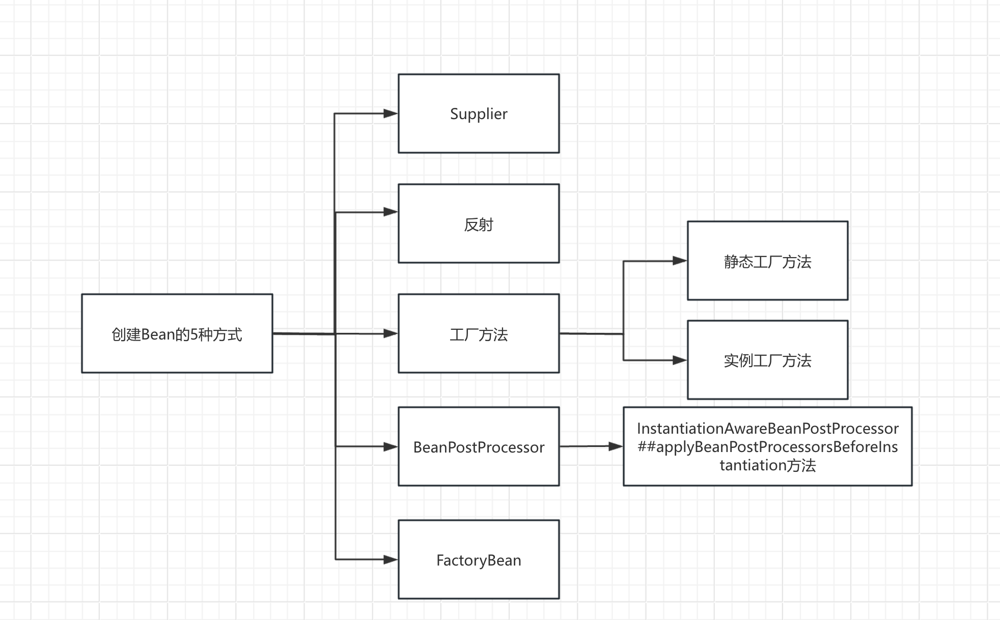

### 1、`FactoryBean`

#### 解析

`FactoryBean`是`Spring`提供的一种特殊的bean，在容器初始化时，会把这个工厂`bean`实例化到IOC容器内，在从容器内获取`FactoryBean`这个对象时，返回的不是`FactoryBean`对象本身，而是`FactoryBean`#`getObject`()方法返回的对象，如果要从容器中获取这个对象本身，需要在对象名前加上&符号

```Java
// 获取FactoryBean对象本身
UserFactoryBean userFactoryBean = (UserFactoryBean) context.getBean("&userFactoryBean");
// 获取FactoryBean对象中定义返回的对象getObject
User user = (User) context.getBean("userFactoryBean");
```

- `getObject`方法，返回需要创建的对象
- `getObjectType`方法，返回创建对象的类型
- `isSingleton`方法创建的bean对象是单例还是原型

```Java
package org.springframework.beans.factory;

import org.springframework.lang.Nullable;

public interface FactoryBean<T> {
    String OBJECT_TYPE_ATTRIBUTE = "factoryBeanObjectType";

    @Nullable
    T getObject() throws Exception;

    @Nullable
    Class<?> getObjectType();

    default boolean isSingleton() {
       return true;
    }

}
```

#### 自定义

自定义的`FactoryBean`，生成的是`User`对象

```Java
import org.springframework.beans.factory.FactoryBean;

public class UserFactoryBean implements FactoryBean<User> {

    @Override
    public User getObject() throws Exception {
        return new User();
    }

    @Override
    public Class<?> getObjectType() {
        return User.class;
    }
}
```

在`spring.xml`文件中配置这个`Bean`需要在容器初始化时生成

```java
<bean id="userFactoryBean" class="com.wangxin.pojo.UserFactoryBean"/>
```

获取`FactoryBean`对象本身和`User`对象

```Java
// 获取FactoryBean对象本身
UserFactoryBean userFactoryBean = (UserFactoryBean) context.getBean("&userFactoryBean");
// 获取FactoryBean对象中定义返回的对象getObject
User user = (User) context.getBean("userFactoryBean");
```

### 2、`BeanPostProcessor`

#### 解析

在`doCreateBean`方法中，需要先创建`Bean`实例，然后依次填充属性，设置Aware接口的属性，执行相关`BeanPostProcessor`接口的`before`和`After`方法，执行`init`方法，以及根据代理或者切面生成代理对象

但`Spring`中提供了可以不走`doCreateBean`方法的策略，即`InstantiationAwareBeanPostProcessor`接口，这个接口实现了`BeanPostProcessor`接口，它自身有4个方法：

1）`postProcessBeforeInstantiation`方法：在`Bean`实例化之前执行，不走后续`doCreateBean`方法，返回的对象可能是代理对象。

2）`postProcessAfterInstantiation`方法：在 `Bean` 实例化之后，但在 `Spring` 属性填充之前执行，通过构造器或者工厂方法。

3）`postProcessProperties`方法：在填充属性阶段，在找到需要填充进字段的属性之后，真正将属性填充进字段之前执行

4）`postProcessPropertyValues`方法：废弃方法，实际效果与3）`postProcessProperties`方法一致

可以根据`InstantiationAwareBeanPostProcessor`接口，实现它的`postProcessBeforeInstantiation`方法，再将这个`BeanPostProcessor`注册到`BeanFactory`中，创建对象，直接返回

```Java
package org.springframework.beans.factory.config;

import java.beans.PropertyDescriptor;

import org.springframework.beans.BeansException;
import org.springframework.beans.PropertyValues;
import org.springframework.lang.Nullable;

public interface InstantiationAwareBeanPostProcessor extends BeanPostProcessor {
    @Nullable
    default Object postProcessBeforeInstantiation(Class<?> beanClass, String beanName) throws BeansException {
        return null;
    }

    default boolean postProcessAfterInstantiation(Object bean, String beanName) throws BeansException {
        return true;
    }

    @Nullable
    default PropertyValues postProcessProperties(PropertyValues pvs, Object bean, String beanName)
            throws BeansException {

        return null;
    }

    @Deprecated
    @Nullable
    default PropertyValues postProcessPropertyValues(
            PropertyValues pvs, PropertyDescriptor[] pds, Object bean, String beanName) throws BeansException {

        return pvs;
    }
}
```
#### 自定义

自定义一个`InstantiationAwareBeanPostProcessor`接口实现类

```Java
public class MyInstantiationAwareBeanPostProcessor implements InstantiationAwareBeanPostProcessor {
    
  public Object postProcessBeforeInstantiation(Class<?> beanClass, String beanName) {
        System.out.println("MyInstantiationAwareBeanPostProcessor--"+ beanName +"--postProcessBeforeInstantiation");
        if (beanClass == BeforeInstantiation.class) {
            Enhancer enhancer = new Enhancer();
            enhancer.setSuperclass(beanClass);
            enhancer.setCallback(new MyMethodInterceptor());
            System.out.println("创建代理对象BeforeInstantiation");
            return enhancer.create();
        }
        return null;
    }
}
```

自定义方法拦截器

```Java
public class MyMethodInterceptor implements MethodInterceptor {
    @Override
    public Object intercept(Object o, Method method, Object[] objects, MethodProxy methodProxy) throws Throwable {
        System.out.println("MyMethodInterceptor执行之前" + method);
        Object result = methodProxy.invokeSuper(o, objects);
        System.out.println("MyMethodInterceptor执行之后" + method);
        return result;
    }
}
```

随便创建的一个实体类

```Java
public class BeforeInstantiation {
    public void doSomething() {
        System.out.println("BeforeInstantiation do something");
    }
}

```

#### Spring中的使用

在`Spring`中的代码，给`BeanPostProcessor`一个机会，在实例化以及后续操作之前，创建一个对象，并返回

```Java
try {
    // Give BeanPostProcessors a chance to return a proxy instead of the target bean instance.
    Object bean = resolveBeforeInstantiation(beanName, mbdToUse);
    if (bean != null) {
       return bean;
    }
}
catch (Throwable ex) {
    throw new BeanCreationException(mbdToUse.getResourceDescription(), beanName,
          "BeanPostProcessor before instantiation of bean failed", ex);
}
```

`resolveBeforeInstantiation`方法具体逻辑，执行`InstantiationAwareBeanPostProcessor`接口的`applyBeanPostProcessorsBeforeInstantiation`方法，如果确实返回了一个对象回来，执行其他注册`BeanPostProcessor`接口的`applyBeanPostProcessorsAfterInitialization`方法，这个方法是正常初始化后执行的

```Java
@Nullable
protected Object resolveBeforeInstantiation(String beanName, RootBeanDefinition mbd) {
    Object bean = null;
    if (!Boolean.FALSE.equals(mbd.beforeInstantiationResolved)) {
       if (!mbd.isSynthetic() && hasInstantiationAwareBeanPostProcessors()) {
          Class<?> targetType = determineTargetType(beanName, mbd);
          if (targetType != null) {
             // 实例化之前
             bean = applyBeanPostProcessorsBeforeInstantiation(targetType, beanName);
             if (bean != null) {
               // 初始化之后
                bean = applyBeanPostProcessorsAfterInitialization(bean, beanName);
             }
          }
       }
       mbd.beforeInstantiationResolved = (bean != null);
    }
    return bean;
}
```

### 3、Supplier

#### 解析

`Supplier` 是一个函数式接口，位于 `java.util.function` 包中。`Supplier` 是一个通用接口，它不接受任何输入参数，但会返回一个类型为 `T` 的结果

`Supplier` 的使用场景

- **延迟计算**: 在某些情况下，你可能希望推迟某个值的计算或生成，直到需要它时再去执行。`Supplier` 非常适合这种场景。
- **默认值生成**: 当你需要为某个变量或配置生成一个默认值时，可以使用 `Supplier` 提供这种默认值。
- **工厂方法**: `Supplier` 可以作为一种简单的工厂方法模式，用来创建和返回新对象。

```Java
package java.util.function;

@FunctionalInterface
public interface Supplier<T> {
    T get();
}
```

#### Spring中的使用

在`doCreateBean`方法的具体实例化方法，`createBeanInstance`方法中

```Java
protected BeanWrapper createBeanInstance(String beanName, RootBeanDefinition mbd, @Nullable Object[] args) {
    Supplier<?> instanceSupplier = mbd.getInstanceSupplier();
    if (instanceSupplier != null) {
       return obtainFromSupplier(instanceSupplier, beanName);
    }
}
```

`Supplier`具体实例化过程

```Java
protected BeanWrapper obtainFromSupplier(Supplier<?> instanceSupplier, String beanName) {
    Object instance;

    String outerBean = this.currentlyCreatedBean.get();
    this.currentlyCreatedBean.set(beanName);
    try {
       instance = instanceSupplier.get();
    }
    finally {
       if (outerBean != null) {
          this.currentlyCreatedBean.set(outerBean);
       }
       else {
          this.currentlyCreatedBean.remove();
       }
    }

    if (instance == null) {
       instance = new NullBean();
    }
    BeanWrapper bw = new BeanWrapperImpl(instance);
    initBeanWrapper(bw);
    return bw;
}
```

如果合并的`BeanDefinition`中，`instanceSupplier`字段不为空，会先执行自定义的`Supplier`接口的`get`方法，实例化对象，再继续下一个流程

```Java
// AbstractBeanDefinition类
@Nullable
private Supplier<?> instanceSupplier;
```

#### 自定义

自定义一个`BeanFactoryPostProcessor`，把自定义的`Supplier`对象加到想加的`BeanDefinition`中

自定义的`BeanFactoryPostProcessor`

```Java
public class SupplierBeanFactoryPostProcessor implements BeanFactoryPostProcessor {
    @Override
    public void postProcessBeanFactory(ConfigurableListableBeanFactory beanFactory) throws BeansException {
        BeanDefinition user = beanFactory.getBeanDefinition("user");
        GenericBeanDefinition beanDefinition = (GenericBeanDefinition) user;
        beanDefinition.setInstanceSupplier(CreateSupplier::createUser);
        beanDefinition.setBeanClass(User.class);
    }
}
```

实现的`Supplier`中具体逻辑

```Java
public class CreateSupplier {
    public static User createUser() {
        User user = new User();
        user.setName("zhangsan");
        return user;
    }
}
```

把自定义的`BeanFactoryPostProcessor`注册到容器内

```xml
<bean id="user" class="com.wangxin.supplier.User"/>
<bean class="com.wangxin.supplier.SupplierBeanFactoryPostProcessor" />
```

### 4、Factory Method

#### 解析

工厂方法创建也分为两种，其一是静态工厂模式，其二是实例工厂模式，两者的区别在于静态工厂不需要实例化，实例工厂需要先实例化工厂类

#### Spring中的使用

在`doCreateBean`方法的具体实例化方法，`createBeanInstance`方法中

```Java
if (mbd.getFactoryMethodName() != null) {
    return instantiateUsingFactoryMethod(beanName, mbd, args);
}
```

`instantiateUsingFactoryMethod`方法

```Java
protected BeanWrapper instantiateUsingFactoryMethod(
       String beanName, RootBeanDefinition mbd, @Nullable Object[] explicitArgs) {
		// 通过工厂方法来创建实例对象
    return new ConstructorResolver(this).instantiateUsingFactoryMethod(beanName, mbd, explicitArgs);
}
```

`instantiateUsingFactoryMethod`方法，具体实例化流程

```Java
public BeanWrapper instantiateUsingFactoryMethod(
       String beanName, RootBeanDefinition mbd, @Nullable Object[] explicitArgs) {

    // 新建一个BeanWrapperImp实例，用于封装使用工厂方法生成与beanName对应的Bean对象
    BeanWrapperImpl bw = new BeanWrapperImpl();
    // 初始化实例包装类
    this.beanFactory.initBeanWrapper(bw);

    // 获取工厂Bean对象，工厂Bean对象的类对象，确定工厂方法是否是静态
    // 定义一个用于存放工厂Bean对象的Object
    Object factoryBean;
    // 定义一个用于存放工厂Bean对象的类对象的Class
    Class<?> factoryClass;
    // 定义一个表示是静态工厂方法的标记
    boolean isStatic;

    // 从mbd中获取配置的FactoryBean名
    String factoryBeanName = mbd.getFactoryBeanName();
    // 如果factoryBeanName不为null
    if (factoryBeanName != null) {
       // 如果factoryBean名与beanName相同
       if (factoryBeanName.equals(beanName)) {
          throw new BeanDefinitionStoreException(mbd.getResourceDescription(), beanName,
                "factory-bean reference points back to the same bean definition");
       }
       // 从bean工厂中获取factoryBeanName所指的factoryBean对象
       factoryBean = this.beanFactory.getBean(factoryBeanName);
       // 如果mbd配置为单例作用域 且 beanName已经在bean工厂的单例对象的高速缓存Map中
       if (mbd.isSingleton() && this.beanFactory.containsSingleton(beanName)) {
          // 这个时候意味着Bean工厂中已经有beanName的Bean对象，而这个还要生成多一个Bean名为BeanName的Bean对象，导致了冲突
          // 抛出ImplicitlyAppearedSingletonException，
          throw new ImplicitlyAppearedSingletonException();
       }
       // 获取factoryBean的Class对象
       factoryClass = factoryBean.getClass();
       // 设置isStatic为false,表示不是静态方法
       isStatic = false;
    }
    else {
       // It's a static factory method on the bean class.
       // 这是bean类上的静态工厂方法
       // 如果mbd没有指定bean类
       if (!mbd.hasBeanClass()) {
          throw new BeanDefinitionStoreException(mbd.getResourceDescription(), beanName,
                "bean definition declares neither a bean class nor a factory-bean reference");
       }
       // 将factoryBean设为null
       factoryBean = null;
       // 指定factoryClass引用mbd指定的bean类
       factoryClass = mbd.getBeanClass();
       // 设置isStatic为true，表示是静态方法
       isStatic = true;
    }

    // 尝试从mbd的缓存属性中获取要使用的工厂方法，要使用的参数值数组
    // 声明一个要使用的工厂方法，默认为null
    Method factoryMethodToUse = null;
    // 声明一个用于存储不同形式的参数值的ArgumentsHolder，默认为null
    ArgumentsHolder argsHolderToUse = null;
    // 声明一个要使用的参数值数组,默认为null
    Object[] argsToUse = null;

    // 如果explicitArgs不为null
    if (explicitArgs != null) {
       // argsToUse就引用explicitArgs
       argsToUse = explicitArgs;
    }
    else {
       // 如果没有传
       // 声明一个要解析的参数值数组，默认为null
       Object[] argsToResolve = null;
       // 使用mbd的构造函数字段通用锁进行加锁，以保证线程安全
       synchronized (mbd.constructorArgumentLock) {
          // 指定factoryMethodToUser引用mbd已解析的构造函数或工厂方法对象
          factoryMethodToUse = (Method) mbd.resolvedConstructorOrFactoryMethod;
          // 如果factoryMethodToUser不为null且mbd已解析构造函数参数
          if (factoryMethodToUse != null && mbd.constructorArgumentsResolved) {
             // 找到了缓存的工厂方法
             // 指定argsToUser引用mbd完全解析的构造函数参数值
             argsToUse = mbd.resolvedConstructorArguments;
             // 如果argsToUse为null
             if (argsToUse == null) {
                // 指定argsToResolve引用mbd部分准备好的构造函数参数值
                argsToResolve = mbd.preparedConstructorArguments;
             }
          }
       }
       // 如果argsToResolve不为null,即表示mbd还没有完全解析的构造函数参数值
       if (argsToResolve != null) {
          // 解析缓存在mbd中准备好的参数值,允许在没有此类BeanDefintion的时候回退
          argsToUse = resolvePreparedArguments(beanName, mbd, bw, factoryMethodToUse, argsToResolve, true);
       }
    }

    // 如果没解析过，就获取factoryClass的用户定义类型，因为此时factoryClass可能是CGLIB动态代理类型，
    // 所以要获取用父类的类型。如果工厂方法是唯一的，就是没重载的，就获取解析的工厂方法，如果不为空，就添加到一个不可变列表里，
    // 如果为空的话，就要去找出factoryClass的以及父类的所有的方法，进一步找出方法修饰符一致且名字跟工厂方法名字相同的且是bean注解的方法，并放入列表里。
    if (factoryMethodToUse == null || argsToUse == null) {
       // 获取工厂类的所有候选工厂方法
       factoryClass = ClassUtils.getUserClass(factoryClass);

       // 定义一个用于存储候选方法的集合
       List<Method> candidates = null;
       // 如果mbd所配置工厂方法时唯一
       if (mbd.isFactoryMethodUnique) {
          // 如果factoryMethodToUse为null
          if (factoryMethodToUse == null) {
             // 获取mbd解析后的工厂方法对象
             factoryMethodToUse = mbd.getResolvedFactoryMethod();
          }
          // 如果factoryMethodToUse不为null
          if (factoryMethodToUse != null) {
             // Collections.singletonList()返回的是不可变的集合，但是这个长度的集合只有1，可以减少内存空间。但是返回的值依然是Collections的内部实现类，
             // 同样没有add的方法，调用add，set方法会报错
             // 新建一个不可变，只能存一个对象的集合，将factoryMethodToUse添加进行，然后让candidateList引用该集合
             candidates = Collections.singletonList(factoryMethodToUse);
          }
       }
       // 如果candidateList为null
       if (candidates == null) {
          // 让candidateList引用一个新的ArrayList
          candidates = new ArrayList<>();
          // 根据mbd的是否允许访问非公共构造函数和方法标记【RootBeanDefinition.isNonPublicAccessAllowed】来获取factoryClass的所有候选方法
          Method[] rawCandidates = getCandidateMethods(factoryClass, mbd);
          // 遍历rawCandidates,元素名为candidate
          for (Method candidate : rawCandidates) {
             // 如果candidate的修饰符与isStatic一致且candidate有资格作为mdb的工厂方法
             if (Modifier.isStatic(candidate.getModifiers()) == isStatic && mbd.isFactoryMethod(candidate)) {
                // 将candidate添加到candidateList中
                candidates.add(candidate);
             }
          }
       }

       // 候选方法只有一个且没有构造函数时，就直接使用该候选方法生成与beanName对应的Bean对象封装到bw中返回出去
       // 如果candidateList只有一个元素且没有传入构造函数值且mbd也没有构造函数参数值
       if (candidates.size() == 1 && explicitArgs == null && !mbd.hasConstructorArgumentValues()) {
          // 获取candidateList中唯一的方法
          Method uniqueCandidate = candidates.get(0);
          // 如果uniqueCandidate是不需要参数
          if (uniqueCandidate.getParameterCount() == 0) {
             // 让mbd缓存uniqueCandidate【{@link RootBeanDefinition#factoryMethodToIntrospect}】
             mbd.factoryMethodToIntrospect = uniqueCandidate;
             // 使用mdb的构造函数字段的通用锁【{@link RootBeanDefinition#constructorArgumentLock}】进行加锁以保证线程安全
             synchronized (mbd.constructorArgumentLock) {
                // 让mbd缓存已解析的构造函数或工厂方法【{@link RootBeanDefinition#resolvedConstructorOrFactoryMethod}】
                mbd.resolvedConstructorOrFactoryMethod = uniqueCandidate;
                // 让mbd标记构造函数参数已解析【{@link RootBeanDefinition#constructorArgumentsResolved}】
                mbd.constructorArgumentsResolved = true;
                // 让mbd缓存完全解析的构造函数参数【{@link RootBeanDefinition#resolvedConstructorArguments}】
                mbd.resolvedConstructorArguments = EMPTY_ARGS;
             }
             // 使用factoryBean生成的与beanName对应的Bean对象,并将该Bean对象保存到bw中
             bw.setBeanInstance(instantiate(beanName, mbd, factoryBean, uniqueCandidate, EMPTY_ARGS));
             // 将bw返回出去
             return bw;
          }
       }

       // 如果有多个工厂方法的话进行排序操作
       if (candidates.size() > 1) {  // explicitly skip immutable singletonList
          candidates.sort(AutowireUtils.EXECUTABLE_COMPARATOR);
       }

       // ConstructorArgumentValues：构造函数参数值的Holder,通常作为BeanDefinition的一部分,支持构造函数参数列表中特定索引的值
       // 以及按类型的通用参数匹配
       // 定义一个用于存放解析后的构造函数参数值的ConstructorArgumentValues对象
       ConstructorArgumentValues resolvedValues = null;
       // 定义一个mbd是否支持使用构造函数进行自动注入的标记
       boolean autowiring = (mbd.getResolvedAutowireMode() == AutowireCapableBeanFactory.AUTOWIRE_CONSTRUCTOR);
       // 定义一个最小类型差异权重，默认是Integer最大值
       int minTypeDiffWeight = Integer.MAX_VALUE;
       // 定义一个存储摸棱两可的工厂方法的Set集合,以用于抛出BeanCreationException时描述异常信息
       Set<Method> ambiguousFactoryMethods = null;

       // 定义一个最少参数数，默认为0
       int minNrOfArgs;
       // 如果explicitArgs不为null
       if (explicitArgs != null) {
          // minNrOfArgs引用explicitArgs的数组长度
          minNrOfArgs = explicitArgs.length;
       }
       else {
          // We don't have arguments passed in programmatically, so we need to resolve the
          // arguments specified in the constructor arguments held in the bean definition.
          // 我们没有以编程方式传递参数，因此我们需要解析BeanDefinition中保存的构造函数参数中指定的参数
          // 如果mbd有构造函数参数值
          if (mbd.hasConstructorArgumentValues()) {
             // 获取mbd的构造函数参数值Holder
             ConstructorArgumentValues cargs = mbd.getConstructorArgumentValues();
             // 对resolvedValues实例化
             resolvedValues = new ConstructorArgumentValues();
             // 将cargs解析后值保存到resolveValues中，并让minNrOfArgs引用解析后的最小(索引参数值数+泛型参数值数)
             minNrOfArgs = resolveConstructorArguments(beanName, mbd, bw, cargs, resolvedValues);
          }
          else {
             // 意味着mbd没有构造函数参数值时，将minNrOfArgs设为0
             minNrOfArgs = 0;
          }
       }

       // 定义一个用于UnsatisfiedDependencyException的列表
       LinkedList<UnsatisfiedDependencyException> causes = null;

       // 遍历candidates，元素名为candidate
       for (Method candidate : candidates) {
          // 获取参数的个数
          int parameterCount = candidate.getParameterCount();

          // 如果paramTypes的数组长度大于等于minNrOfArgs
          if (parameterCount >= minNrOfArgs) {
             // ArgumentsHolder:用于保存参数数组
             // 定义一个封装参数数组的ArgumentsHolder对象
             ArgumentsHolder argsHolder;
             // 获取candidate的参数类型数组
             Class<?>[] paramTypes = candidate.getParameterTypes();
             // 如果explicitArgs不为null
             if (explicitArgs != null) {
                // Explicit arguments given -> arguments length must match exactly.
                // 给定的显示参数->参数长度必须完全匹配
                // 如果paramTypes的长度与explicitArgsd额长度不相等
                if (paramTypes.length != explicitArgs.length) {
                   // 跳过当次循环中剩下的步骤，执行下一次循环。
                   continue;
                }
                // 实例化argsHolder，封装explicitArgs到argsHolder
                argsHolder = new ArgumentsHolder(explicitArgs);
             }
             else {
                // Resolved constructor arguments: type conversion and/or autowiring necessary.
                // 已解析的构造函数参数:类型转换 and/or 自动注入时必须的
                try {
                   // 定义用于保存参数名的数组
                   String[] paramNames = null;
                   // 获取beanFactory的参数名发现器
                   ParameterNameDiscoverer pnd = this.beanFactory.getParameterNameDiscoverer();
                   // 如果pnd不为null
                   if (pnd != null) {
                      // 通过pnd解析candidate的参数名
                      paramNames = pnd.getParameterNames(candidate);
                   }
                   // 将resolvedValues转换成一个封装着参数数组ArgumentsHolder实例，当candidate只有一个时，支持可在抛
                   // 出没有此类BeanDefinition的异常返回null，而不抛出异常
                   argsHolder = createArgumentArray(beanName, mbd, resolvedValues, bw,
                         paramTypes, paramNames, candidate, autowiring, candidates.size() == 1);
                }
                // 捕捉UnsatisfiedDependencyException
                catch (UnsatisfiedDependencyException ex) {
                   if (logger.isTraceEnabled()) {
                      logger.trace("Ignoring factory method [" + candidate + "] of bean '" + beanName + "': " + ex);
                   }
                   // Swallow and try next overloaded factory method.
                   // 吞下并尝试下一个重载的工厂方法
                   // 如果cause为null
                   if (causes == null) {
                      // 对cause进行实例化成LinkedList对象
                      causes = new LinkedList<>();
                   }
                   // 将ex添加到causes中
                   causes.add(ex);
                   // 跳过本次循环体中余下尚未执行的语句，立即进行下一次的循环
                   continue;
                }
             }

             // mbd支持的构造函数解析模式,默认使用宽松模式:
             // 1. 严格模式如果摸棱两可的构造函数在转换参数时都匹配，则抛出异常
             // 2. 宽松模式将使用"最接近类型匹配"的构造函数
             // 如果bd支持的构造函数解析模式时宽松模式,引用获取类型差异权重值，否则引用获取Assignabliity权重值
             int typeDiffWeight = (mbd.isLenientConstructorResolution() ?
                   argsHolder.getTypeDifferenceWeight(paramTypes) : argsHolder.getAssignabilityWeight(paramTypes));
             // Choose this factory method if it represents the closest match.
             // 如果它表示最接近的匹配项，则选择此工厂方法
             // 如果typeDiffWeight小于minTypeDiffWeight
             if (typeDiffWeight < minTypeDiffWeight) {
                // 让factoryMethodToUser引用candidate
                factoryMethodToUse = candidate;
                // 让argsHolderToUse引用argsHolder
                argsHolderToUse = argsHolder;
                // 让argToUse引用argsHolder的经过转换后参数值数组
                argsToUse = argsHolder.arguments;
                // 让minTypeDiffWeight引用typeDiffWeight
                minTypeDiffWeight = typeDiffWeight;
                // 将ambiguousFactoryMethods置为null
                ambiguousFactoryMethods = null;
             }
             // 找出歧义:如果具有相同数量参数的方法具有相同的类型差异权重，则收集此类候选想并最终引发歧义异常。
             // 但是，仅在非宽松构造函数解析模式下执行该检查，并显示忽略的方法（具有相同的参数签名）
             // 如果factoryMethodToUse不为null且typeDiffWeight与minTypeDiffWeight相等
             // 且mbd指定了严格模式解析构造函数且paramTypes的数组长度与factoryMethodToUse的参数数组长度相等且
             // paramTypes的数组元素与factoryMethodToUse的参数数组元素不相等
             else if (factoryMethodToUse != null && typeDiffWeight == minTypeDiffWeight &&
                   !mbd.isLenientConstructorResolution() &&
                   paramTypes.length == factoryMethodToUse.getParameterCount() &&
                   !Arrays.equals(paramTypes, factoryMethodToUse.getParameterTypes())) {
                // 如果ambiguousFactoryMethods为null
                if (ambiguousFactoryMethods == null) {
                   // 初始化ambiguousFactoryMethods为LinkedHashSet实例
                   ambiguousFactoryMethods = new LinkedHashSet<>();
                   // 将factoryMethodToUse添加到ambiguousFactoryMethods中
                   ambiguousFactoryMethods.add(factoryMethodToUse);
                }
                // 将candidate添加到ambiguousFactoryMethods中
                ambiguousFactoryMethods.add(candidate);
             }
          }
       }

       // 整合无法筛选出候选方法或者无法解析出要使用的参数值的情况，抛出BeanCreationException并加以描述
       // 如果factoryMethodToUse为null或者argsToUse为null
       if (factoryMethodToUse == null || argsToUse == null) {
          // 如果causes不为null
          if (causes != null) {
             // 从cause中移除最新的UnsatisfiedDependencyException
             UnsatisfiedDependencyException ex = causes.removeLast();
             // 遍历causes,元素为cause
             for (Exception cause : causes) {
                // 将cause添加到该Bean工厂的抑制异常列表【{@link DefaultSingletonBeanRegistry#suppressedExceptions】中
                this.beanFactory.onSuppressedException(cause);
             }
             // 重新抛出ex
             throw ex;
          }
          // 定义一个用于存放参数类型的简单类名的ArrayList对象，长度为minNrOfArgs
          List<String> argTypes = new ArrayList<>(minNrOfArgs);
          // 如果explicitArgs不为null
          if (explicitArgs != null) {
             // 遍历explicitArgs.元素为arg
             for (Object arg : explicitArgs) {
                // 如果arg不为null，将arg的简单类名添加到argTypes中；否则将"null"添加到argTypes中
                argTypes.add(arg != null ? arg.getClass().getSimpleName() : "null");
             }
          }
          // 如果resolvedValues不为null
          else if (resolvedValues != null) {
             // 定义一个用于存放resolvedValues的泛型参数值和方法参数值的LinkedHashSet对象
             Set<ValueHolder> valueHolders = new LinkedHashSet<>(resolvedValues.getArgumentCount());
             // 将resolvedValues的方法参数值添加到valueHolders中
             valueHolders.addAll(resolvedValues.getIndexedArgumentValues().values());
             // 将resolvedValues的泛型参数值添加到valueHolders中
             valueHolders.addAll(resolvedValues.getGenericArgumentValues());
             // 遍历valueHolders，元素为value
             for (ValueHolder value : valueHolders) {
                // 如果value的参数类型不为null，就获取该参数类型的简单类名；否则(如果value的参数值不为null，即获取该参数值的简单类名;否则为"null")
                String argType = (value.getType() != null ? ClassUtils.getShortName(value.getType()) :
                      (value.getValue() != null ? value.getValue().getClass().getSimpleName() : "null"));
                // 将argType添加到argTypes中
                argTypes.add(argType);
             }
          }
          // 将argType转换成字符串，以","隔开元素.用于描述Bean创建异常
          String argDesc = StringUtils.collectionToCommaDelimitedString(argTypes);
          // 抛出BeanCreationException:找不到匹配的工厂方法：工厂Bean'mbd.getFactoryBeanName()';工厂方法
          // 'mbd.getFactoryMethodName()(argDesc)'.检查是否存在具体指定名称和参数的方法，并且该方法时静态/非静态的.
          throw new BeanCreationException(mbd.getResourceDescription(), beanName,
                "No matching factory method found: " +
                (mbd.getFactoryBeanName() != null ?
                   "factory bean '" + mbd.getFactoryBeanName() + "'; " : "") +
                "factory method '" + mbd.getFactoryMethodName() + "(" + argDesc + ")'. " +
                "Check that a method with the specified name " +
                (minNrOfArgs > 0 ? "and arguments " : "") +
                "exists and that it is " +
                (isStatic ? "static" : "non-static") + ".");
       }
       // 如果factoryMethodToUse时无返回值方法
       else if (void.class == factoryMethodToUse.getReturnType()) {
          throw new BeanCreationException(mbd.getResourceDescription(), beanName,
                "Invalid factory method '" + mbd.getFactoryMethodName() +
                "': needs to have a non-void return type!");
       }
       // 如果ambiguousFactoryMethods不为null
       else if (ambiguousFactoryMethods != null) {
          throw new BeanCreationException(mbd.getResourceDescription(), beanName,
                "Ambiguous factory method matches found in bean '" + beanName + "' " +
                "(hint: specify index/type/name arguments for simple parameters to avoid type ambiguities): " +
                ambiguousFactoryMethods);
       }

       // 将筛选出来的工厂方法和解析出来的参数值缓存到mdb中
       // 如果explicitArgs为null且argsHolderToUser不为null
       if (explicitArgs == null && argsHolderToUse != null) {
          // 让mbd的唯一方法候选【{@link RootBeanDefinition#factoryMethodToIntrospect}】引用factoryMethodToUse
          mbd.factoryMethodToIntrospect = factoryMethodToUse;
          // 将argsHolderToUse所得到的参数值属性缓存到mbd对应的属性中
          argsHolderToUse.storeCache(mbd, factoryMethodToUse);
       }
    }

    // 使用factoryBean生成与beanName对应的Bean对象,并将该Bean对象保存到bw中
    bw.setBeanInstance(instantiate(beanName, mbd, factoryBean, factoryMethodToUse, argsToUse));
    // 将bw返回出去
    return bw;
}
```

自定义实现静态工厂和实例工厂

`spring.xml`配置文件，静态工厂可以直接注册`factory`-method，而实例工厂模式，需要先把当前类注册到容器内，再指定`factory`-bean和factory-method

```xml
<?xml version="1.0" encoding="UTF-8"?>
<beans xmlns="http://www.springframework.org/schema/beans"
       xmlns:xsi="http://www.w3.org/2001/XMLSchema-instance"
       xsi:schemaLocation="http://www.springframework.org/schema/beans http://www.springframework.org/schema/beans/spring-beans.xsd">
    <!--静态工厂-->
    <bean id="person" class="com.wangxin.FactoryMethod.PersonStaticFactory" factory-method="createPerson">
        <constructor-arg value="wangxin"/>
    </bean>
  	<!--实例工厂-->
    <bean id="personInstanceFactory" class="com.wangxin.FactoryMethod.PersonInstanceFactory"/>
    <bean id="person2" class="com.wangxin.FactoryMethod.Person" factory-bean="personInstanceFactory" factory-method="createPerson">
       <constructor-arg value="heyuting"/>
    </bean>
</beans>
```

静态工厂类

```Java
public class PersonStaticFactory {
    public static Person createPerson(String name) {
        Person person = new Person();
        person.setName(name);
        person.setSex(1);
        person.setAge(18);
        person.setAddress("china");
        return person;
    }
}
```

实例工厂类

```Java
public class PersonInstanceFactory {
    public Person createPerson(String name) {
        Person person = new Person();
        person.setName(name);
        person.setSex(0);
        person.setAge(18);
        person.setAddress("beijing");
        return person;
    }
}
```

### 5、Constructor(反射)

#### spring中的使用

其实可以称为用构造器创建，但需要先找到最合适的构造器和对相关参数进行解析

```Java
protected BeanWrapper createBeanInstance(String beanName, RootBeanDefinition mbd, @Nullable Object[] args) {
    // 判断之前是否已经解析过最合适的构造器和参数，对于原型来说，这个缓存模式可以减少重复查询
  	// 如果BeanDefiniton对象中的resolvedConstructorOrFactoryMethod（已解析的构造器或工厂方法）不为空，把resolved
  	// 设置为true，下一步直接拿来使用
    boolean resolved = false;
    boolean autowireNecessary = false;
    if (args == null) {
       synchronized (mbd.constructorArgumentLock) {
          if (mbd.resolvedConstructorOrFactoryMethod != null) {
             resolved = true;
             autowireNecessary = mbd.constructorArgumentsResolved;
          }
       }
    }
  	// 如果已解析的构造器或工厂方法不为空，说明之前已经解析过了，如果参数也解析过了，直接用之前的构造器和参数实例化
  	// 如果之前已经解析过了，但解析参数为空，使用无参数构造器实例化
    if (resolved) {
       if (autowireNecessary) {
          return autowireConstructor(beanName, mbd, null, null);
       }
       else {
          return instantiateBean(beanName, mbd);
       }
    }

    // 1、SmartInstantiationAwareBeanPostProcessor接口的determineCandidateConstructors方法被重新实现，可以获取到构造器
  	// 2、bean的注入方式是构造器注入
  	// 3、在spring.xml文件中配置了构造器的参数值
  	// 4、通过getBean方法传来的args参数不为空
    Constructor<?>[] ctors = determineConstructorsFromBeanPostProcessors(beanClass, beanName);
    if (ctors != null || mbd.getResolvedAutowireMode() == AUTOWIRE_CONSTRUCTOR ||
          mbd.hasConstructorArgumentValues() || !ObjectUtils.isEmpty(args)) {
       return autowireConstructor(beanName, mbd, ctors, args);
    }

    ctors = mbd.getPreferredConstructors();
    if (ctors != null) {
       return autowireConstructor(beanName, mbd, ctors, null);
    }
		// 使用无参数构造器实例化bean
    return instantiateBean(beanName, mbd);
}
```

新建`ConstructorResolver`类，找到最合适的构造器，实例化`bean`

```Java
protected BeanWrapper autowireConstructor(
       String beanName, RootBeanDefinition mbd, @Nullable Constructor<?>[] ctors, @Nullable Object[] explicitArgs) {

    return new ConstructorResolver(this).autowireConstructor(beanName, mbd, ctors, explicitArgs);
}
```

具体实例化流程，包括的情况有上面代码列举的5种情况

> 1） 构造器和参数之前已经解析过了，直接拿来使用，实例化
> 2） SmartInstantiationAwareBeanPostProcessor接口的determineCandidateConstructors方法被重新实现，可以获取到构造器
> 3） bean的注入方式是构造器注入
> 4） 在spring.xml文件中配置了构造器的参数值
> 5） 通过getBean方法传来的args参数不为空

```Java
public BeanWrapper autowireConstructor(String beanName, RootBeanDefinition mbd,
       @Nullable Constructor<?>[] chosenCtors, @Nullable Object[] explicitArgs) {

    BeanWrapperImpl bw = new BeanWrapperImpl();
    this.beanFactory.initBeanWrapper(bw);

    Constructor<?> constructorToUse = null;
    ArgumentsHolder argsHolderToUse = null;
    Object[] argsToUse = null;

    if (explicitArgs != null) {
       argsToUse = explicitArgs;
    }
    else {
       Object[] argsToResolve = null;
       synchronized (mbd.constructorArgumentLock) {
          constructorToUse = (Constructor<?>) mbd.resolvedConstructorOrFactoryMethod;
          if (constructorToUse != null && mbd.constructorArgumentsResolved) {
             // Found a cached constructor...
             argsToUse = mbd.resolvedConstructorArguments;
             if (argsToUse == null) {
                argsToResolve = mbd.preparedConstructorArguments;
             }
          }
       }
       if (argsToResolve != null) {
          argsToUse = resolvePreparedArguments(beanName, mbd, bw, constructorToUse, argsToResolve);
       }
    }
		// 如果构造器和参数之前已经解析过了，resolvedConstructorArguments和resolvedConstructorOrFactoryMethod都能获取到，跳过这一步，直接走到最后实例化
    if (constructorToUse == null || argsToUse == null) {
       // 如果进入这个方法没有指定构造器，找到这个类的所有构造器作为候选者
       Constructor<?>[] candidates = chosenCtors;
       if (candidates == null) {
          Class<?> beanClass = mbd.getBeanClass();
          try {
             candidates = (mbd.isNonPublicAccessAllowed() ?
                   beanClass.getDeclaredConstructors() : beanClass.getConstructors());
          }
          catch (Throwable ex) {
             throw new BeanCreationException(mbd.getResourceDescription(), beanName,
                   "Resolution of declared constructors on bean Class [" + beanClass.getName() +
                   "] from ClassLoader [" + beanClass.getClassLoader() + "] failed", ex);
          }
       }
			 // 如果只有一个候选者（指定或者真的这个类只有一个构造器），并且没有构造器参数需要解析，并且这个构造器是无参数构造器
       // 直接实例化
       if (candidates.length == 1 && explicitArgs == null && !mbd.hasConstructorArgumentValues()) {
          Constructor<?> uniqueCandidate = candidates[0];
          if (uniqueCandidate.getParameterCount() == 0) {
             synchronized (mbd.constructorArgumentLock) {
                mbd.resolvedConstructorOrFactoryMethod = uniqueCandidate;
                mbd.constructorArgumentsResolved = true;
                mbd.resolvedConstructorArguments = EMPTY_ARGS;
             }
             bw.setBeanInstance(instantiate(beanName, mbd, uniqueCandidate, EMPTY_ARGS));
             return bw;
          }
       }

       // 有指定构造器或者注入模式是构造器注入的话，autowiring为true
       boolean autowiring = (chosenCtors != null ||
             mbd.getResolvedAutowireMode() == AutowireCapableBeanFactory.AUTOWIRE_CONSTRUCTOR);
       ConstructorArgumentValues resolvedValues = null;
			 // 找到最小参数限制，即构造器的参数一定要大于或等于这个限制
       int minNrOfArgs;
       if (explicitArgs != null) {
          minNrOfArgs = explicitArgs.length;
       }
       else {
          ConstructorArgumentValues cargs = mbd.getConstructorArgumentValues();
          resolvedValues = new ConstructorArgumentValues();
          minNrOfArgs = resolveConstructorArguments(beanName, mbd, bw, cargs, resolvedValues);
       }
			 // 排序，参数多的排在前面
       AutowireUtils.sortConstructors(candidates);
       // 构造器差异得分，最小的得分即是最合适的构造器
       int minTypeDiffWeight = Integer.MAX_VALUE;
       // 得分最小并且得分一样的构造器集合
       Set<Constructor<?>> ambiguousConstructors = null;
       // 异常捕获队列
       Deque<UnsatisfiedDependencyException> causes = null;

       for (Constructor<?> candidate : candidates) {
          int parameterCount = candidate.getParameterCount();
					// 如果之前的循环找到了合适的构造器，符合参数条件，直接打破循环，毕竟已经有一个合适的构造器了
          if (constructorToUse != null && argsToUse != null && argsToUse.length > parameterCount) {
             break;
          }
         	// 小于最小参数限制，也不用判断这个构造器合不合适了
          if (parameterCount < minNrOfArgs) {
             continue;
          }

          ArgumentsHolder argsHolder;
          Class<?>[] paramTypes = candidate.getParameterTypes();
         	// 如果获取bean时没有传入参数，并且xml文件中配置了构造器参数
          if (resolvedValues != null) {
             try {
               	// 找到构造器参数的命名
                String[] paramNames = ConstructorPropertiesChecker.evaluate(candidate, parameterCount);
                if (paramNames == null) {
                   ParameterNameDiscoverer pnd = this.beanFactory.getParameterNameDiscoverer();
                   if (pnd != null) {
                      paramNames = pnd.getParameterNames(candidate);
                   }
                }
               	// 判断配置的参数和构造器参数是否匹配
                argsHolder = createArgumentArray(beanName, mbd, resolvedValues, bw, paramTypes, paramNames,
                      getUserDeclaredConstructor(candidate), autowiring, candidates.length == 1);
             }
             catch (UnsatisfiedDependencyException ex) {
                if (logger.isTraceEnabled()) {
                   logger.trace("Ignoring constructor [" + candidate + "] of bean '" + beanName + "': " + ex);
                }
                // Swallow and try next constructor.
                if (causes == null) {
                   causes = new ArrayDeque<>(1);
                }
                causes.add(ex);
                continue;
             }
          }
          else {
             // 如果获取bean传入了构造器参数，参数数量必须要一致
             if (parameterCount != explicitArgs.length) {
                continue;
             }
             argsHolder = new ArgumentsHolder(explicitArgs);
          }
					// 类型比较得分，找到最合适的构造器
          int typeDiffWeight = (mbd.isLenientConstructorResolution() ?
                argsHolder.getTypeDifferenceWeight(paramTypes) : argsHolder.getAssignabilityWeight(paramTypes));
          // Choose this constructor if it represents the closest match.
          if (typeDiffWeight < minTypeDiffWeight) {
             constructorToUse = candidate;
             argsHolderToUse = argsHolder;
             argsToUse = argsHolder.arguments;
             minTypeDiffWeight = typeDiffWeight;
             ambiguousConstructors = null;
          }
          else if (constructorToUse != null && typeDiffWeight == minTypeDiffWeight) {
             if (ambiguousConstructors == null) {
                ambiguousConstructors = new LinkedHashSet<>();
                ambiguousConstructors.add(constructorToUse);
             }
             ambiguousConstructors.add(candidate);
          }
       }
			 // 如果一个合适的构造器都没找到，抛出异常
       if (constructorToUse == null) {
          if (causes != null) {
             UnsatisfiedDependencyException ex = causes.removeLast();
             for (Exception cause : causes) {
                this.beanFactory.onSuppressedException(cause);
             }
             throw ex;
          }
          throw new BeanCreationException(mbd.getResourceDescription(), beanName,
                "Could not resolve matching constructor on bean class [" + mbd.getBeanClassName() + "] " +
                "(hint: specify index/type/name arguments for simple parameters to avoid type ambiguities)");
       }
       // 如果存在得分一致的多个构造器，并且构造器选择的策略也不是宽松的，抛出异常
       else if (ambiguousConstructors != null && !mbd.isLenientConstructorResolution()) {
          throw new BeanCreationException(mbd.getResourceDescription(), beanName,
                "Ambiguous constructor matches found on bean class [" + mbd.getBeanClassName() + "] " +
                "(hint: specify index/type/name arguments for simple parameters to avoid type ambiguities): " +
                ambiguousConstructors);
       }
			 // 缓存，方便下次使用
       if (explicitArgs == null && argsHolderToUse != null) {
          argsHolderToUse.storeCache(mbd, constructorToUse);
       }
    }

		// 根据找到的构造器和解析的参数实例化bean
    bw.setBeanInstance(instantiate(beanName, mbd, constructorToUse, argsToUse));
    return bw;
}
```

其中，参数名的查询，是通过`NameDiscoverer`发现

```Java
public class DefaultParameterNameDiscoverer extends PrioritizedParameterNameDiscoverer {

    public DefaultParameterNameDiscoverer() {
       // TODO Remove this conditional inclusion when upgrading to Kotlin 1.5, see https://youtrack.jetbrains.com/issue/KT-44594
       if (KotlinDetector.isKotlinReflectPresent() && !NativeDetector.inNativeImage()) {
          addDiscoverer(new KotlinReflectionParameterNameDiscoverer());
       }
       addDiscoverer(new StandardReflectionParameterNameDiscoverer());
       addDiscoverer(new LocalVariableTableParameterNameDiscoverer());
    }

}
```

毕竟是构造器注入，参数也需要解析处理，也需要经过`convertIfNecessary`方法

```Java
convertedValue = converter.convertIfNecessary(originalValue, paramType, methodParam);
```