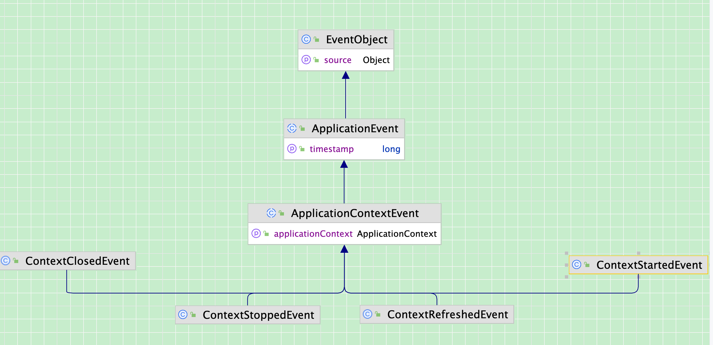
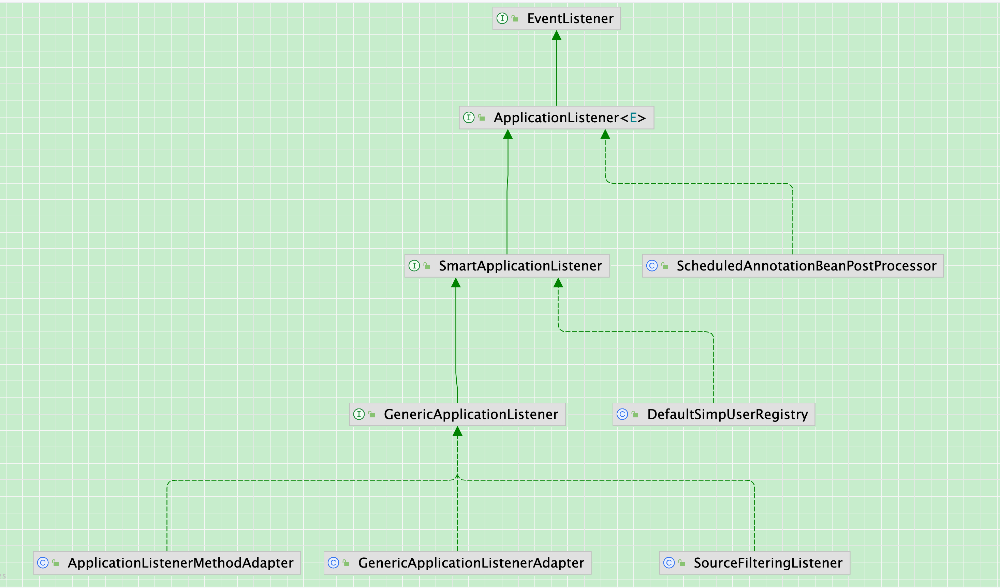
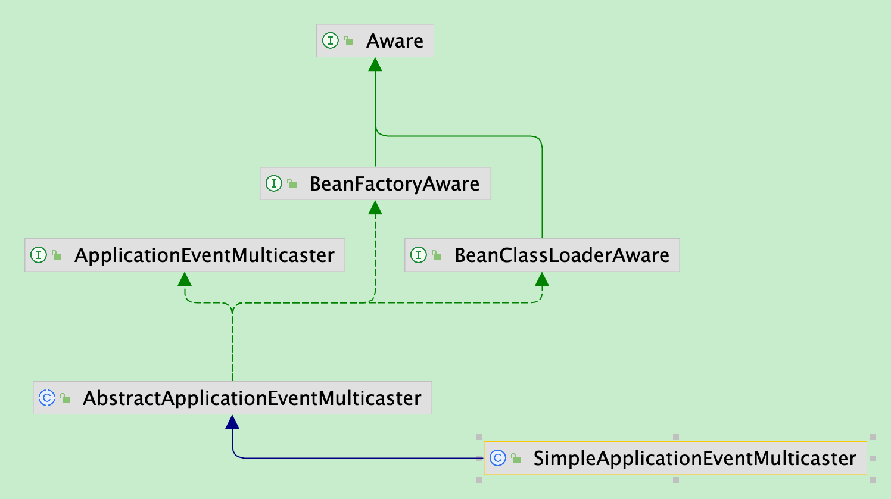

事件的发布和监听是观察者模式，只不过正常的观察者模式是观察者和被观察者。而事件中的观察者模式进一步拆分，分为了四部分，监听事件、监听器、多播器（根据事件类型找到相关的监听起，调用监听器中的方法）、监听源（发布事件，然后多播器调用相关监听器）

#### 1、监听事件



在Spring中，所有事件的源头是`ApplicationEvent`，比如对于ApplicationContext，被ApplicationContextEvent继承，有4个包括ContextClosedEvent、ContextRefreshedEvent、ContextStoppedEvent、ContextStartedEvent在内的事件，记录上下文

##### ApplicationEvent

```Java
package org.springframework.context;

import java.time.Clock;
import java.util.EventObject;

// 所有Application事件的源头，作为一个抽象类，不作为具体事件发布，作用是被子类实现
public abstract class ApplicationEvent extends EventObject {

    private static final long serialVersionUID = 7099057708183571937L;
		// 事件发生时的时间戳
    private final long timestamp;

    public ApplicationEvent(Object source) {
       super(source);
       this.timestamp = System.currentTimeMillis();
    }

    public ApplicationEvent(Object source, Clock clock) {
       super(source);
       this.timestamp = clock.millis();
    }

    public final long getTimestamp() {
       return this.timestamp;
    }

}
```

#### 2、监听器



监听器的源头类是ApplicationListener，具体的实现下面的接口和类，其他待研究的有ScheduledAnnotationBeanPostProcessor、DefaultSimpUserRegistry

GenericApplicationListener的实现类有ApplicationListenerMethodAdapter、SourceFilteringListener、GenericApplicationListenerAdapter，

在Spring中做了处理，具体判断监听器是否符合监听这个事件的条件，要实现GenericApplicationListener接口，如果自定义的监听器是直接实现ApplicationListener，在Spring中的容器中，会通过GenericApplicationListenerAdapter这个类来处理，把ApplicationListener对象转换成GenericApplicationListenerAdapter对象，再通过GenericApplicationListenerAdapter里supportsEventType和supportsSourceType方法进行判断

在GenericApplicationListenerAdapter对象中，最重要的方法是实现的GenericApplicationListener接口的supportsEventType方法，其次是实现的SmartApplicationListener接口的default默认方法-supportsSourceType方法，这2个方法都是用来判断指定事件是否符合监听事件的条件

a) 在supportsEventType方法，判断给定的对象是否实现了GenericApplicationListener接口，有就调用实现GenericApplicationListener接口的具体supportsEventType方法（传参是ResolvableType对象）；没有实现GenericApplicationListener接口，就判断是否实现了SmartApplicationListener接口，有就调用实现的supportsEventType方法（传参是Class对象）；如果指定对象这2个接口都没有实现，就判断本对象的declaredEventType是否是制定对象的eventType的子类，是则满足监听条件

b) 在supportsSourceType方法，判断sourceType是否是SmartApplicationListener的实现类，不是或者调用supportsSourceType方法返回true，都表示支持指定sourceType

##### ApplicationListener

```Java
package org.springframework.context;

import java.util.EventListener;
import java.util.function.Consumer;


@FunctionalInterface
public interface ApplicationListener<E extends ApplicationEvent> extends EventListener {

		// 处理事件
    void onApplicationEvent(E event);

    static <T> ApplicationListener<PayloadApplicationEvent<T>> forPayload(Consumer<T> consumer) {
       return event -> consumer.accept(event.getPayload());
    }

}
```

##### SmartApplicationListener

```Java
package org.springframework.context.event;

import org.springframework.context.ApplicationEvent;
import org.springframework.context.ApplicationListener;
import org.springframework.core.Ordered;
import org.springframework.lang.Nullable;

public interface SmartApplicationListener extends ApplicationListener<ApplicationEvent>, Ordered {

   	// 确认this监听器是否支持给定的事件类型
    boolean supportsEventType(Class<? extends ApplicationEvent> eventType);

    // 确认this监听器是否支持给定sourceType数据类型
    default boolean supportsSourceType(@Nullable Class<?> sourceType) {
       return true;
    }

		// 默认方法，支持排序
    @Override
    default int getOrder() {
       return LOWEST_PRECEDENCE;
    }

    default String getListenerId() {
       return "";
    }

}
```

##### GenericApplicationListener

```Java
package org.springframework.context.event;

import org.springframework.context.ApplicationEvent;
import org.springframework.context.ApplicationListener;
import org.springframework.core.ResolvableType;

public interface GenericApplicationListener extends SmartApplicationListener {


    @Override
    default boolean supportsEventType(Class<? extends ApplicationEvent> eventType) {
       return supportsEventType(ResolvableType.forClass(eventType));
    }
		
    // 确定this 监听器是否实际支持给定的事件类型。
    boolean supportsEventType(ResolvableType eventType);

}
```

##### GenericApplicationListenerAdapter

```Java
package org.springframework.context.event;

import java.util.Map;

import org.springframework.aop.support.AopUtils;
import org.springframework.context.ApplicationEvent;
import org.springframework.context.ApplicationListener;
import org.springframework.core.Ordered;
import org.springframework.core.ResolvableType;
import org.springframework.lang.Nullable;
import org.springframework.util.Assert;
import org.springframework.util.ConcurrentReferenceHashMap;

public class GenericApplicationListenerAdapter implements GenericApplicationListener {

    private static final Map<Class<?>, ResolvableType> eventTypeCache = new ConcurrentReferenceHashMap<>();


    private final ApplicationListener<ApplicationEvent> delegate;

    @Nullable
    private final ResolvableType declaredEventType;

    @SuppressWarnings("unchecked")
    public GenericApplicationListenerAdapter(ApplicationListener<?> delegate) {
       Assert.notNull(delegate, "Delegate listener must not be null");
       this.delegate = (ApplicationListener<ApplicationEvent>) delegate;
       this.declaredEventType = resolveDeclaredEventType(this.delegate);
    }


    @Override
    public void onApplicationEvent(ApplicationEvent event) {
       this.delegate.onApplicationEvent(event);
    }

    @Override
    @SuppressWarnings("unchecked")
    public boolean supportsEventType(ResolvableType eventType) {
       if (this.delegate instanceof GenericApplicationListener) {
          return ((GenericApplicationListener) this.delegate).supportsEventType(eventType);
       }
       else if (this.delegate instanceof SmartApplicationListener) {
          Class<? extends ApplicationEvent> eventClass = (Class<? extends ApplicationEvent>) eventType.resolve();
          return (eventClass != null && ((SmartApplicationListener) this.delegate).supportsEventType(eventClass));
       }
       else {
          return (this.declaredEventType == null || this.declaredEventType.isAssignableFrom(eventType));
       }
    }

    @Override
    public boolean supportsSourceType(@Nullable Class<?> sourceType) {
       return !(this.delegate instanceof SmartApplicationListener) ||
             ((SmartApplicationListener) this.delegate).supportsSourceType(sourceType);
    }

    @Override
    public int getOrder() {
       return (this.delegate instanceof Ordered ? ((Ordered) this.delegate).getOrder() : Ordered.LOWEST_PRECEDENCE);
    }

    @Override
    public String getListenerId() {
       return (this.delegate instanceof SmartApplicationListener ?
             ((SmartApplicationListener) this.delegate).getListenerId() : "");
    }


    @Nullable
    private static ResolvableType resolveDeclaredEventType(ApplicationListener<ApplicationEvent> listener) {
       ResolvableType declaredEventType = resolveDeclaredEventType(listener.getClass());
       if (declaredEventType == null || declaredEventType.isAssignableFrom(ApplicationEvent.class)) {
          Class<?> targetClass = AopUtils.getTargetClass(listener);
          if (targetClass != listener.getClass()) {
             declaredEventType = resolveDeclaredEventType(targetClass);
          }
       }
       return declaredEventType;
    }

    @Nullable
    static ResolvableType resolveDeclaredEventType(Class<?> listenerType) {
       ResolvableType eventType = eventTypeCache.get(listenerType);
       if (eventType == null) {
          eventType = ResolvableType.forClass(listenerType).as(ApplicationListener.class).getGeneric();
          eventTypeCache.put(listenerType, eventType);
       }
       return (eventType != ResolvableType.NONE ? eventType : null);
    }

}
```

#### 3、多播器



多播器的作用，是根据指定的事件类型，找到所有符合条件的监听器，然后执行监听器的`onApplicationEvent`方法

最重要的，则是`multicastEvent`方法，如何找到所有符合条件的监听器，则是在`AbstractApplicationEventMulticaster`类的`getApplicationListeners`方法中实现

##### ApplicationEventMulticaster

```Java
package org.springframework.context.event;

import java.util.function.Predicate;

import org.springframework.context.ApplicationEvent;
import org.springframework.context.ApplicationListener;
import org.springframework.core.ResolvableType;
import org.springframework.lang.Nullable;

public interface ApplicationEventMulticaster {

    void addApplicationListener(ApplicationListener<?> listener);

    void addApplicationListenerBean(String listenerBeanName);

    void removeApplicationListener(ApplicationListener<?> listener);

    void removeApplicationListenerBean(String listenerBeanName);

    void removeApplicationListeners(Predicate<ApplicationListener<?>> predicate);

    void removeApplicationListenerBeans(Predicate<String> predicate);

    void removeAllListeners();
		
    void multicastEvent(ApplicationEvent event);

    void multicastEvent(ApplicationEvent event, @Nullable ResolvableType eventType);

}
```

##### AbstractApplicationEventMulticaster（删减版）

##### 内部类DefaultListenerRetriever、CachedListenerRetriever、CachedListenerRetriever

```Java
package org.springframework.context.event;

import java.util.ArrayList;
import java.util.Collection;
import java.util.LinkedHashSet;
import java.util.List;
import java.util.Map;
import java.util.Set;
import java.util.concurrent.ConcurrentHashMap;
import java.util.function.Predicate;

import org.springframework.aop.framework.AopProxyUtils;
import org.springframework.beans.factory.BeanClassLoaderAware;
import org.springframework.beans.factory.BeanFactory;
import org.springframework.beans.factory.BeanFactoryAware;
import org.springframework.beans.factory.NoSuchBeanDefinitionException;
import org.springframework.beans.factory.config.BeanDefinition;
import org.springframework.beans.factory.config.ConfigurableBeanFactory;
import org.springframework.context.ApplicationEvent;
import org.springframework.context.ApplicationListener;
import org.springframework.core.ResolvableType;
import org.springframework.core.annotation.AnnotationAwareOrderComparator;
import org.springframework.lang.Nullable;
import org.springframework.util.Assert;
import org.springframework.util.ClassUtils;
import org.springframework.util.ObjectUtils;

public abstract class AbstractApplicationEventMulticaster
       implements ApplicationEventMulticaster, BeanClassLoaderAware, BeanFactoryAware {

    private final DefaultListenerRetriever defaultRetriever = new DefaultListenerRetriever();

    final Map<ListenerCacheKey, CachedListenerRetriever> retrieverCache = new ConcurrentHashMap<>(64);

    @Nullable
    private ClassLoader beanClassLoader;

    @Nullable
    private ConfigurableBeanFactory beanFactory;


    @Override
    public void addApplicationListener(ApplicationListener<?> listener) {
       synchronized (this.defaultRetriever) {
					// 防止存在代理，调用2次
          Object singletonTarget = AopProxyUtils.getSingletonTarget(listener);
          if (singletonTarget instanceof ApplicationListener) {
             this.defaultRetriever.applicationListeners.remove(singletonTarget);
          }
          this.defaultRetriever.applicationListeners.add(listener);
          this.retrieverCache.clear();
       }
    }

    @Override
    public void addApplicationListenerBean(String listenerBeanName) {
       synchronized (this.defaultRetriever) {
          this.defaultRetriever.applicationListenerBeans.add(listenerBeanName);
          this.retrieverCache.clear();
       }
    }

    @Override
    public void removeApplicationListener(ApplicationListener<?> listener) {
       synchronized (this.defaultRetriever) {
          this.defaultRetriever.applicationListeners.remove(listener);
          this.retrieverCache.clear();
       }
    }

    @Override
    public void removeApplicationListenerBean(String listenerBeanName) {
       synchronized (this.defaultRetriever) {
          this.defaultRetriever.applicationListenerBeans.remove(listenerBeanName);
          this.retrieverCache.clear();
       }
    }

    @Override
    public void removeApplicationListeners(Predicate<ApplicationListener<?>> predicate) {
       synchronized (this.defaultRetriever) {
          this.defaultRetriever.applicationListeners.removeIf(predicate);
          this.retrieverCache.clear();
       }
    }

    @Override
    public void removeApplicationListenerBeans(Predicate<String> predicate) {
       synchronized (this.defaultRetriever) {
          this.defaultRetriever.applicationListenerBeans.removeIf(predicate);
          this.retrieverCache.clear();
       }
    }

    @Override
    public void removeAllListeners() {
       synchronized (this.defaultRetriever) {
          this.defaultRetriever.applicationListeners.clear();
          this.defaultRetriever.applicationListenerBeans.clear();
          this.retrieverCache.clear();
       }
    }

    protected Collection<ApplicationListener<?>> getApplicationListeners() {
       synchronized (this.defaultRetriever) {
          return this.defaultRetriever.getApplicationListeners();
       }
    }

    protected Collection<ApplicationListener<?>> getApplicationListeners(
          ApplicationEvent event, ResolvableType eventType) {

       Object source = event.getSource();
       Class<?> sourceType = (source != null ? source.getClass() : null);
       ListenerCacheKey cacheKey = new ListenerCacheKey(eventType, sourceType);

       CachedListenerRetriever newRetriever = null;

       CachedListenerRetriever existingRetriever = this.retrieverCache.get(cacheKey);
       if (existingRetriever == null) {
          if (this.beanClassLoader == null ||
                (ClassUtils.isCacheSafe(event.getClass(), this.beanClassLoader) &&
                      (sourceType == null || ClassUtils.isCacheSafe(sourceType, this.beanClassLoader)))) {
             newRetriever = new CachedListenerRetriever();
             existingRetriever = this.retrieverCache.putIfAbsent(cacheKey, newRetriever);
             if (existingRetriever != null) {
                newRetriever = null;  // no need to populate it in retrieveApplicationListeners
             }
          }
       }

       if (existingRetriever != null) {
          Collection<ApplicationListener<?>> result = existingRetriever.getApplicationListeners();
          if (result != null) {
             return result;
          }
          // If result is null, the existing retriever is not fully populated yet by another thread.
          // Proceed like caching wasn't possible for this current local attempt.
       }

       return retrieveApplicationListeners(eventType, sourceType, newRetriever);
    }

    private Collection<ApplicationListener<?>> retrieveApplicationListeners(
          ResolvableType eventType, @Nullable Class<?> sourceType, @Nullable CachedListenerRetriever retriever) {

       List<ApplicationListener<?>> allListeners = new ArrayList<>();
       Set<ApplicationListener<?>> filteredListeners = (retriever != null ? new LinkedHashSet<>() : null);
       Set<String> filteredListenerBeans = (retriever != null ? new LinkedHashSet<>() : null);

       Set<ApplicationListener<?>> listeners;
       Set<String> listenerBeans;
       synchronized (this.defaultRetriever) {
          listeners = new LinkedHashSet<>(this.defaultRetriever.applicationListeners);
          listenerBeans = new LinkedHashSet<>(this.defaultRetriever.applicationListenerBeans);
       }

       // Add programmatically registered listeners, including ones coming
       // from ApplicationListenerDetector (singleton beans and inner beans).
       for (ApplicationListener<?> listener : listeners) {
          if (supportsEvent(listener, eventType, sourceType)) {
             if (retriever != null) {
                filteredListeners.add(listener);
             }
             allListeners.add(listener);
          }
       }

       // Add listeners by bean name, potentially overlapping with programmatically
       // registered listeners above - but here potentially with additional metadata.
       if (!listenerBeans.isEmpty()) {
          ConfigurableBeanFactory beanFactory = getBeanFactory();
          for (String listenerBeanName : listenerBeans) {
             try {
                if (supportsEvent(beanFactory, listenerBeanName, eventType)) {
                   ApplicationListener<?> listener =
                         beanFactory.getBean(listenerBeanName, ApplicationListener.class);
                   if (!allListeners.contains(listener) && supportsEvent(listener, eventType, sourceType)) {
                      if (retriever != null) {
                         if (beanFactory.isSingleton(listenerBeanName)) {
                            filteredListeners.add(listener);
                         }
                         else {
                            filteredListenerBeans.add(listenerBeanName);
                         }
                      }
                      allListeners.add(listener);
                   }
                }
                else {
                   // Remove non-matching listeners that originally came from
                   // ApplicationListenerDetector, possibly ruled out by additional
                   // BeanDefinition metadata (e.g. factory method generics) above.
                   Object listener = beanFactory.getSingleton(listenerBeanName);
                   if (retriever != null) {
                      filteredListeners.remove(listener);
                   }
                   allListeners.remove(listener);
                }
             }
             catch (NoSuchBeanDefinitionException ex) {
                // Singleton listener instance (without backing bean definition) disappeared -
                // probably in the middle of the destruction phase
             }
          }
       }

       AnnotationAwareOrderComparator.sort(allListeners);
       if (retriever != null) {
          if (filteredListenerBeans.isEmpty()) {
             retriever.applicationListeners = new LinkedHashSet<>(allListeners);
             retriever.applicationListenerBeans = filteredListenerBeans;
          }
          else {
             retriever.applicationListeners = filteredListeners;
             retriever.applicationListenerBeans = filteredListenerBeans;
          }
       }
       return allListeners;
    }

    private boolean supportsEvent(
          ConfigurableBeanFactory beanFactory, String listenerBeanName, ResolvableType eventType) {

       Class<?> listenerType = beanFactory.getType(listenerBeanName);
       if (listenerType == null || GenericApplicationListener.class.isAssignableFrom(listenerType) ||
             SmartApplicationListener.class.isAssignableFrom(listenerType)) {
          return true;
       }
       if (!supportsEvent(listenerType, eventType)) {
          return false;
       }
       try {
          BeanDefinition bd = beanFactory.getMergedBeanDefinition(listenerBeanName);
          ResolvableType genericEventType = bd.getResolvableType().as(ApplicationListener.class).getGeneric();
          return (genericEventType == ResolvableType.NONE || genericEventType.isAssignableFrom(eventType));
       }
       catch (NoSuchBeanDefinitionException ex) {
          // Ignore - no need to check resolvable type for manually registered singleton
          return true;
       }
    }

    protected boolean supportsEvent(Class<?> listenerType, ResolvableType eventType) {
       ResolvableType declaredEventType = GenericApplicationListenerAdapter.resolveDeclaredEventType(listenerType);
       return (declaredEventType == null || declaredEventType.isAssignableFrom(eventType));
    }

    protected boolean supportsEvent(
          ApplicationListener<?> listener, ResolvableType eventType, @Nullable Class<?> sourceType) {

       GenericApplicationListener smartListener = (listener instanceof GenericApplicationListener ?
             (GenericApplicationListener) listener : new GenericApplicationListenerAdapter(listener));
       return (smartListener.supportsEventType(eventType) && smartListener.supportsSourceType(sourceType));
    }

    private static final class ListenerCacheKey implements Comparable<ListenerCacheKey> {

       private final ResolvableType eventType;

       @Nullable
       private final Class<?> sourceType;

       public ListenerCacheKey(ResolvableType eventType, @Nullable Class<?> sourceType) {
          Assert.notNull(eventType, "Event type must not be null");
          this.eventType = eventType;
          this.sourceType = sourceType;
       }

       @Override
       public boolean equals(@Nullable Object other) {
          if (this == other) {
             return true;
          }
          if (!(other instanceof ListenerCacheKey)) {
             return false;
          }
          ListenerCacheKey otherKey = (ListenerCacheKey) other;
          return (this.eventType.equals(otherKey.eventType) &&
                ObjectUtils.nullSafeEquals(this.sourceType, otherKey.sourceType));
       }

       @Override
       public int hashCode() {
          return this.eventType.hashCode() * 29 + ObjectUtils.nullSafeHashCode(this.sourceType);
       }

       @Override
       public String toString() {
          return "ListenerCacheKey [eventType = " + this.eventType + ", sourceType = " + this.sourceType + "]";
       }

       @Override
       public int compareTo(ListenerCacheKey other) {
          int result = this.eventType.toString().compareTo(other.eventType.toString());
          if (result == 0) {
             if (this.sourceType == null) {
                return (other.sourceType == null ? 0 : -1);
             }
             if (other.sourceType == null) {
                return 1;
             }
             result = this.sourceType.getName().compareTo(other.sourceType.getName());
          }
          return result;
       }
    }

    private class CachedListenerRetriever {

       @Nullable
       public volatile Set<ApplicationListener<?>> applicationListeners;

       @Nullable
       public volatile Set<String> applicationListenerBeans;

       @Nullable
       public Collection<ApplicationListener<?>> getApplicationListeners() {
          Set<ApplicationListener<?>> applicationListeners = this.applicationListeners;
          Set<String> applicationListenerBeans = this.applicationListenerBeans;
          if (applicationListeners == null || applicationListenerBeans == null) {
             return null;
          }

          List<ApplicationListener<?>> allListeners = new ArrayList<>(
                applicationListeners.size() + applicationListenerBeans.size());
          allListeners.addAll(applicationListeners);
          if (!applicationListenerBeans.isEmpty()) {
             BeanFactory beanFactory = getBeanFactory();
             for (String listenerBeanName : applicationListenerBeans) {
                try {
                   allListeners.add(beanFactory.getBean(listenerBeanName, ApplicationListener.class));
                }
                catch (NoSuchBeanDefinitionException ex) {
                   // Singleton listener instance (without backing bean definition) disappeared -
                   // probably in the middle of the destruction phase
                }
             }
          }
          if (!applicationListenerBeans.isEmpty()) {
             AnnotationAwareOrderComparator.sort(allListeners);
          }
          return allListeners;
       }
    }


    private class DefaultListenerRetriever {

       public final Set<ApplicationListener<?>> applicationListeners = new LinkedHashSet<>();

       public final Set<String> applicationListenerBeans = new LinkedHashSet<>();

       public Collection<ApplicationListener<?>> getApplicationListeners() {
          List<ApplicationListener<?>> allListeners = new ArrayList<>(
                this.applicationListeners.size() + this.applicationListenerBeans.size());
          allListeners.addAll(this.applicationListeners);
          if (!this.applicationListenerBeans.isEmpty()) {
             BeanFactory beanFactory = getBeanFactory();
             for (String listenerBeanName : this.applicationListenerBeans) {
                try {
                   ApplicationListener<?> listener =
                         beanFactory.getBean(listenerBeanName, ApplicationListener.class);
                   if (!allListeners.contains(listener)) {
                      allListeners.add(listener);
                   }
                }
                catch (NoSuchBeanDefinitionException ex) {
                   // Singleton listener instance (without backing bean definition) disappeared -
                   // probably in the middle of the destruction phase
                }
             }
          }
          AnnotationAwareOrderComparator.sort(allListeners);
          return allListeners;
       }
    }

}
```

#### 4、事件源

##### ApplicationEventPublisher

```Java
package org.springframework.context;

@FunctionalInterface
public interface ApplicationEventPublisher {

    default void publishEvent(ApplicationEvent event) {
       publishEvent((Object) event);
    }

    void publishEvent(Object event);

}
```

##### AbstractApplicationContext中实现的方法

被`AbstractApplicationContext`实现

```Java
// AbstractApplicationContext
@Override
public void publishEvent(ApplicationEvent event) {
    publishEvent(event, null);
}

@Override
public void publishEvent(Object event) {
    publishEvent(event, null);
}

// 具体发布事件，调用启动时新建的ApplicationContext的多播器，广播所有符合条件的监听器
protected void publishEvent(Object event, @Nullable ResolvableType eventType) {
  Assert.notNull(event, "Event must not be null");

  ApplicationEvent applicationEvent;
  if (event instanceof ApplicationEvent) {
    applicationEvent = (ApplicationEvent) event;
  }
  else {
    applicationEvent = new PayloadApplicationEvent<>(this, event);
    if (eventType == null) {
      eventType = ((PayloadApplicationEvent<?>) applicationEvent).getResolvableType();
    }
  }

// 具体多播操作
  if (this.earlyApplicationEvents != null) {
    this.earlyApplicationEvents.add(applicationEvent);
  }
  else {
    getApplicationEventMulticaster().multicastEvent(applicationEvent, eventType);
  }

// 父子容器
  if (this.parent != null) {
    if (this.parent instanceof AbstractApplicationContext) {
      ((AbstractApplicationContext) this.parent).publishEvent(event, eventType);
    }
    else {
      this.parent.publishEvent(event);
    }
  }
}
```

#### 5、怎么使用事件驱动

自定义一个事件和对应的监听器，最方便的方法的是直接使用`Spring`的事件驱动，通过`ApplicationContextAware`接口获取到`ApplicationContext`，然后调用`pulishEvent`方法使用，自定义监听器需要加入到容器内

当前`Spring`的监听执行流程是，<font color="red">事件源</font>：`ApplicationContext`对象实现了ApplicationEventPublisher接口，调用`pulishEvent`方法 ->  <font color="red">多播器</font>：`publishEvent`方法获取到`ApplicationContext`对象中的多播器，这个多播器在启动时初始化，然后调用多播器对象中的`multicastEvent`方法 -> 在注册到多播器内的所有监听器，通过`getApplicationListeners`方法找出所有支持指定事件的监听器  -> <font color="red">监听器</font>：执行实现的`onApplicationEvent`方法

6、Spring在哪些地方使用到了事件驱动
