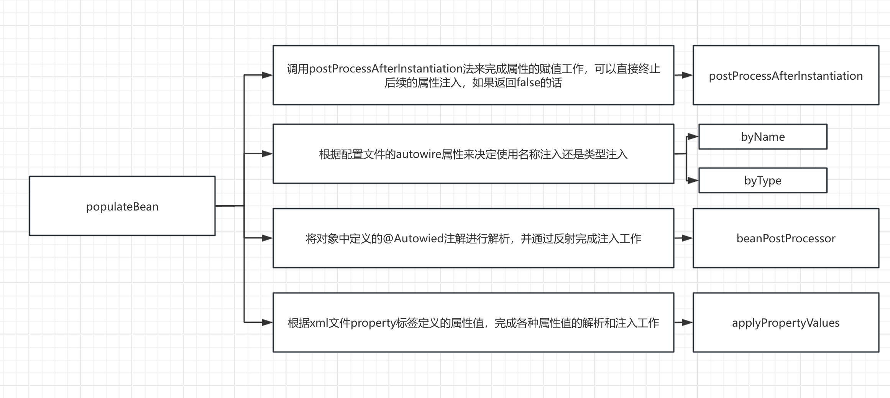

## Spring启动流程

### 1、构造一个ApplicationContext

```Java
ApplicationContext context = new ClassPathXmlApplicationContext("beans.xml");
```

```Java
// 新建一个ClassPathXmlApplicationContext，加载给的xml文件(configLocation)中的定义，并且自动刷新context
public ClassPathXmlApplicationContext(String configLocation) throws BeansException {
    this(new String[] {configLocation}, true, null);
}
```

```Java
// 加载所有 Bean 定义并创建所有单例,或者在进一步配置context后，手动调用刷新
public ClassPathXmlApplicationContext(
       String[] configLocations, boolean refresh, @Nullable ApplicationContext parent)
       throws BeansException {

    super(parent);
    setConfigLocations(configLocations);
    if (refresh) {
       refresh();
    }
}
```

#### 1-1) `super`方法

```Java
public abstract class AbstractApplicationContext extends DefaultResourceLoader
		implements ConfigurableApplicationContext {
  
  // 在调用构造方法时，同时新建一个对象
  private ResourcePatternResolver resourcePatternResolver;
  // 父context
  @Nullable
	private ApplicationContext parent;
  
  // 不断寻找父类，直至AbstractApplicationContext类
  public AbstractApplicationContext(@Nullable ApplicationContext parent) {
      this();
      setParent(parent);
  }
  // this方法，新建一个资源解析器
  public AbstractApplicationContext() {
  		this.resourcePatternResolver = getResourcePatternResolver();
	}
  
  @Override
	public void setParent(@Nullable ApplicationContext parent) {
		this.parent = parent;
		if (parent != null) {
			Environment parentEnvironment = parent.getEnvironment();
			if (parentEnvironment instanceof ConfigurableEnvironment) {
				getEnvironment().merge((ConfigurableEnvironment) parentEnvironment);
			}
		}
	}
  
}
```


#### 1-2) `setConfigLocations`方法

```Java
// public abstract class AbstractRefreshableConfigApplicationContext 
public void setConfigLocations(@Nullable String... locations) {
    if (locations != null) {
       Assert.noNullElements(locations, "Config locations must not be null");
       this.configLocations = new String[locations.length];
       for (int i = 0; i < locations.length; i++) {
          this.configLocations[i] = resolvePath(locations[i]).trim();
       }
    }
    else {
       this.configLocations = null;
    }
  
}
```

在`resolvePath`方法中，先创建一个`StandardEnvironment`对象，再根据环境对象属性，替换掉xml文件中的占位符，例如spring-${username}.xml格式，如果在环境中找不到username这个变量，会报错`IllegalArgumentException`，提示例如：`Could not resolve placeholder 'username' in value "spring-${username}.xml"`

创建`StandardEnvironment`对象

```Java
public abstract class AbstractApplicationContext extends DefaultResourceLoader
       implements ConfigurableApplicationContext {
  
  	// 相当于 ConfigurableEnvironment environment = new StandardEnvironment();
  	@Override
		public ConfigurableEnvironment getEnvironment() {
			if (this.environment == null) {
				this.environment = createEnvironment();
			}
			return this.environment;
		}
  
  	protected ConfigurableEnvironment createEnvironment() {
			return new StandardEnvironment();
		} 
}
```

```Java
protected AbstractEnvironment(MutablePropertySources propertySources) {
    this.propertySources = propertySources;
    this.propertyResolver = createPropertyResolver(propertySources);
    customizePropertySources(propertySources);
}

// 子类StandardEnvironment重写父类的方法
/** System environment property source name: {@value}. */
public static final String SYSTEM_ENVIRONMENT_PROPERTY_SOURCE_NAME = "systemEnvironment";

/** JVM system properties property source name: {@value}. */
public static final String SYSTEM_PROPERTIES_PROPERTY_SOURCE_NAME = "systemProperties";
@Override
protected void customizePropertySources(MutablePropertySources propertySources) {
  propertySources.addLast(
      new PropertiesPropertySource(SYSTEM_PROPERTIES_PROPERTY_SOURCE_NAME, getSystemProperties()));
  propertySources.addLast(
      new SystemEnvironmentPropertySource(SYSTEM_ENVIRONMENT_PROPERTY_SOURCE_NAME, getSystemEnvironment()));
}

// MutablePropertySources
private final List<PropertySource<?>> propertySourceList = new CopyOnWriteArrayList<>();
```

需要注意的是，在新建一个`StandardEnvironment`对象时，会先隐式调用父类`AbstractEnvironment`类的构造方法，然后凭借Java的多态性，调用子类`StandardEnvironment`重写的`customizePropertySources`方法

还有一个可以直接借鉴的点是，Spring的代码具有很好的扩展性，例如刚刚提到的处理xml文件中的占位符方法，在调用`AbstractEnvironment`类的构造方法时，会同时创建一个`PropertySourcesPropertyResolver`对象，如下代码，处理占位符替换

```Java
// 在AbstractEnvironment类中定义的ConfigurablePropertyResolver解析器对象
ConfigurablePropertyResolver resolver = new PropertySourcesPropertyResolver(propertySources);
```

即，`AbstractEnvironment`和`PropertySourcesPropertyResolver`类都重写了`PropertyResolver`接口的`resolveRequiredPlaceholders`方法，但`AbstractEnvironment`类中压根就没有这个替换方法的具体实现，在`AbstractEnvironment`中的这个重写方法，只是调用刚刚说的新创建的`ConfigurablePropertyResolver`对象的`resolveRequiredPlaceholders`方法来进行具体解析

注意：方法的具体实现在`PropertySourcesProperty`的父类`ResolverAbstractPropertyResolver`中实现


```Java
// 刚刚说的具体实现在Spring中是通过递归来处理
protected String parseStringValue(
			String value, PlaceholderResolver placeholderResolver, @Nullable Set<String> visitedPlaceholders) {...}
// TODO 有时间的话可以研究一下Spring的递归写法
```


### 2、`refresh`方法里的`prepareRefresh`方法（刷新前的准备工作）

刷新前的准备工作

1.  设置容器的启动时间
2.  设置活跃状态为true
3.  设置关闭状态为false
4.  获取Environment对象，并加载当前系统的属性值到Environment对象中
5.  准备监听器和事件的集合对象，默认为空的集合

```Java
/** Flag that indicates whether this context is currently active. */
private final AtomicBoolean active = new AtomicBoolean();

/** Flag that indicates whether this context has been closed already. */
private final AtomicBoolean closed = new AtomicBoolean();

/** Statically specified listeners. */
private final Set<ApplicationListener<?>> applicationListeners = new LinkedHashSet<>();

/** Local listeners registered before refresh. */
@Nullable
private Set<ApplicationListener<?>> earlyApplicationListeners;

/** ApplicationEvents published before the multicaster setup. */
@Nullable
private Set<ApplicationEvent> earlyApplicationEvents;

protected void prepareRefresh() {
  	// 设置容器的启动时间
    this.startupDate = System.currentTimeMillis();
  	// 活跃状态和关闭状态
    this.closed.set(false);
    this.active.set(true);
  
    // 初始化context环境的任何占位符属性资源，留给子类重写的方法
  	/* 
  	* @see org.springframework.core.env.PropertySource.StubPropertySource
	 	* @see org.springframework.web.context.support.WebApplicationContextUtils#initServletPropertySources
	 	*/
    initPropertySources();

    // 校验所有必须的属性是否可解析
    // see ConfigurablePropertyResolver#setRequiredProperties
    getEnvironment().validateRequiredProperties();

    // Store pre-refresh ApplicationListeners...
    if (this.earlyApplicationListeners == null) {
       this.earlyApplicationListeners = new LinkedHashSet<>(this.applicationListeners);
    }
    else {
       // Reset local application listeners to pre-refresh state.
       this.applicationListeners.clear();
       this.applicationListeners.addAll(this.earlyApplicationListeners);
    }

    // Allow for the collection of early ApplicationEvents,
    // to be published once the multicaster is available...
    this.earlyApplicationEvents = new LinkedHashSet<>();
}
```

刚刚说的留给子类重写的方法`initPropertySources`

```Java
public class MyClassPathXmlApplicationContext extends ClassPathXmlApplicationContext {

    public MyClassPathXmlApplicationContext(String... configLocations) throws BeansException {
        super(configLocations);
    }

    @Override
    protected void initPropertySources() {
        System.out.println("initPropertySources");
        getEnvironment().setRequiredProperties("username");
    }
}
```


### 3、`refresh`方法中的`obtainFreshBeanFactory`方法（加载xml文件到BeanFactory中）

```Java 
ConfigurableListableBeanFactory beanFactory = obtainFreshBeanFactory();
```

```Java
// abstract class AbstractApplicationContext extends DefaultResourceLoader
// implements ConfigurableApplicationContext
protected ConfigurableListableBeanFactory obtainFreshBeanFactory() {
    refreshBeanFactory();
    return getBeanFactory();
}
```

```Java
public abstract class AbstractRefreshableApplicationContext extends AbstractApplicationContext {

    @Nullable
    private Boolean allowBeanDefinitionOverriding;

    @Nullable
    private Boolean allowCircularReferences;

    /** Bean factory for this context. */
    @Nullable
    private volatile DefaultListableBeanFactory beanFactory;
  
  	// 确保每次刷新都是新建的BeanFactory
  	@Override
    protected final void refreshBeanFactory() throws BeansException {
      // 如果BeanFactory存在，destory容器内的Bean和关闭BeanFactory
      if (hasBeanFactory()) {
        destroyBeans();
        closeBeanFactory();
      }
      // 新建一个beanFactory、配置beanFactory、加载解析xml文件为BeanDefinition到beanFactory中
      try {
        DefaultListableBeanFactory beanFactory = createBeanFactory();
        // 在新建一个AbstractApplicationContext时自动生成一个id
        beanFactory.setSerializationId(getId());
        // 是否允许覆盖、是否允许循环依赖
        customizeBeanFactory(beanFactory);
        loadBeanDefinitions(beanFactory);
        this.beanFactory = beanFactory;
      }
      catch (IOException ex) {
        throw new ApplicationContextException("I/O error parsing bean definition source for " + getDisplayName(), ex);
      }
    }
}
```


#### 3-1）新建一个`beanFactory`

```Java
// AbstractRefreshableApplicationContext类

@Nullable
private volatile DefaultListableBeanFactory beanFactory;

protected DefaultListableBeanFactory createBeanFactory() {
    return new DefaultListableBeanFactory(getInternalParentBeanFactory());
}
```

`beanFactory`的类型是`DefaultListableBeanFactory`，在new 一个`DefaultListableBeanFactory`对象时，会先调用父类`AbstractAutowireCapableBeanFactory`的构造方法，在构造父类时，会添加部分要忽略依赖的接口

```Java
public AbstractAutowireCapableBeanFactory() {
  super();
  // 忽略要依赖的接口
  ignoreDependencyInterface(BeanNameAware.class);
  ignoreDependencyInterface(BeanFactoryAware.class);
  ignoreDependencyInterface(BeanClassLoaderAware.class);
  if (NativeDetector.inNativeImage()) {
    this.instantiationStrategy = new SimpleInstantiationStrategy();
  }
  else {
    this.instantiationStrategy = new CglibSubclassingInstantiationStrategy();
  }
}
```


```Java
// getInternalParentBeanFactory调用父类AbstractApplicationContext中的方法
// TODO 暂时不知道这个parent有什么用
// private ApplicationContext parent;
protected BeanFactory getInternalParentBeanFactory() {
  return (getParent() instanceof ConfigurableApplicationContext ?
      ((ConfigurableApplicationContext) getParent()).getBeanFactory() : getParent());
}
```

#### 3-2）配置beanFactory

```Java
protected void customizeBeanFactory(DefaultListableBeanFactory beanFactory) {
  	// 允许beanDefinition覆盖
    if (this.allowBeanDefinitionOverriding != null) {
       beanFactory.setAllowBeanDefinitionOverriding(this.allowBeanDefinitionOverriding);
    }
    // 允许互相依赖
    if (this.allowCircularReferences != null) {
       beanFactory.setAllowCircularReferences(this.allowCircularReferences);
    }
}
```

可以重写这个方法，修改这个配置

```Java
@Override
protected void customizeBeanFactory(DefaultListableBeanFactory beanFactory) {
    super.setAllowBeanDefinitionOverriding(false);
    super.setAllowCircularReferences(false);
    super.customizeBeanFactory(beanFactory);
}
```

#### 3-3）加载`bean definition`

​       入口是`loadBeanDefinitions`方法，在`AbstractXmlApplicationContext`类中重写了这个方法，如下3-3-1代码，新建了一个`XmlBeanDefinitionReader`对象，配置好相关属性后，重载这个`loadBeanDefinitions`方法，在这个重载方法中，切换到了`XmlBeanDefinitionReader`对象的`loadBeanDefinitions`方法，如果资源文件是地址，就按照这个路线config location[] -> config location -> resource[] -> resource转换为resource进行进一步加载，最终都是转换为Resource再统一处理。

​	需要注意的是，在新建`ResourceEntityResolver`对象时，此时已经初始化了默认映射文件的地址，META-INF/spring.schemas，这个文件主要用途在于映射XML命名空间（namespace）到对应的XML Schema定义（XSD）文件。具体来说，这个文件帮助Spring解析器理解并验证XML配置文件中的自定义命名空间元素。

```properties
## spring.schemas文件格式
http\://www.example.org/schema/user.xsd=META-INF/user.xsd
## spring.handlers文件格式
http\://www.example.org/schema/user=com.wangxin.selftag.UserNamespaceHandler
```

​	除了META-INF/spring.schemas，还有一个默认映射文件，是命名空间到spring中的处理器的映射，是在3-3-6代码中执行`getNamespaceHandlerResolver()`方法，创建一个这个对象时设置的。

​	解析xml文件具体标签，先更根据spring.handlers文件得到Handler类的类路径，其中Handler类重写了init方法，把具体解析Parser类注册到`NamespaceHandlerSupport`类中的`Map<String, BeanDefinitionParser> parsers`中，解析时会根据相关命名调用BeanDefinitionParser里的doParse 方法

```Java
// 3-3-1 在AbstractXmlApplicationContext类中，通过`XmlBeanDefinitionReader`加载`bean definiton`
@Override
protected void loadBeanDefinitions(DefaultListableBeanFactory beanFactory) throws BeansException, IOException {
    // Create a new XmlBeanDefinitionReader for the given BeanFactory.
    XmlBeanDefinitionReader beanDefinitionReader = new XmlBeanDefinitionReader(beanFactory);

    // Configure the bean definition reader with this context's
    // resource loading environment.
    beanDefinitionReader.setEnvironment(this.getEnvironment());
    beanDefinitionReader.setResourceLoader(this);
  	// DEFAULT_SCHEMA_MAPPINGS_LOCATION = "META-INF/spring.schemas";
    beanDefinitionReader.setEntityResolver(new ResourceEntityResolver(this));

    // Allow a subclass to provide custom initialization of the reader,
    // then proceed with actually loading the bean definitions.
    initBeanDefinitionReader(beanDefinitionReader);
    loadBeanDefinitions(beanDefinitionReader);
}	

// 3-3-2 在AbstractXmlApplicationContext类中，重载3-3-1中的loadBeanDefinitions
protected void loadBeanDefinitions(XmlBeanDefinitionReader reader) throws BeansException, IOException {
  Resource[] configResources = getConfigResources();
  if (configResources != null) {
    reader.loadBeanDefinitions(configResources);
  }
  String[] configLocations = getConfigLocations();
  if (configLocations != null) {
    reader.loadBeanDefinitions(configLocations);
  }
}

// 3-3-3 在`XmlBeanDefinitionReader`类中，处理已经将location转换成resource的资源，将之加载成BeanDefinition
@Override
public int loadBeanDefinitions(Resource resource) throws BeanDefinitionStoreException {
  return loadBeanDefinitions(new EncodedResource(resource));
}

// 3-3-4 此处利用ThreadLocal来控制上下文，控制资源的try-catch写法可以学习
public int loadBeanDefinitions(EncodedResource encodedResource) throws BeanDefinitionStoreException {
		Set<EncodedResource> currentResources = this.resourcesCurrentlyBeingLoaded.get();

		if (!currentResources.add(encodedResource)) {
			throw new BeanDefinitionStoreException(
					"Detected cyclic loading of " + encodedResource + " - check your import definitions!");
		}

		try (InputStream inputStream = encodedResource.getResource().getInputStream()) {
			InputSource inputSource = new InputSource(inputStream);
			if (encodedResource.getEncoding() != null) {
				inputSource.setEncoding(encodedResource.getEncoding());
			}
      // 加载BeanDefinition
			return doLoadBeanDefinitions(inputSource, encodedResource.getResource());
		}
		catch (IOException ex) {
			throw new BeanDefinitionStoreException(
					"IOException parsing XML document from " + encodedResource.getResource(), ex);
		}
		finally {
			currentResources.remove(encodedResource);
			if (currentResources.isEmpty()) {
				this.resourcesCurrentlyBeingLoaded.remove();
			}
		}
}

// 3-3-5 将xml配置文件加载为Document,再把Document以BeanDefiniton的形式加载到BeanFactory
protected int doLoadBeanDefinitions(InputSource inputSource, Resource resource)
    throws BeanDefinitionStoreException {

  try {
    // 在这里把xml配置文件加载为Document，方便进一步解析
    // 此处过于复杂，不做探究
    Document doc = doLoadDocument(inputSource, resource);
    // 把刚刚的Document以BeanDefiniton的形式加载到BeanFactory
    int count = registerBeanDefinitions(doc, resource);
    return count;
  }
  catch (BeanDefinitionStoreException ex) {
    throw ex;
  }
}

// 3-3-6 创建一个BeanDefinitionDocumentReader对象，将Doc转换为BeanDefiniton到BeanFactory
public int registerBeanDefinitions(Document doc, Resource resource) throws BeanDefinitionStoreException {
  // 创建一个DefaultBeanDefinitionDocumentReader对象
  BeanDefinitionDocumentReader documentReader = createBeanDefinitionDocumentReader();
  // beanDefinitionMap.size();
  // 这个countBefore是DefaultListableBeanFactory的beanDefinitionMap的size
  int countBefore = getRegistry().getBeanDefinitionCount();
  // 在这一步注册BeanDefinition到BeanFactory中
  // 这个createReadContext方法具体是 new XmlReaderContext(resource, this.problemReporter, this.eventListener, this.sourceExtractor, this, getNamespaceHandlerResolver());
  // 在getNamespaceHandlerResolver()方法中新建了一个这个对象，其中配置了处理器映射文件的默认位置为META-INF/spring.handlers
  documentReader.registerBeanDefinitions(doc, createReaderContext(resource));
  return getRegistry().getBeanDefinitionCount() - countBefore;
}

// 3-3-7 
@Override
public void registerBeanDefinitions(Document doc, XmlReaderContext readerContext) {
  this.readerContext = readerContext;
  doRegisterBeanDefinitions(doc.getDocumentElement());
}

@SuppressWarnings("deprecation")  
protected void doRegisterBeanDefinitions(Element root) {
  BeanDefinitionParserDelegate parent = this.delegate;
  this.delegate = createDelegate(getReaderContext(), root, parent);

  preProcessXml(root);
  // 解析BeanDefinition
  parseBeanDefinitions(root, this.delegate);
  postProcessXml(root);

  this.delegate = parent;
}

// 区分，识别默认标签和自定义标签
protected void parseBeanDefinitions(Element root, BeanDefinitionParserDelegate delegate) {
  if (delegate.isDefaultNamespace(root)) {
    NodeList nl = root.getChildNodes();
    for (int i = 0; i < nl.getLength(); i++) {
      Node node = nl.item(i);
      if (node instanceof Element) {
        Element ele = (Element) node;
        if (delegate.isDefaultNamespace(ele)) {
          // 默认标签分为四类：import、alias、beans、bean
          parseDefaultElement(ele, delegate);
        }
        else {
          // 自定义标签
          delegate.parseCustomElement(ele);
        }
      }
    }
  }
  else {
    // 自定义标签解析
    delegate.parseCustomElement(root);
  }
}

// 最终，将beanDefiniton放入DefaultListableBeanFactory中
this.beanDefinitionMap.put(beanName, beanDefinition);
this.beanDefinitionNames.add(beanName);
```

`XmlBeanDefinitionReader`的继承关系


```Java
// context
context.resourcePatternResolver = new PathMatchingResourcePatternResolver(this);
resourcePatternResolver.resourceLoader = 当前classPathXmlApplicationContext对象
resourcePatternResolver.pathMatcher = new AntPathMatcher()
// xmlBeanDefinitionReader
xmlBeanDefinitionReader.registry = defaultListableBeanFactory;
xmlBeanDefinitionReader.resourceLoader = 当前classPathXmlApplicationContext对象
xmlBeanDefinitionReader.environment = 当前standardEnviroment对象
xmlBeanDefinitionReader.validationMode = XmlValidationModeDetector.VALIDATION_AUTO; // 等于1
xmlBeanDefinitionReader.namespaceAware = false;
xmlBeanDefinitionReader.entityResolver = new ResourceEntityResolver(this);
// entityResolver
// 在entityResolver new对象中，this就是当前classPathXmlApplicationContext对象
// classLoader是classPathXmlApplicationContext的classLoader
// ResourceEntityResolver的父类是DelegatingEntityResolver
entityResolver.resourceLoader = 当前classPathXmlApplicationContext对象;
entityResolver.dtdResolver = new BeansDtdResolver();
entityResolver.schemaResolver = new PluggableSchemaResolver(classLoader);
// schemaResolver
schemaResolver.classLoader = classPathXmlApplicationContext.getClassLoader();
schemaResolver.schemaMappingsLocation = DEFAULT_SCHEMA_MAPPINGS_LOCATION;
// encodedResource
encodedResource = new EncodedResource(resource);
encodedResource.resource = resource;
encodedResource.encoding = null;
encodedResource.charset = null;
```

```Java
new ClassPathContextResource(path, getClassLoader());// TODO
```


#### 3-4）自定义标签写法

```Java
// 实体类
@Data
public class User {
    private String username;
    private Integer age;
    private String sex;
    private String password;
    private String email;
}
// 解析类
public class UserBeanDefinitionParser extends AbstractSingleBeanDefinitionParser {

  @Override
  protected Class<?> getBeanClass(Element element) {
      return User.class;
  }

  @Override
  protected void doParse(Element element, BeanDefinitionBuilder builder) {
      String username = element.getAttribute("username");
      String password = element.getAttribute("password");
      String sex = element.getAttribute("sex");
      String age = element.getAttribute("age");
      String email = element.getAttribute("email");

      if (StringUtils.hasText(username)) {
          builder.addPropertyValue("username", username);
      }
      if (StringUtils.hasText(password)) {
          builder.addPropertyValue("password", password);
      }
      if (StringUtils.hasText(sex)) {
          builder.addPropertyValue("sex", sex);
      }
      if (StringUtils.hasText(age)) {
          builder.addPropertyValue("age", age);
      }
      if (StringUtils.hasText(email)) {
          builder.addPropertyValue("email", email);
      }
  }
  
 //  Handler类
public class UserNamespaceHandler extends NamespaceHandlerSupport {

  @Override
  public void init() {
      registerBeanDefinitionParser("user", new UserBeanDefinitionParser());
  }
}
```

resources下META-INF文件夹下

```properties
## spring.schemas文件格式
http\://www.example.org/schema/user.xsd=META-INF/user.xsd
## spring.handlers文件格式
http\://www.example.org/schema/user=com.wangxin.selftag.UserNamespaceHandler
```

```xml
<!--user.xsd-->
<?xml version="1.0" encoding="UTF-8" standalone="no"?>
<xsd:schema xmlns:xsd="http://www.w3.org/2001/XMLSchema"  targetNamespace="http://www.example.org/schema/user"
            xmlns:tns="http://www.example.org/schema/user"
            elementFormDefault="qualified">
    <xsd:element name="user">
        <xsd:complexType>
            <xsd:attribute name="id" type="xsd:string"/>
            <xsd:attribute name="username" type="xsd:string"/>
            <xsd:attribute name="password" type="xsd:string"/>
            <xsd:attribute name="age" type="xsd:int"/>
            <xsd:attribute name="sex" type="xsd:string"/>
            <xsd:attribute name="email" type="xsd:string"/>
        </xsd:complexType>
    </xsd:element>

</xsd:schema>
```


### 4、`refresh`方法中`prepareBeanFactory`方法（初始化beanFactory的各种属性值）

```Java
protected void prepareBeanFactory(ConfigurableListableBeanFactory beanFactory) {
  // 设置beanFactory的classLoader为当前context的classLoader
  beanFactory.setBeanClassLoader(getClassLoader());
  // 设置beanFactory的spel表达式语言处理器
  if (!shouldIgnoreSpel) {
    beanFactory.setBeanExpressionResolver(new 			StandardBeanExpressionResolver(beanFactory.getBeanClassLoader()));
  }
  // 为beanFactory增加一个默认的propertEditor，这个主要是对bean的属性等设置管理的一个工具类
  beanFactory.addPropertyEditorRegistrar(new ResourceEditorRegistrar(this, getEnvironment()));

  // Configure the bean factory with context callbacks.
  // 添加BeanPostProcessor
  beanFactory.addBeanPostProcessor(new ApplicationContextAwareProcessor(this));
  // 设置要忽略自动装配的接口，原因：这些接口的实现由容器通过set方法进行注入
  // 所以在使用autowire进行注入的时候需要将这个接口进行忽略
  beanFactory.ignoreDependencyInterface(EnvironmentAware.class);
  beanFactory.ignoreDependencyInterface(EmbeddedValueResolverAware.class);
  beanFactory.ignoreDependencyInterface(ResourceLoaderAware.class);
  beanFactory.ignoreDependencyInterface(ApplicationEventPublisherAware.class);
  beanFactory.ignoreDependencyInterface(MessageSourceAware.class);
  beanFactory.ignoreDependencyInterface(ApplicationContextAware.class);
  beanFactory.ignoreDependencyInterface(ApplicationStartupAware.class);

  // BeanFactory interface not registered as resolvable type in a plain factory.
  // MessageSource registered (and found for autowiring) as a bean.
  // 设置几个自动装配的特殊规则，当在进行ios初始化的时候如果有多个实现，那么就使用指定的对象进行注入
  beanFactory.registerResolvableDependency(BeanFactory.class, beanFactory);
  beanFactory.registerResolvableDependency(ResourceLoader.class, this);
  beanFactory.registerResolvableDependency(ApplicationEventPublisher.class, this);
  beanFactory.registerResolvableDependency(ApplicationContext.class, this);

  // Register early post-processor for detecting inner beans as ApplicationListeners.
  // 注册BeanPostProcessor
  beanFactory.addBeanPostProcessor(new ApplicationListenerDetector(this));

  // Detect a LoadTimeWeaver and prepare for weaving, if found.
  // 增加对AspectJ的支持，在Java中织入分为三种方式，分别是编译器织入，类加载器织入，运行期织入，编译器织入是指在Java编译器，采用特殊的编译器，将切面织入到Java类中，而类加载器织入是指采用特殊的类加载器，在将字节码加载到JVM时，织入切面，运行期织入则是通过cglib和jdk进行切面的织入
  // aspectJ提供了两种织入方法，一种是通过特殊编译器，第二种是类加载器，就是这里的load time weaving
  if (!NativeDetector.inNativeImage() && beanFactory.containsBean(LOAD_TIME_WEAVER_BEAN_NAME)) {
    beanFactory.addBeanPostProcessor(new LoadTimeWeaverAwareProcessor(beanFactory));
    // Set a temporary ClassLoader for type matching.
    beanFactory.setTempClassLoader(new ContextTypeMatchClassLoader(beanFactory.getBeanClassLoader()));
  }

  // Register default environment beans.
  // 注册默认的系统环境bean到一级缓存中
  if (!beanFactory.containsLocalBean(ENVIRONMENT_BEAN_NAME)) {
    beanFactory.registerSingleton(ENVIRONMENT_BEAN_NAME, getEnvironment());
  }
  if (!beanFactory.containsLocalBean(SYSTEM_PROPERTIES_BEAN_NAME)) {
    beanFactory.registerSingleton(SYSTEM_PROPERTIES_BEAN_NAME, getEnvironment().getSystemProperties());
  }
  if (!beanFactory.containsLocalBean(SYSTEM_ENVIRONMENT_BEAN_NAME)) {
    beanFactory.registerSingleton(SYSTEM_ENVIRONMENT_BEAN_NAME, getEnvironment().getSystemEnvironment());
  }
  if (!beanFactory.containsLocalBean(APPLICATION_STARTUP_BEAN_NAME)) {
    beanFactory.registerSingleton(APPLICATION_STARTUP_BEAN_NAME, getApplicationStartup());
  }
}
```

### 5、`postProcessBeanFactory`方法（空）

在标准初始化后修改应用程序上下文的内部 Bean 工厂。

所有 Bean 定义都已加载，但尚未实例化任何 Bean。这允许在某些 ApplicationContext 实现中注册特殊的 BeanPostProcessors。

如，对于spring-web

```Java
	@Override
	protected void postProcessBeanFactory(ConfigurableListableBeanFactory beanFactory) {
		beanFactory.addBeanPostProcessor(new ServletContextAwareProcessor(this.servletContext, this.servletConfig));
		beanFactory.ignoreDependencyInterface(ServletContextAware.class);
		beanFactory.ignoreDependencyInterface(ServletConfigAware.class);

		WebApplicationContextUtils.registerWebApplicationScopes(beanFactory, this.servletContext);
		WebApplicationContextUtils.registerEnvironmentBeans(beanFactory, this.servletContext, this.servletConfig);
	}
```

### 6、`invokeBeanFactoryPostProcessors`方法

此处重要，此时，BeanDefiniton已经全部加载到BeanFactory中了，但还没有开始实例化，可以通过BeaFactoryPostProcessor和BeanDefinitonRegitryPostProcessor来处理BeanDefiniton，甚至直接开始实例化

```Java
// BeanFactoryPostProcessor
@FunctionalInterface
public interface BeanFactoryPostProcessor {
    void postProcessBeanFactory(ConfigurableListableBeanFactory beanFactory) throws BeansException;
}
// BeanDefinitionRegistryPostProcessor
public interface BeanDefinitionRegistryPostProcessor extends BeanFactoryPostProcessor {
    void postProcessBeanDefinitionRegistry(BeanDefinitionRegistry registry) throws BeansException;
}
```

```Java
protected void invokeBeanFactoryPostProcessors(ConfigurableListableBeanFactory beanFactory) {
    PostProcessorRegistrationDelegate.invokeBeanFactoryPostProcessors(beanFactory, getBeanFactoryPostProcessors());
}
```

此处代码挺简单的，存在大量重复代码，最核心的顺序是外部 -> 子类 -> 父类 ，以及PriorityOrder -> Order -> 无
1、先执行传参进来的invokeBeanFactoryPostProcessors这些处理器，如果是BeanDefinitionRegistryPostProcessor的实现，就先执行postProcessBeanDefinitionRegistry方法

2、找到BeanFacotry中所有实现了BeanDefinitionRegistryPostProcessor和PriorityOrdered接口的Bean
按照优先级进行排序，然后执行postProcessBeanDefinitionRegistry

3、找到BeanFactory中所有实现了BeanDefinitionRegistryPostProcessor和Ordered接口，并且没有在2中执行过，按照优先级进行排序操作，然后执行postProcessBeanDefinitionRegistry

4、找到BeanFactory中所有实现了BeanDefinitionRegistryPostProcessor接口并且没有在2、3中执行postProcessBeanDefinitionRegistry的处理器，通过while循环，防止在2、3、4中执行postProcessBeanDefinitionRegistry方法将新的BeanDefinitionRegistryPostProcessor加到BeanFactory，导致遗漏没有执行

5、调用所有BeanDefinitionRegistryPostProcessor的postProcessBeanFactory方法，调用传参进来的处理器中的postProcessBeanFactory方法

此时，所有BeanDefinitionRegistryPostProcessor接口的实现类的方法都已经执行了，接下来处理没有实现BeanDefinitionRegistryPostProcessor接口，只实现了BeanFactoryPostProcessor接口的处理器

6、对实现了PriorityOrdered接口的BeanFactoryPostProcessor进行排序，然后执行postProcessBeanFactory方法

7、对实现了Ordered接口的BeanFactoryPostProcessor进行排序操作，然后执行postProcessBeanFactory方法

8、没有实现任何排序接口，遍历普通的BeanFactoryPostProcessor，执行postProcessBeanFactory方法

```Java

public static void invokeBeanFactoryPostProcessors(
			ConfigurableListableBeanFactory beanFactory, List<BeanFactoryPostProcessor> beanFactoryPostProcessors) {
		// Invoke BeanDefinitionRegistryPostProcessors first, if any.
		Set<String> processedBeans = new HashSet<>();
		
		if (beanFactory instanceof BeanDefinitionRegistry) {
			BeanDefinitionRegistry registry = (BeanDefinitionRegistry) beanFactory;
			List<BeanFactoryPostProcessor> regularPostProcessors = new ArrayList<>();
			List<BeanDefinitionRegistryPostProcessor> registryProcessors = new ArrayList<>();
 			// 1、先执行传参进来的invokeBeanFactoryPostProcessors这些处理器，如果是BeanDefinitionRegistryPostProcessor的实现，就先执行postProcessBeanDefinitionRegistry方法
			for (BeanFactoryPostProcessor postProcessor : beanFactoryPostProcessors) {
				if (postProcessor instanceof BeanDefinitionRegistryPostProcessor) {
					BeanDefinitionRegistryPostProcessor registryProcessor =
							(BeanDefinitionRegistryPostProcessor) postProcessor;
					registryProcessor.postProcessBeanDefinitionRegistry(registry);
					registryProcessors.add(registryProcessor);
				}
				else {
					regularPostProcessors.add(postProcessor);
				}
			}

			List<BeanDefinitionRegistryPostProcessor> currentRegistryProcessors = new ArrayList<>();

			// 2、找到BeanFacotry中所有实现了BeanDefinitionRegistryPostProcessor和PriorityOrdered接口的Bean
按照优先级进行排序，然后执行postProcessBeanDefinitionRegistry
			String[] postProcessorNames =
					beanFactory.getBeanNamesForType(BeanDefinitionRegistryPostProcessor.class, true, false);
			for (String ppName : postProcessorNames) {
				if (beanFactory.isTypeMatch(ppName, PriorityOrdered.class)) {
					currentRegistryProcessors.add(beanFactory.getBean(ppName, BeanDefinitionRegistryPostProcessor.class));
					processedBeans.add(ppName);
				}
			}
      // 按照优先级进行排序，然后执行postProcessBeanDefinitionRegistry
			sortPostProcessors(currentRegistryProcessors, beanFactory);
			registryProcessors.addAll(currentRegistryProcessors);
			invokeBeanDefinitionRegistryPostProcessors(currentRegistryProcessors, registry, beanFactory.getApplicationStartup());
			currentRegistryProcessors.clear();

			// 3、找到BeanFactory中所有实现了BeanDefinitionRegistryPostProcessor和Ordered接口，并且没有在2中执行过，
			postProcessorNames = beanFactory.getBeanNamesForType(BeanDefinitionRegistryPostProcessor.class, true, false);
			for (String ppName : postProcessorNames) {
				if (!processedBeans.contains(ppName) && beanFactory.isTypeMatch(ppName, Ordered.class)) {
					currentRegistryProcessors.add(beanFactory.getBean(ppName, BeanDefinitionRegistryPostProcessor.class));
					processedBeans.add(ppName);
				}
			}
      // 按照优先级进行排序操作，然后执行postProcessBeanDefinitionRegistry
			sortPostProcessors(currentRegistryProcessors, beanFactory);
			registryProcessors.addAll(currentRegistryProcessors);
			invokeBeanDefinitionRegistryPostProcessors(currentRegistryProcessors, registry, beanFactory.getApplicationStartup());
			currentRegistryProcessors.clear();

			// 找到BeanFactory中所有实现了BeanDefinitionRegistryPostProcessor接口并且没有在2、3中执行postProcessBeanDefinitionRegistry的处理器，通过while循环，防止在2、3、4中执行postProcessBeanDefinitionRegistry方法将新的BeanDefinitionRegistryPostProcessor加到BeanFactory，导致遗漏没有执行
			boolean reiterate = true;
			while (reiterate) {
				reiterate = false;
				postProcessorNames = beanFactory.getBeanNamesForType(BeanDefinitionRegistryPostProcessor.class, true, false);
				for (String ppName : postProcessorNames) {
					if (!processedBeans.contains(ppName)) {
						currentRegistryProcessors.add(beanFactory.getBean(ppName, BeanDefinitionRegistryPostProcessor.class));
						processedBeans.add(ppName);
						reiterate = true;
					}
				}
				sortPostProcessors(currentRegistryProcessors, beanFactory);
				registryProcessors.addAll(currentRegistryProcessors);
				invokeBeanDefinitionRegistryPostProcessors(currentRegistryProcessors, registry, beanFactory.getApplicationStartup());
				currentRegistryProcessors.clear();
			}

			// 调用所有BeanDefinitionRegistryPostProcessor的postProcessBeanFactory方法
			invokeBeanFactoryPostProcessors(registryProcessors, beanFactory);
      // 调用传参进来的处理器中的postProcessBeanFactory方法
			invokeBeanFactoryPostProcessors(regularPostProcessors, beanFactory);
      // 此时，所有BeanDefinitionRegistryPostProcessor接口的实现类的方法都已经执行了，接下来处理没有实现BeanDefinitionRegistryPostProcessor接口，只实现了BeanFactoryPostProcessor接口的处理器
		}

		else {
			invokeBeanFactoryPostProcessors(beanFactoryPostProcessors, beanFactory);
		}

		String[] postProcessorNames =
				beanFactory.getBeanNamesForType(BeanFactoryPostProcessor.class, true, false);
		List<BeanFactoryPostProcessor> priorityOrderedPostProcessors = new ArrayList<>();
		List<String> orderedPostProcessorNames = new ArrayList<>();
		List<String> nonOrderedPostProcessorNames = new ArrayList<>();
		for (String ppName : postProcessorNames) {
			if (processedBeans.contains(ppName)) {
				// skip - already processed in first phase above
			}
			else if (beanFactory.isTypeMatch(ppName, PriorityOrdered.class)) {
				priorityOrderedPostProcessors.add(beanFactory.getBean(ppName, BeanFactoryPostProcessor.class));
			}
			else if (beanFactory.isTypeMatch(ppName, Ordered.class)) {
				orderedPostProcessorNames.add(ppName);
			}
			else {
				nonOrderedPostProcessorNames.add(ppName);
			}
		}
		// 6、对实现了PriorityOrdered接口的BeanFactoryPostProcessor进行排序，然后执行postProcessBeanFactory方法
		sortPostProcessors(priorityOrderedPostProcessors, beanFactory);
		invokeBeanFactoryPostProcessors(priorityOrderedPostProcessors, beanFactory);

		// 7、对实现了Ordered接口的BeanFactoryPostProcessor进行排序操作，然后执行postProcessBeanFactory方法
		List<BeanFactoryPostProcessor> orderedPostProcessors = new ArrayList<>(orderedPostProcessorNames.size());
		for (String postProcessorName : orderedPostProcessorNames) {
			orderedPostProcessors.add(beanFactory.getBean(postProcessorName, BeanFactoryPostProcessor.class));
		}
		sortPostProcessors(orderedPostProcessors, beanFactory);
		invokeBeanFactoryPostProcessors(orderedPostProcessors, beanFactory);

		// 8、没有实现任何排序接口，遍历普通的BeanFactoryPostProcessor，执行postProcessBeanFactory方法
		List<BeanFactoryPostProcessor> nonOrderedPostProcessors = new ArrayList<>(nonOrderedPostProcessorNames.size());
		for (String postProcessorName : nonOrderedPostProcessorNames) {
			nonOrderedPostProcessors.add(beanFactory.getBean(postProcessorName, BeanFactoryPostProcessor.class));
		}
		invokeBeanFactoryPostProcessors(nonOrderedPostProcessors, beanFactory);

		// Clear cached merged bean definitions since the post-processors might have
		// modified the original metadata, e.g. replacing placeholders in values...
		beanFactory.clearMetadataCache();
	}`
```

### 重点关注：ConfigurationClassPostProcessor

### 7、注册BeanPostProcessor（registerBeanPostProcessors方法）

依旧是在上一个执行工厂BeanFactoryPostProcessor方法的指派类`PostProcessorRegistrationDelegate `中具体执行

```Java
final class PostProcessorRegistrationDelegate {
  public static void registerBeanPostProcessors(
			ConfigurableListableBeanFactory beanFactory, AbstractApplicationContext applicationContext) {
    // 查询得到beanFactory中所有BeanPostProcessor类型的bean name
		String[] postProcessorNames = beanFactory.getBeanNamesForType(BeanPostProcessor.class, true, false);
		int beanProcessorTargetCount = beanFactory.getBeanPostProcessorCount() + 1 + postProcessorNames.length;
    // BeanPostProcessor只是一个记录但不做任何处理的BeanPostProcessor
    // 在创建一个bean的过程中，在日志里记录相关信息，即这个bean既不是BeanPostProcessor接口的实现，也不是基础角色的BeanDefinition
		beanFactory.addBeanPostProcessor(new BeanPostProcessorChecker(beanFactory, beanProcessorTargetCount));
		
    // 跟BeanFactoryPostProcessor一样，先PriorityOrdered接口，再Ordered接口，最后是都没有实现的剩余接口
    // 如果这个BeanPostProcessor是MergedBeanDefinitionPostProcessor的子类,那要另说
		List<BeanPostProcessor> priorityOrderedPostProcessors = new ArrayList<>();
		List<BeanPostProcessor> internalPostProcessors = new ArrayList<>();
		List<String> orderedPostProcessorNames = new ArrayList<>();
		List<String> nonOrderedPostProcessorNames = new ArrayList<>();
		for (String ppName : postProcessorNames) {
			if (beanFactory.isTypeMatch(ppName, PriorityOrdered.class)) {
				BeanPostProcessor pp = beanFactory.getBean(ppName, BeanPostProcessor.class);
				priorityOrderedPostProcessors.add(pp);
				if (pp instanceof MergedBeanDefinitionPostProcessor) {
					internalPostProcessors.add(pp);
				}
			}
			else if (beanFactory.isTypeMatch(ppName, Ordered.class)) {
				orderedPostProcessorNames.add(ppName);
			}
			else {
				nonOrderedPostProcessorNames.add(ppName);
			}
		}

		// 首先， PriorityOrdered接口放入beanFacotry中
		sortPostProcessors(priorityOrderedPostProcessors, beanFactory);
		registerBeanPostProcessors(beanFactory, priorityOrderedPostProcessors);

		// Next, Ordered接口
		List<BeanPostProcessor> orderedPostProcessors = new ArrayList<>(orderedPostProcessorNames.size());
		for (String ppName : orderedPostProcessorNames) {
			BeanPostProcessor pp = beanFactory.getBean(ppName, BeanPostProcessor.class);
			orderedPostProcessors.add(pp);
			if (pp instanceof MergedBeanDefinitionPostProcessor) {
				internalPostProcessors.add(pp);
			}
		}
		sortPostProcessors(orderedPostProcessors, beanFactory);
		registerBeanPostProcessors(beanFactory, orderedPostProcessors);

		// 接着，没有实现这2个接口的
		List<BeanPostProcessor> nonOrderedPostProcessors = new ArrayList<>(nonOrderedPostProcessorNames.size());
		for (String ppName : nonOrderedPostProcessorNames) {
			BeanPostProcessor pp = beanFactory.getBean(ppName, BeanPostProcessor.class);
			nonOrderedPostProcessors.add(pp);
			if (pp instanceof MergedBeanDefinitionPostProcessor) {
				internalPostProcessors.add(pp);
			}
		}
		registerBeanPostProcessors(beanFactory, nonOrderedPostProcessors);

		// 最后，是MergedBeanDefinitionPostProcessor的子类的PostProcessor，再次注册，放到最后
		sortPostProcessors(internalPostProcessors, beanFactory);
		registerBeanPostProcessors(beanFactory, internalPostProcessors);

		// 再次注册ApplicationListenerDetector
		beanFactory.addBeanPostProcessor(new ApplicationListenerDetector(applicationContext));
	}
}
```


在继承`BeanPostProcessor`接口的接口中，有三个需要格外注意，1、`MergedBeanDefinitionPostProcessor` 2、`DestructionAwareBeanPostProcessor`  3、`InstantiationAwareBeanPostProcessor`

1、`MergedBeanDefinitionPostProcessor` ：

当 Spring 容器在创建 bean 实例之前，会先合并 bean 定义。合并是指将一个 bean 的所有配置信息（包括继承的配置、注解配置等）合并成一个完整的 `BeanDefinition` 对象。在这个阶段，`MergedBeanDefinitionPostProcessor` 可以介入并对这个合并后的 `BeanDefinition` 进行处理。

2、`DestructionAwareBeanPostProcessor`：

`DestructionAwareBeanPostProcessor` 的工作原理基于 Spring 的 bean 生命周期管理机制。Spring 容器在销毁 bean 时，会调用所有实现了 `DestructionAwareBeanPostProcessor` 接口的 `postProcessBeforeDestruction` 方法。这些方法会在实际的销毁操作（如调用 `@PreDestroy` 注解的方法或实现 `DisposableBean` 接口的 `destroy` 方法）之前执行

> 使用场景
>
> 资源释放：关闭数据库连接、网络连接、文件句柄等。
>
> 清理任务：删除临时文件、停止后台线程等。
>
> 状态保存：在销毁 bean 之前保存其状态，以便在下次启动时恢复。

3、`InstantiationAwareBeanPostProcessor`：

`postProcessBeforeInstantiation`: 在 bean 实例化之前调用。如果返回非空对象，这个对象将作为 bean 实例，跳过 Spring 的默认实例化过程。

```Java
@Nullable
default Object postProcessBeforeInstantiation(Class<?> beanClass, String beanName) throws BeansException {
    return null;
}
```

`postProcessAfterInstantiation`: 在 bean 实例化之后调用，如果返回 `false`，则跳过依赖注入阶段。

```Java
default boolean postProcessAfterInstantiation(Object bean, String beanName) throws BeansException {
    return true;
}
```

`postProcessProperties`: 在 Spring 设置 bean 属性之前调用，这个方法是 Spring 5.1 引入的，替代了 `postProcessPropertyValues` 方法。用于处理属性注入。

```Java
default PropertyValues postProcessProperties(PropertyValues pvs, Object bean, String beanName) throws BeansException {
    return pvs;
}
```

`postProcessPropertyValues`: 在 Spring 设置 bean 属性之前调用。这个方法在 `postProcessProperties` 引入之前用于处理属性注入。

```Java
@Deprecated
default PropertyValues postProcessPropertyValues(
    PropertyValues pvs, PropertyDescriptor[] pds, Object bean, String beanName) throws BeansException {
    return pvs;
}
```

4、`SmartInstantiationAwareBeanPostProcessor`

```Java
public interface SmartInstantiationAwareBeanPostProcessor extends InstantiationAwareBeanPostProcessor {
		// 预测 bean 的类型，（可能在注入时使用）
    @Nullable
    default Class<?> predictBeanType(Class<?> beanClass, String beanName) throws BeansException {
       return null;
    }
		// 在实例化 bean 之前，Spring 容器会调用这个方法，以确定用于实例化 bean 的构造函数。如果返回一个构造函数数组，Spring 将使用这些构造函数来实例化 bean
    @Nullable
    default Constructor<?>[] determineCandidateConstructors(Class<?> beanClass, String beanName)
          throws BeansException {

       return null;
    }

    // 解决循环依赖，在bean 实例创建的早期阶段，Spring容器会调用这个方法，以获取 bean 的早期引用。这对于创建代理对象或解决循环依赖非常有用
    default Object getEarlyBeanReference(Object bean, String beanName) throws BeansException {
       return bean;
    }
}
```

### 8、初始化消息源（initMessageSource方法）

跟国际化i18n有关，`Locale`类

```Java
protected void initMessageSource() {
    ConfigurableListableBeanFactory beanFactory = getBeanFactory();
    if (beanFactory.containsLocalBean(MESSAGE_SOURCE_BEAN_NAME)) {
       this.messageSource = beanFactory.getBean(MESSAGE_SOURCE_BEAN_NAME, MessageSource.class);
       if (this.parent != null && this.messageSource instanceof HierarchicalMessageSource) {
          HierarchicalMessageSource hms = (HierarchicalMessageSource) this.messageSource;
          if (hms.getParentMessageSource() == null) {
             hms.setParentMessageSource(getInternalParentMessageSource());
          }
       }
    } else {
       // 在spring初始化时，会先创建一个DelegatingMessageSource，并将其注册到beanFactroy中
       DelegatingMessageSource dms = new DelegatingMessageSource();
       dms.setParentMessageSource(getInternalParentMessageSource());
       this.messageSource = dms;
       beanFactory.registerSingleton(MESSAGE_SOURCE_BEAN_NAME, this.messageSource);
    }
}
```

### 9、初始化事件多播器（initApplicationEventMulticaster方法）和注册监听器(registerListeners方法）

```Java
protected void initApplicationEventMulticaster() {
    ConfigurableListableBeanFactory beanFactory = getBeanFactory();
// 	public static final String APPLICATION_EVENT_MULTICASTER_BEAN_NAME = "applicationEventMulticaster";
    if (beanFactory.containsLocalBean(APPLICATION_EVENT_MULTICASTER_BEAN_NAME)) {
       this.applicationEventMulticaster =
             beanFactory.getBean(APPLICATION_EVENT_MULTICASTER_BEAN_NAME, ApplicationEventMulticaster.class);
    } else {
       this.applicationEventMulticaster = new SimpleApplicationEventMulticaster(beanFactory);
       beanFactory.registerSingleton(APPLICATION_EVENT_MULTICASTER_BEAN_NAME, this.applicationEventMulticaster);
    }
}
```

事件的发布和监听是观察者模式，只不过正常的观察者模式是观察者和被观察者。而事件中的观察者模式进一步拆分，分为了四部分，监听事件、监听器、多播器（根据事件类型找到相关的监听起，调用监听器中的方法）、监听源（发布事件，然后多播器调用相关监听器）

事件源：`ApplicationContext`对象实现了ApplicationEventPublisher接口，调用`pulishEvent`方法 -> 多播器：`publishEvent`方法获取到`ApplicationContext`对象中的多播器，这个多播器在启动时初始化，然后调用多播器对象中的`multicastEvent`方法 -> 在注册到多播器内的所有监听器，通过`getApplicationListeners`方法找出所有支持指定事件的监听器 -> 监听器：执行实现的`onApplicationEvent`方法

[Spring事件驱动解析](Spring事件驱动解析.md)

注册监听器，把所有BeanDefintion中实现了ApplicationListener接口的监听器，放入多播器

```Java
protected void registerListeners() {

    for (ApplicationListener<?> listener : getApplicationListeners()) {
       getApplicationEventMulticaster().addApplicationListener(listener);
    }

   // 注册监听器
    String[] listenerBeanNames = getBeanNamesForType(ApplicationListener.class, true, false);
    for (String listenerBeanName : listenerBeanNames) {
       getApplicationEventMulticaster().addApplicationListenerBean(listenerBeanName);
    }
  
    Set<ApplicationEvent> earlyEventsToProcess = this.earlyApplicationEvents;
    this.earlyApplicationEvents = null;
    if (!CollectionUtils.isEmpty(earlyEventsToProcess)) {
       for (ApplicationEvent earlyEvent : earlyEventsToProcess) {
          getApplicationEventMulticaster().multicastEvent(earlyEvent);
       }
    }
}
```

### 10、初始化剩下的单实例（非懒加载的）finishBeanFactoryInitialization

进入`finishBeanFactoryInitialization`方法

```Java
protected void finishBeanFactoryInitialization(ConfigurableListableBeanFactory beanFactory) {
    // 为上下文初始化类型转换器ConversionService
    if (beanFactory.containsBean(CONVERSION_SERVICE_BEAN_NAME) &&
          beanFactory.isTypeMatch(CONVERSION_SERVICE_BEAN_NAME, ConversionService.class)) {
       beanFactory.setConversionService(
             beanFactory.getBean(CONVERSION_SERVICE_BEAN_NAME, ConversionService.class));
    }

    // 如果beanFactory之前没有注册嵌入值解析器，则注册默认的嵌入值解析器，主要用于注解属性值的解析
    if (!beanFactory.hasEmbeddedValueResolver()) {
       beanFactory.addEmbeddedValueResolver(strVal -> getEnvironment().resolvePlaceholders(strVal));
    }

    // 尽早初始化loadTimeWeaverAware bean,以便尽早注册它们的转换器
    String[] weaverAwareNames = beanFactory.getBeanNamesForType(LoadTimeWeaverAware.class, false, false);
    for (String weaverAwareName : weaverAwareNames) {
       getBean(weaverAwareName);
    }

    // 禁止使用临时类加载器进行类型匹配
    beanFactory.setTempClassLoader(null);

    // 冻结所有的bean定义，说明注册的bean定义将不被修改或任何进一步的处理
    beanFactory.freezeConfiguration();

    // 实例化剩下的单例对象
    beanFactory.preInstantiateSingletons();
}
```

进入`BeanFactory`的`preInstantiateSingletons`方法，实例化剩下的单例对象

```Java
@Override
public void preInstantiateSingletons() throws BeansException {
    List<String> beanNames = new ArrayList<>(this.beanDefinitionNames);

    //  初始化所有非懒加载的单例对象
    for (String beanName : beanNames) {
       RootBeanDefinition bd = getMergedLocalBeanDefinition(beanName);
       if (!bd.isAbstract() && bd.isSingleton() && !bd.isLazyInit()) {
          if (isFactoryBean(beanName)) {
             Object bean = getBean(FACTORY_BEAN_PREFIX + beanName);
             if (bean instanceof FactoryBean) {
                FactoryBean<?> factory = (FactoryBean<?>) bean;
                boolean isEagerInit;
                if (System.getSecurityManager() != null && factory instanceof SmartFactoryBean) {
                   isEagerInit = AccessController.doPrivileged(
                         (PrivilegedAction<Boolean>) ((SmartFactoryBean<?>) factory)::isEagerInit,
                         getAccessControlContext());
                }
                else {
                   isEagerInit = (factory instanceof SmartFactoryBean &&
                         ((SmartFactoryBean<?>) factory).isEagerInit());
                }
                if (isEagerInit) {
                   getBean(beanName);
                }
             }
          }
          else {
             getBean(beanName);
          }
       }
    }

    // Trigger post-initialization callback for all applicable beans...
    for (String beanName : beanNames) {
       Object singletonInstance = getSingleton(beanName);
       if (singletonInstance instanceof SmartInitializingSingleton) {
          StartupStep smartInitialize = this.getApplicationStartup().start("spring.beans.smart-initialize")
                .tag("beanName", beanName);
          SmartInitializingSingleton smartSingleton = (SmartInitializingSingleton) singletonInstance;
          if (System.getSecurityManager() != null) {
             AccessController.doPrivileged((PrivilegedAction<Object>) () -> {
                smartSingleton.afterSingletonsInstantiated();
                return null;
             }, getAccessControlContext());
          }
          else {
             smartSingleton.afterSingletonsInstantiated();
          }
          smartInitialize.end();
       }
    }
}
```

#### 10-1）getMergedLocalBeanDefinition方法

通过beanName查询获取`BeanDefinition`对象，先在`mergedBeanDefinitions`中查找缓存，如果没有获取到，就再次在`beanDefinitionMap`获取，并继续下一步，合并`BeanDefinition`，直至得到一个合并的`RootBeanDefinition`对象，放入`mergedBeanDefinitions`缓存中，返回，如果在这2处都获取不到`BeanDefinition`，就抛出`NoSuchBeanDefinitionException`异常

得到`beanName`和一个`BeanDefintion`对象后，进入`getMergedBeanDefinition`方法的重载方法，`containingBd`字段为空

```Java
private final Map<String, RootBeanDefinition> mergedBeanDefinitions = new ConcurrentHashMap<>(256);
```

##### a) 得到相关`BeanDefinition`对象

`mergedBeanDefinitions`不一定为空，在执行`BeanFactoryPostProcessor`中的方法时，处理过一部分`BeanDefinition`了

```Java
protected RootBeanDefinition getMergedLocalBeanDefinition(String beanName) throws BeansException {
    RootBeanDefinition mbd = this.mergedBeanDefinitions.get(beanName);
    if (mbd != null && !mbd.stale) {
       return mbd;
    }
    return getMergedBeanDefinition(beanName, getBeanDefinition(beanName));
}

// 上面的getBeanDefinition方法
@Override
public BeanDefinition getBeanDefinition(String beanName) throws NoSuchBeanDefinitionException {
    BeanDefinition bd = this.beanDefinitionMap.get(beanName);
    if (bd == null) {
       throw new NoSuchBeanDefinitionException(beanName);
    }
    return bd;
}
```

##### b) 进入重载方法

```Java
protected RootBeanDefinition getMergedBeanDefinition(String beanName, BeanDefinition bd)
       throws BeanDefinitionStoreException {
		// 进入重载方法
    return getMergedBeanDefinition(beanName, bd, null);
}
```

##### c) 处理`BeanDefintion`对象，返回一个`RootBeanDefinition`对象

这个方法获取的是合并的`RootBeanDefinition`，方便我们获取`BeanDefinition`中的属性做进一步处理

因为进入`getMergedBeanDefinition`方法时，`containingBd`字段为空，最后会将得到的`RootBeanDefinition`对象放入`mergedBeanDefinitions`中作为缓存

> 当`containingBd`不为空时，并且`containingBd`不是单例，得到的`RootBeanDefinition`对象是单例，会把得到的`RootBeanDefinition`对象的范围变成`containingBd`的范围，即不再是单例模式

想要获取到一个新的合并的`RootBeanDefinition`对象 mbd，还需要区分是否存在parentName，即是否有父类BeanDefintion需要先处理

当parentName等于null时，直接通过new或者clone方法得到

当parentName不为null，则判断一下beanName是否和parentName一致。

如果一致，通过父`BeanFactory`处理，判断parentName是否在父`BeanFactory`的`BeanDefinitionMap`中，不在，就一级一级往上寻找父`BeanFactory`寻找parentName的`BeanDefinition`，直至找到或者抛出`NoSuchBeanDefinitionException`异常，然后再通过`getMergedBeanDefinition`方法处理；

如果不一致，先在本地`beanFactory`中找`BeanDefinition`，不在，也一级一级往上寻找父`BeanFactory`寻找parentName的`BeanDefinition`，直至找到或者抛出`NoSuchBeanDefinitionException`异常，然后再通过`getMergedBeanDefinition`方法处理；最终，处理到mbd的`parentName`为null的最上层，放入`mergedBeanDefinitions`中，返回`ParentBeanDefinition`，最后根据父类`ParentBeanDefiniton`和传入的`BeanDefiniton` `bd`得到一个新的`RootBeanDefinition`对象

`previous`是为了因为`mbd`的`stale`的字段为true，表明`mergedBeanDefinition`需要重构，相关字段需要进行处理

```Java
protected RootBeanDefinition getMergedBeanDefinition(
       String beanName, BeanDefinition bd, @Nullable BeanDefinition containingBd)
       throws BeanDefinitionStoreException {

    synchronized (this.mergedBeanDefinitions) {
       RootBeanDefinition mbd = null;
       RootBeanDefinition previous = null;

       if (containingBd == null) {
          mbd = this.mergedBeanDefinitions.get(beanName);
       }

       if (mbd == null || mbd.stale) {
          previous = mbd;
          if (bd.getParentName() == null) {
             if (bd instanceof RootBeanDefinition) {
                mbd = ((RootBeanDefinition) bd).cloneBeanDefinition();
             }
             else {
                mbd = new RootBeanDefinition(bd);
             }
          }
          else {
             // Child bean definition: needs to be merged with parent.
             BeanDefinition pbd;
             try {
                String parentBeanName = transformedBeanName(bd.getParentName());
                if (!beanName.equals(parentBeanName)) {
                   pbd = getMergedBeanDefinition(parentBeanName);
                }
                else {
                   BeanFactory parent = getParentBeanFactory();
                   if (parent instanceof ConfigurableBeanFactory) {
                      pbd = ((ConfigurableBeanFactory) parent).getMergedBeanDefinition(parentBeanName);
                   }
                   else {
                      throw new NoSuchBeanDefinitionException(parentBeanName,
                            "Parent name '" + parentBeanName + "' is equal to bean name '" + beanName +
                                  "': cannot be resolved without a ConfigurableBeanFactory parent");
                   }
                }
             }
             catch (NoSuchBeanDefinitionException ex) {
                throw new BeanDefinitionStoreException(bd.getResourceDescription(), beanName,
                      "Could not resolve parent bean definition '" + bd.getParentName() + "'", ex);
             }
             // Deep copy with overridden values.
             mbd = new RootBeanDefinition(pbd);
             mbd.overrideFrom(bd);
          }

          if (!StringUtils.hasLength(mbd.getScope())) {
             mbd.setScope(SCOPE_SINGLETON);
          }
					
          if (containingBd != null && !containingBd.isSingleton() && mbd.isSingleton()) {
             mbd.setScope(containingBd.getScope());
          }

          if (containingBd == null && isCacheBeanMetadata()) {
             this.mergedBeanDefinitions.put(beanName, mbd);
          }
       }
       if (previous != null) {
          copyRelevantMergedBeanDefinitionCaches(previous, mbd);
       }
       return mbd;
    }
}
```

##### d) 最终返回了一个合并的经过处理的RootBeanDefinition对象

#### 10-2) doGetBean

##### a) 区分FactoryBean和Bean

判断要处理的Bean不是抽象的，单例，并且不是懒加载的，就进行处理

区分FactoryBean和普通的Bean，FactoryBean和普通的Bean都是走的同一个方法getBean，但如果是FactoryBean的话，会判断一下它要生成的Bean对象是否急切的需要生成，如果需要急切生成，就一起处理了

```Java
protected boolean isFactoryBean(String beanName, RootBeanDefinition mbd) {
		Boolean result = mbd.isFactoryBean;
		if (result == null) {
			Class<?> beanType = predictBeanType(beanName, mbd, FactoryBean.class);
			result = (beanType != null && FactoryBean.class.isAssignableFrom(beanType));
			mbd.isFactoryBean = result;
		}
		return result;
	}
```

##### b) doGetBean方法

```Java
getBean(beanName);
```

```Java
@Override
public Object getBean(String name) throws BeansException {
    return doGetBean(name, null, null, false);
}
```

类中用到的相关字段

```Java
private final ThreadLocal<Object> prototypesCurrentlyInCreation =
       new NamedThreadLocal<>("Prototype beans currently in creation");
```

```Java
@SuppressWarnings("unchecked")
protected <T> T doGetBean(
       String name, @Nullable Class<T> requiredType, @Nullable Object[] args, boolean typeCheckOnly)
       throws BeansException {
		// 返回规范名称
    String beanName = transformedBeanName(name);
    Object beanInstance;
		// 提前检查单例缓存中是否有手动注册的单例对象，跟循环依赖有关联
    Object sharedInstance = getSingleton(beanName);
  	// sharedInstance一般为空
    if (sharedInstance != null && args == null) {
       beanInstance = getObjectForBeanInstance(sharedInstance, name, beanName, null);
    } else {
       // 当前prototypesCurrentlyInCreation中存在这个beanName,抛出异常，针对的是原型模式下出现循环依赖的问题
       if (isPrototypeCurrentlyInCreation(beanName)) {
          throw new BeanCurrentlyInCreationException(beanName);
       }
			 // 如果本地获取不到beanDefinition，就从父工厂中取
       BeanFactory parentBeanFactory = getParentBeanFactory();
       if (parentBeanFactory != null && !containsBeanDefinition(beanName)) {
         	//返回name对应的全类名，如果是factoryBean，就返回& + 规范name
          String nameToLookup = originalBeanName(name);
         	// 如果父工厂是AbstractBeanFactory的实例
          if (parentBeanFactory instanceof AbstractBeanFactory) {
             // 调用父工厂的doGetBean方法，也就是本方法，递归处理
             return ((AbstractBeanFactory) parentBeanFactory).doGetBean(
                   nameToLookup, requiredType, args, typeCheckOnly);
          }
          else if (args != null) {
             return (T) parentBeanFactory.getBean(nameToLookup, args);
          }
          else if (requiredType != null) {
             return parentBeanFactory.getBean(nameToLookup, requiredType);
          }
          else {
             return (T) parentBeanFactory.getBean(nameToLookup);
          }
       }
      // 如果不是类型检查，表明要创建bean
			// 传入的时候typeCheckOnly为false, markBeanAsCreated方法一定会执行
      // 如果alreadyCreated中没有beanName,就执行以上逻辑
      // 如果在mergedBeanDefinitions能够通过beanName获取到RootBeanDefiniton，则把RootBeanDefiniton的stale置为true
      // 并在mergedBeanDefinitionHolders中移除beanName的值
      // 最后在alreadyCreated中加入beanName
       if (!typeCheckOnly) {
          markBeanAsCreated(beanName);
       }

       StartupStep beanCreation = this.applicationStartup.start("spring.beans.instantiate")
             .tag("beanName", name);
       try {
          if (requiredType != null) {
             beanCreation.tag("beanType", requiredType::toString);
          }
          RootBeanDefinition mbd = getMergedLocalBeanDefinition(beanName);
         	// 如果这个RootBeanDefinition对象mbd是抽象的，就抛出异常BeanIsAbstractException
          checkMergedBeanDefinition(mbd, beanName, args);

          // 确保这个bean依赖的其他Bean先被初始化
          String[] dependsOn = mbd.getDependsOn();
          if (dependsOn != null) {
             for (String dep : dependsOn) {
               	// 如果存在依赖，并且beanName已经注册依赖于dependentBeanName的关系
                if (isDependent(beanName, dep)) {
                   throw new BeanCreationException(mbd.getResourceDescription(), beanName,
                         "Circular depends-on relationship between '" + beanName + "' and '" + dep + "'");
                }
               	// 注册各个Bean的依赖关系
                registerDependentBean(dep, beanName);
                try {
                   getBean(dep);
                }
                catch (NoSuchBeanDefinitionException ex) {
                   throw new BeanCreationException(mbd.getResourceDescription(), beanName,
                         "'" + beanName + "' depends on missing bean '" + dep + "'", ex);
                }
             }
          }

          // Create bean instance.
          if (mbd.isSingleton()) {
             sharedInstance = getSingleton(beanName, () -> {
                try {
                   return createBean(beanName, mbd, args);
                }
                catch (BeansException ex) {
                   destroySingleton(beanName);
                   throw ex;
                }
             });
             beanInstance = getObjectForBeanInstance(sharedInstance, name, beanName, mbd);
          }

          else if (mbd.isPrototype()) {
             // It's a prototype -> create a new instance.
             Object prototypeInstance = null;
             try {
                beforePrototypeCreation(beanName);
                prototypeInstance = createBean(beanName, mbd, args);
             }
             finally {
                afterPrototypeCreation(beanName);
             }
             beanInstance = getObjectForBeanInstance(prototypeInstance, name, beanName, mbd);
          }

          else {
             String scopeName = mbd.getScope();
             if (!StringUtils.hasLength(scopeName)) {
                throw new IllegalStateException("No scope name defined for bean '" + beanName + "'");
             }
             Scope scope = this.scopes.get(scopeName);
             if (scope == null) {
                throw new IllegalStateException("No Scope registered for scope name '" + scopeName + "'");
             }
             try {
                Object scopedInstance = scope.get(beanName, () -> {
                   beforePrototypeCreation(beanName);
                   try {
                      return createBean(beanName, mbd, args);
                   }
                   finally {
                      afterPrototypeCreation(beanName);
                   }
                });
                beanInstance = getObjectForBeanInstance(scopedInstance, name, beanName, mbd);
             }
             catch (IllegalStateException ex) {
                throw new ScopeNotActiveException(beanName, scopeName, ex);
             }
          }
       }
       catch (BeansException ex) {
          beanCreation.tag("exception", ex.getClass().toString());
          beanCreation.tag("message", String.valueOf(ex.getMessage()));
          cleanupAfterBeanCreationFailure(beanName);
          throw ex;
       }
       finally {
          beanCreation.end();
       }
    }

    return adaptBeanInstance(name, beanInstance, requiredType);
}
```

##### c) 实现ObjectFactory接口的匿名内部类

返回一个被工厂管理的Object实例，可能是共享，也可能是独立的

```Java
package org.springframework.beans.factory;

import org.springframework.beans.BeansException;

@FunctionalInterface
public interface ObjectFactory<T> {
		
    T getObject() throws BeansException;

}
```

```Java
// ObjectFactory接口的匿名内部类
sharedInstance = getSingleton(beanName, () -> {
    try {
       // 为给定的合并后BeanDefinition(和参数)创建一个bean实例
       return createBean(beanName, mbd, args);
    }
    catch (BeansException ex) {
       destroySingleton(beanName);
       throw ex;
    }
});
```

##### d) getSingleton方法

返回以给定名称beanName注册的(原始)单例对象，如果尚未注册，则创建并注册一个对象

```Java
public Object getSingleton(String beanName, ObjectFactory<?> singletonFactory) {
    Assert.notNull(beanName, "Bean name must not be null");
    synchronized (this.singletonObjects) {
       Object singletonObject = this.singletonObjects.get(beanName);
       if (singletonObject == null) {
         	// 如果当前在destorySingletons中
          if (this.singletonsCurrentlyInDestruction) {
             throw new BeanCreationNotAllowedException(beanName,
                   "Singleton bean creation not allowed while singletons of this factory are in destruction " +
                   "(Do not request a bean from a BeanFactory in a destroy method implementation!)");
          }
         	// inCreationCheckExclusions：创建检查中需要排查的bean名单不包含beanName的话
         	// 就把把要创建的beanName放入singletonsCurrentlyInCreation中，进行标记
          beforeSingletonCreation(beanName);
          boolean newSingleton = false;
         	// 确保suppressedExceptions字段实例化，记录抑制异常记录
          boolean recordSuppressedExceptions = (this.suppressedExceptions == null);
          if (recordSuppressedExceptions) {
             this.suppressedExceptions = new LinkedHashSet<>();
          }
          try {
            	// 调用createBean(beanName, mbd, args)方法
             singletonObject = singletonFactory.getObject();
            	// 标记生成了新的单例对象
             newSingleton = true;
          }
          catch (IllegalStateException ex) {
             // 同时，单例对象是否隐式出现 -> 如果是，请继续操作，因为异常表明该状态
             singletonObject = this.singletonObjects.get(beanName);
             if (singletonObject == null) {
                throw ex;
             }
          }
          catch (BeanCreationException ex) {
             // 如果没有抑制异常记录
             if (recordSuppressedExceptions) {
                for (Exception suppressedException : this.suppressedExceptions) {
                   // 将抑制的异常对象添加到bean创建异常中，相当于 '因XXX异常导致了Bean创建异常‘ 的说法
                   ex.addRelatedCause(suppressedException);
                }
             }
             
             throw ex;
          }
          finally {
             if (recordSuppressedExceptions) {
                this.suppressedExceptions = null;
             }
            // inCreationCheckExclusions：创建检查中需要排查的bean名单不包含beanName的话
            // 就把要创建的beanName从singletonsCurrentlyInCreation中移除，解除标记
             afterSingletonCreation(beanName);
          }
         	// 新建的new 单例对象，放入缓存中
          if (newSingleton) {
             addSingleton(beanName, singletonObject);
          }
       }
       return singletonObject;
    }
}
```

#### 10-3）doCreateBean

##### a） createBean方法

```Java
@Override
protected Object createBean(String beanName, RootBeanDefinition mbd, @Nullable Object[] args)
       throws BeanCreationException {
    RootBeanDefinition mbdToUse = mbd;

		// 解析获取Class,根据RootBeanDefinition对象mbd的BeanClass或BeanClassName来解析得到
    Class<?> resolvedClass = resolveBeanClass(mbd, beanName);
  	// 刚刚解析得到的resolvedClass不是通过BeanClass得到，而是通过BeanClassName来解析得到
    if (resolvedClass != null && !mbd.hasBeanClass() && mbd.getBeanClassName() != null) {
       mbdToUse = new RootBeanDefinition(mbd);
       mbdToUse.setBeanClass(resolvedClass);
    }

    // 进行方法覆盖准备
  	// 如果BeanDefinition对象的methodOverrides不为空，进行检查，要覆盖的方法的methodName数量为0，抛出异常
  	// 数量为1，则标记这个要覆盖的方法不是重载方法
    try {
       mbdToUse.prepareMethodOverrides();
    }
    catch (BeanDefinitionValidationException ex) {
       throw new BeanDefinitionStoreException(mbdToUse.getResourceDescription(),
             beanName, "Validation of method overrides failed", ex);
    }

    try {
			 // InstantiationAwareBeanPostProcessors
       // 给实现了这个接口的BeanPostProcessor一个机会，跳过实例化，直接返回一个代理对象
       Object bean = resolveBeforeInstantiation(beanName, mbdToUse);
       if (bean != null) {
          return bean;
       }
    }
    catch (Throwable ex) {
       throw new BeanCreationException(mbdToUse.getResourceDescription(), beanName,
             "BeanPostProcessor before instantiation of bean failed", ex);
    }

    try {
       // 开始真正创建Bean实例
       Object beanInstance = doCreateBean(beanName, mbdToUse, args);
       if (logger.isTraceEnabled()) {
          logger.trace("Finished creating instance of bean '" + beanName + "'");
       }
       return beanInstance;
    }
    catch (BeanCreationException | ImplicitlyAppearedSingletonException ex) {
       // A previously detected exception with proper bean creation context already,
       // or illegal singleton state to be communicated up to DefaultSingletonBeanRegistry.
       throw ex;
    }
    catch (Throwable ex) {
       throw new BeanCreationException(
             mbdToUse.getResourceDescription(), beanName, "Unexpected exception during bean creation", ex);
    }
}
```

##### b）doCreateBean方法

```Java
protected Object doCreateBean(String beanName, RootBeanDefinition mbd, @Nullable Object[] args)
       throws BeanCreationException {

    // Instantiate the bean.
  	// 用BeanWrapper对象持有创建的Bean对象
    BeanWrapper instanceWrapper = null;
    if (mbd.isSingleton()) {
       instanceWrapper = this.factoryBeanInstanceCache.remove(beanName);
    }
    if (instanceWrapper == null) {
       // 创建新的实例
       instanceWrapper = createBeanInstance(beanName, mbd, args);
    }
    Object bean = instanceWrapper.getWrappedInstance();
    Class<?> beanType = instanceWrapper.getWrappedClass();
    if (beanType != NullBean.class) {
       mbd.resolvedTargetType = beanType;
    }

    // 允许 post-processors 去修改合并的bean definition对象
  	// MergedBeanDefinitionPostProcessor后置处理器
    synchronized (mbd.postProcessingLock) {
       if (!mbd.postProcessed) {
          try {
             applyMergedBeanDefinitionPostProcessors(mbd, beanType, beanName);
          }
          catch (Throwable ex) {
             throw new BeanCreationException(mbd.getResourceDescription(), beanName,
                   "Post-processing of merged bean definition failed", ex);
          }
          mbd.postProcessed = true;
       }
    }

    // 为了避免循环依赖，在bean初始化完成前，将创建的bean放入ObjectFactory,也就是三级缓存中
    boolean earlySingletonExposure = (mbd.isSingleton() && this.allowCircularReferences &&
          isSingletonCurrentlyInCreation(beanName));
    if (earlySingletonExposure) {
       if (logger.isTraceEnabled()) {
          logger.trace("Eagerly caching bean '" + beanName +
                "' to allow for resolving potential circular references");
       }
       // getEarlyBeanReference方法执行的是SmartInstantiationAwareBeanPostProcessor的getEarlyBeanReference方法
       addSingletonFactory(beanName, () -> getEarlyBeanReference(beanName, mbd, bean));
    }

    // Initialize the bean instance.
    Object exposedObject = bean;
    try {
       // 填充属性
       populateBean(beanName, mbd, instanceWrapper);
       // 执行初始化逻辑
       exposedObject = initializeBean(beanName, exposedObject, mbd);
    }
    catch (Throwable ex) {
       if (ex instanceof BeanCreationException && beanName.equals(((BeanCreationException) ex).getBeanName())) {
          throw (BeanCreationException) ex;
       }
       else {
          throw new BeanCreationException(
                mbd.getResourceDescription(), beanName, "Initialization of bean failed", ex);
       }
    }

    if (earlySingletonExposure) {
       Object earlySingletonReference = getSingleton(beanName, false);
       if (earlySingletonReference != null) {
          if (exposedObject == bean) {
             exposedObject = earlySingletonReference;
          }
          else if (!this.allowRawInjectionDespiteWrapping && hasDependentBean(beanName)) {
             String[] dependentBeans = getDependentBeans(beanName);
             Set<String> actualDependentBeans = new LinkedHashSet<>(dependentBeans.length);
             for (String dependentBean : dependentBeans) {
                if (!removeSingletonIfCreatedForTypeCheckOnly(dependentBean)) {
                   actualDependentBeans.add(dependentBean);
                }
             }
             if (!actualDependentBeans.isEmpty()) {
                throw new BeanCurrentlyInCreationException(beanName,
                      "Bean with name '" + beanName + "' has been injected into other beans [" +
                      StringUtils.collectionToCommaDelimitedString(actualDependentBeans) +
                      "] in its raw version as part of a circular reference, but has eventually been " +
                      "wrapped. This means that said other beans do not use the final version of the " +
                      "bean. This is often the result of over-eager type matching - consider using " +
                      "'getBeanNamesForType' with the 'allowEagerInit' flag turned off, for example.");
             }
          }
       }
    }

    // 注册bean对象，方便后续在容器销毁的时候销毁对象
    try {
       registerDisposableBeanIfNecessary(beanName, bean, mbd);
    }
    catch (BeanDefinitionValidationException ex) {
       throw new BeanCreationException(
             mbd.getResourceDescription(), beanName, "Invalid destruction signature", ex);
    }

    return exposedObject;
}
```

##### c）createBeanInstance方法

```Java
protected BeanWrapper createBeanInstance(String beanName, RootBeanDefinition mbd, @Nullable Object[] args) {
    // Make sure bean class is actually resolved at this point.
    Class<?> beanClass = resolveBeanClass(mbd, beanName);
		// 确保class不为空，并且访问权限是public
    if (beanClass != null && !Modifier.isPublic(beanClass.getModifiers()) && !mbd.isNonPublicAccessAllowed()) {
       throw new BeanCreationException(mbd.getResourceDescription(), beanName,
             "Bean class isn't public, and non-public access not allowed: " + beanClass.getName());
    }
		// 判断当前beanDefinition中是否包含实例供应器，此处相当于一个回调方法，利用回调方法来创建bean
    Supplier<?> instanceSupplier = mbd.getInstanceSupplier();
    if (instanceSupplier != null) {
       return obtainFromSupplier(instanceSupplier, beanName);
    }
		// 如果工厂方法不为空则使用工厂方法初始化策略
    if (mbd.getFactoryMethodName() != null) {
       return instantiateUsingFactoryMethod(beanName, mbd, args);
    }

    // 如果之前解析过，并且在getBean的时候args为空，就用之前解析过的参数和构造方法来实例化bean
    boolean resolved = false;
    boolean autowireNecessary = false;
    if (args == null) {
       synchronized (mbd.constructorArgumentLock) {
          if (mbd.resolvedConstructorOrFactoryMethod != null) {
             resolved = true;
             autowireNecessary = mbd.constructorArgumentsResolved;
          }
       }
    }
  	// 通过之前解析过的参数和构造方法来实例化bean
    if (resolved) {
       if (autowireNecessary) {
          return autowireConstructor(beanName, mbd, null, null);
       }
       else {
          return instantiateBean(beanName, mbd);
       }
    }

    // 四种情况
  	// 1、实现了SmartInstantiationAwareBeanPostProcessor接口的determineCandidateConstructors方法
  	// 获取到了返回的构造器，就用这个构造器来时实例化
  	// 2、解析得到的注入方法是构造器注入，要么是直接设置构造器注入，要么是自动检测注入方法，并且不存在无参构造函数
  	// 3、BeanDefinition中的构造器参数值不为空，存在，在xml文件中设置过构造器参数
  	// 4、传入的args不为空
    Constructor<?>[] ctors = determineConstructorsFromBeanPostProcessors(beanClass, beanName);
    if (ctors != null || mbd.getResolvedAutowireMode() == AUTOWIRE_CONSTRUCTOR ||
          mbd.hasConstructorArgumentValues() || !ObjectUtils.isEmpty(args)) {
       return autowireConstructor(beanName, mbd, ctors, args);
    }

    ctors = mbd.getPreferredConstructors();
    if (ctors != null) {
       return autowireConstructor(beanName, mbd, ctors, null);
    }

    // 使用无参数构造函数来实例化bean
    return instantiateBean(beanName, mbd);
}
```

##### d）ConstructorResolver类的autowireConstructor方法

```Java
BeanWrapper autowireConstructor(String beanName, RootBeanDefinition mbd,
       @Nullable Constructor<?>[] chosenCtors, @Nullable Object[] explicitArgs) {...}
```

为什么返回的是BeanWrapper，而不是直接实例化后的bean对象，因为需要对参数的value进行转换，包装类已经实现了相关转换Suppoer类，可以直接使用

如果explicitArgs显式参数为空，表明是在xml文件配置好的构造函数参数，先去beanDefinition对象中，找resolvedConstructorOrFactoryMethod（解析过的构造参数或工厂方法）、constructorArgumentsResolved（构造器参数是否已经解析）、resolvedConstructorArguments（已经解析过的构造器参数），如果获取到了这几个字段，就不用判断再次解析构造方法和构造参数了，直接执行实例化

#### 10-4）**创建Bean的五种方式**

[Spring中创建bean实例的五种方法](../06-Framework/Spring中创建bean实例的五种方法.md)

#### 10-5）合并BeanDefinition

此处是在实例化`Bean`之后，属性注入之前的装备工作，特点是通过`BeanPostProcessor`实现，作用对象是注解，处理相关注解，基础`BeanPostProcess`是`MergedBeanDefinitionPostProcessor`的`postProcessMergedBeanDefinition`方法

如@`PostContruct`，在初始化阶段执行，但在这部做准备工作，加入缓存，初始化阶段直接执行方法就好了，如@`PreDestroy`，在销毁`Bean`之前执行，也是这里做准备工作，加入缓存，销毁阶段执行方法就好了，这2个注解都是`InitDestroyAnnotationBeanPostProcessor`实现的

如@`Autowired`、@`Value`，在这里处理，做准备工作，加入缓存，在属性注入阶段直接反射执行方法注入`bean`中，在`AutowiredAnnotationBeanPostProcessor`中实现

如@`Resource`等，在这里处理，做准备工作，加入缓存，在属性注入阶段直接反射执行方法注入`bean`中，在`CommonAnnotationBeanPostProcessor`接口中实现

综上所述，此处只是处理注解相关，做准备工作，加入缓存，具体处理是在后续执行

```Java
synchronized (mbd.postProcessingLock) {
    if (!mbd.postProcessed) {
       applyMergedBeanDefinitionPostProcessors(mbd, beanType, beanName);
       mbd.postProcessed = true;
    }
}
```

```Java
protected void applyMergedBeanDefinitionPostProcessors(RootBeanDefinition mbd, Class<?> beanType, String beanName) {
    for (MergedBeanDefinitionPostProcessor processor : getBeanPostProcessorCache().mergedDefinition) {
       processor.postProcessMergedBeanDefinition(mbd, beanType, beanName);
    }
}
```

[Spring中几个非常重要的BeanPostProcessor类](../Spring中几个非常重要的BeanPostProcessor类.md)

#### 10-6）populateBean（属性注入）

在完成Bean的实例化后，需要往bean对象里填充属性

属性注入，上面的创建Bean的五种方法中，用到了构造器注入，除此之外，还有通过属性类型和属性名注入，即  <font color="red">byName和 byType</font>  ，在使用byType时需要小心，如果是Map<String, Object> 会把当前所有bean放入map

要注入的属性，也分为注解标注的字段，以及我们在xml文件中配置好的属性。

如果是注解标注的字段，在10-5）处理后，通过实现InstantiationAwareBeanPostProcessor接口的postProcessProperties方法，直接通过反射注入，可以看[Spring中几个非常重要的BeanPostProcessor类](../Spring中几个非常重要的BeanPostProcessor类.md)

此处主要讲讲通过xml文件配置相关属性，如何注入到bean对象中



```Java
protected void populateBean(String beanName, RootBeanDefinition mbd, @Nullable BeanWrapper bw) {
    // InstantiationAwareBeanPostProcessors接口实现的postProcessAfterInstantiation方法
  	// 在属性注入前，修改bean的状态，字段注入
  	// mbd.isSynthetic() 一般只有在AOP代理和Advice切面时才会为true
    if (!mbd.isSynthetic() && hasInstantiationAwareBeanPostProcessors()) {
       for (InstantiationAwareBeanPostProcessor bp : getBeanPostProcessorCache().instantiationAware) {
          if (!bp.postProcessAfterInstantiation(bw.getWrappedInstance(), beanName)) {
             return;
          }
       }
    }
  
		// xml文件是否配置了注入属性
    PropertyValues pvs = (mbd.hasPropertyValues() ? mbd.getPropertyValues() : null);
    int resolvedAutowireMode = mbd.getResolvedAutowireMode();
    if (resolvedAutowireMode == AUTOWIRE_BY_NAME || resolvedAutowireMode == AUTOWIRE_BY_TYPE) {
       MutablePropertyValues newPvs = new MutablePropertyValues(pvs);
			 // byName，如果容器内有和属性名一致的bean或beanDefinition，从容器中获取，只处理复杂属性
       if (resolvedAutowireMode == AUTOWIRE_BY_NAME) {
          autowireByName(beanName, mbd, bw, newPvs);
       }
       // byType，处理复杂属性，!BeanUtils.isSimpleProperty()
       // 解析属性类型-doResolveDependency
       if (resolvedAutowireMode == AUTOWIRE_BY_TYPE) {
          autowireByType(beanName, mbd, bw, newPvs);
       }
       pvs = newPvs;
    }

    boolean hasInstAwareBpps = hasInstantiationAwareBeanPostProcessors();
    boolean needsDepCheck = (mbd.getDependencyCheck() != AbstractBeanDefinition.DEPENDENCY_CHECK_NONE);
		
  	// 把xml文件配置的属性注入到bean中去
    if (pvs != null) {
       applyPropertyValues(beanName, mbd, bw, pvs);
    }
}
```

要注入的对象类型，可以分为基本数据类型和引用类型，引用类型的填充是从容器中获取，如果还没创建就查询有没有相关BeanDefinition定义，先创建相关Bean对象再获取

其一：

属性注入我们只关注三块，其一是在注入前的校验，如果实现了InstantiationAwareBeanPostProcessor接口的postProcessAfterInstantiation方法，并且返回false，直接跳过属性注入这个阶段

其二：

xml配置文件中是否配置了注入方式，如果没有配置，这块可以跳过，直接到第三步，把配置的属性注入bean对象中，配置的注入有按名字注入和按类型注入

按名称注入，先找到所有有写入方法（setXXX），并且在配置xml文件中没有配置的字段，并且非简单的字段，再根据这些复杂的字段名，去beanFactory中查找是否有这个指定名的bean，有就记录下来，和配置过的字段放在一起，在第三步执行

按类型注入，就比较复杂了，也是先找到所有非简单的字段，接着beanFactory需要解析与类型一致的bean，比如，如果是Map<String, Object> 会把当前所有bean放入map

判断哪些字段是简单字段类型的方法isSimpleValueType

```Java
public static boolean isSimpleValueType(Class<?> type) {
    return (Void.class != type && void.class != type &&
          (ClassUtils.isPrimitiveOrWrapper(type) ||
          Enum.class.isAssignableFrom(type) ||
          CharSequence.class.isAssignableFrom(type) ||
          Number.class.isAssignableFrom(type) ||
          Date.class.isAssignableFrom(type) ||
          Temporal.class.isAssignableFrom(type) ||
          URI.class == type ||
          URL.class == type ||
          Locale.class == type ||
          Class.class == type));
}
```

其三：根据xml文件property标签定义的属性值，完成各种属性值的解析和注入工作

Spring属性值的解析流程：TODO

#### 10-7）initializeBean 初始化

初始化就简单了，主要分为4个部分

1、先完成BeanNameAware、BeanClassLoaderAware、BeanFactoryAware这三个Aware接口的注入，防止等会执行applyBeanPostProcessorsBeforeInitialization相关方法用到这些属性

2、执行BeanPostProcessor中的before方法

3、执行init-method方法，先执行InitializingBean的afterPropertiesSet方法，再执行用户自定义的，在xml配置文件中设置的init-method方法

4、执行BeanPostProcessor中的after方法，例如AbstractAutoProxyCreator，跟AOP相关

```Java
protected Object initializeBean(String beanName, Object bean, @Nullable RootBeanDefinition mbd) {
  	// 先完成BeanNameAware、BeanClassLoaderAware、BeanFactoryAware这三个Aware接口的注入
    if (System.getSecurityManager() != null) {
       AccessController.doPrivileged((PrivilegedAction<Object>) () -> {
          invokeAwareMethods(beanName, bean);
          return null;
       }, getAccessControlContext());
    }
    else {
       invokeAwareMethods(beanName, bean);
    }
		
  	// 执行before方法
    Object wrappedBean = bean;
    if (mbd == null || !mbd.isSynthetic()) {
       wrappedBean = applyBeanPostProcessorsBeforeInitialization(wrappedBean, beanName);
    }

    try {
      	// 执行init-method方法
       invokeInitMethods(beanName, wrappedBean, mbd);
    }
    catch (Throwable ex) {
       throw new BeanCreationException(
             (mbd != null ? mbd.getResourceDescription() : null),
             beanName, "Invocation of init method failed", ex);
    }
  	// 执行after方法
    if (mbd == null || !mbd.isSynthetic()) {
       wrappedBean = applyBeanPostProcessorsAfterInitialization(wrappedBean, beanName);
    }

    return wrappedBean;
}
```

#### 10-8）循环依赖

如果不涉及到代理，那么不需要三级缓存，只需要二级缓存就能解决循环依赖

循环依赖的解决

bean的流程图

#### 10-9）BeanFactory的继承关系

ListableBeanFactory

HierarchicalBeanFactory

ConfigurableBeanFactory

AutowireCapableBeanFactory

4、initilizeBean方法，我们自己创建的bean，交给容器管理，什么时候会执行这个方法，什么时候不会

#### 10-10）Bean的生命周期

Bean的生命周期流程图

## Spring AOP

#### 

