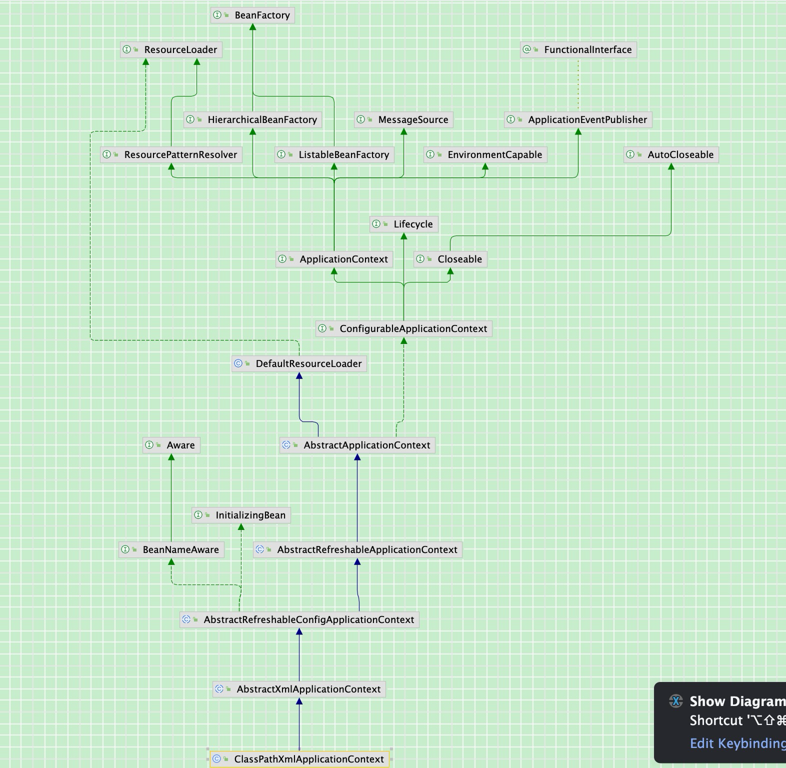
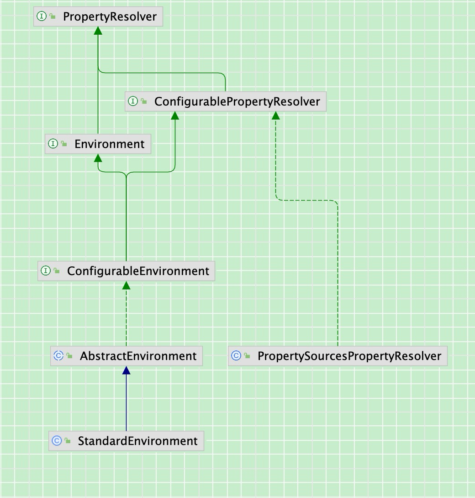
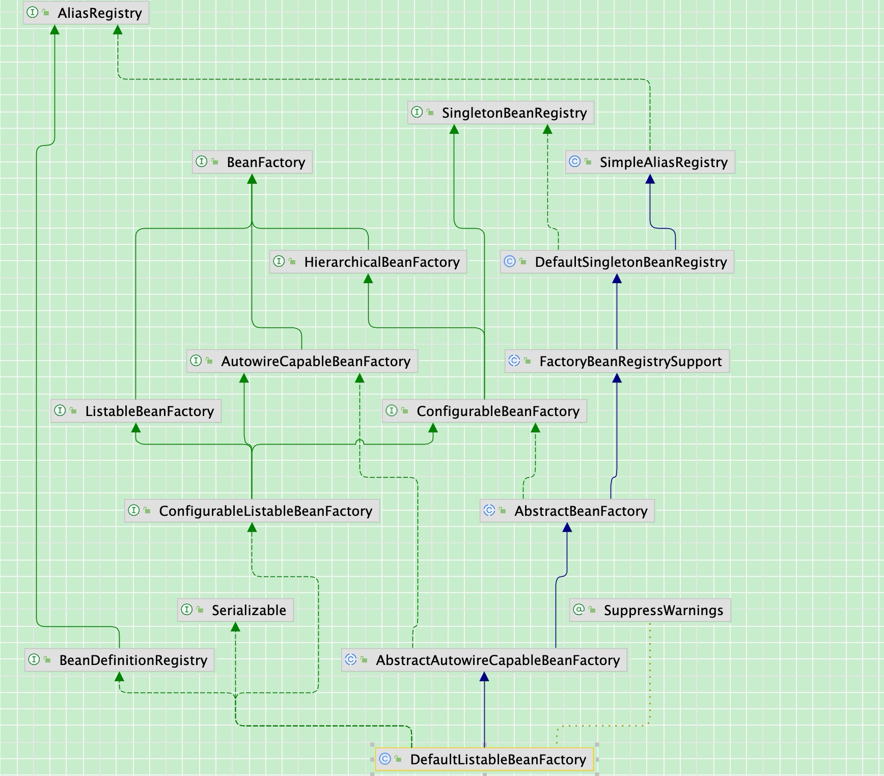
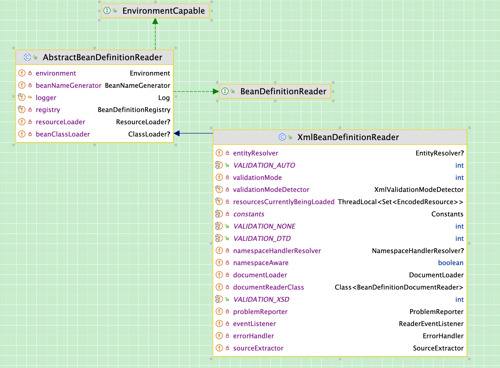

## Spring启动流程

### 1、构造一个ApplicationContext

```Java
ApplicationContext context = new ClassPathXmlApplicationContext("beans.xml");
```

```Java
// 新建一个ClassPathXmlApplicationContext，加载给的xml文件(configLocation)中的定义，并且自动刷新context
public ClassPathXmlApplicationContext(String configLocation) throws BeansException {
    this(new String[] {configLocation}, true, null);
}
```

```Java
// 加载所有 Bean 定义并创建所有单例,或者在进一步配置context后，手动调用刷新
public ClassPathXmlApplicationContext(
       String[] configLocations, boolean refresh, @Nullable ApplicationContext parent)
       throws BeansException {

    super(parent);
    setConfigLocations(configLocations);
    if (refresh) {
       refresh();
    }
}
```

#### 1-1) `super`方法

```Java
public abstract class AbstractApplicationContext extends DefaultResourceLoader
		implements ConfigurableApplicationContext {
  
  // 在调用构造方法时，同时新建一个对象
  private ResourcePatternResolver resourcePatternResolver;
  // 父context
  @Nullable
	private ApplicationContext parent;
  
  // 不断寻找父类，直至AbstractApplicationContext类
  public AbstractApplicationContext(@Nullable ApplicationContext parent) {
      this();
      setParent(parent);
  }
  // this方法，新建一个资源解析器
  public AbstractApplicationContext() {
  		this.resourcePatternResolver = getResourcePatternResolver();
	}
  
  @Override
	public void setParent(@Nullable ApplicationContext parent) {
		this.parent = parent;
		if (parent != null) {
			Environment parentEnvironment = parent.getEnvironment();
			if (parentEnvironment instanceof ConfigurableEnvironment) {
				getEnvironment().merge((ConfigurableEnvironment) parentEnvironment);
			}
		}
	}
  
}
```



#### 1-2) `setConfigLocations`方法

```Java
// public abstract class AbstractRefreshableConfigApplicationContext 
public void setConfigLocations(@Nullable String... locations) {
    if (locations != null) {
       Assert.noNullElements(locations, "Config locations must not be null");
       this.configLocations = new String[locations.length];
       for (int i = 0; i < locations.length; i++) {
          this.configLocations[i] = resolvePath(locations[i]).trim();
       }
    }
    else {
       this.configLocations = null;
    }
  
}
```

在`resolvePath`方法中，先创建一个`StandardEnvironment`对象，再根据环境对象属性，替换掉xml文件中的占位符，例如spring-${username}.xml格式，如果在环境中找不到username这个变量，会报错`IllegalArgumentException`，提示例如：`Could not resolve placeholder 'username' in value "spring-${username}.xml"`

创建`StandardEnvironment`对象

```Java
public abstract class AbstractApplicationContext extends DefaultResourceLoader
       implements ConfigurableApplicationContext {
  
  	// 相当于 ConfigurableEnvironment environment = new StandardEnvironment();
  	@Override
		public ConfigurableEnvironment getEnvironment() {
			if (this.environment == null) {
				this.environment = createEnvironment();
			}
			return this.environment;
		}
  
  	protected ConfigurableEnvironment createEnvironment() {
			return new StandardEnvironment();
		} 
}
```

```Java
protected AbstractEnvironment(MutablePropertySources propertySources) {
    this.propertySources = propertySources;
    this.propertyResolver = createPropertyResolver(propertySources);
    customizePropertySources(propertySources);
}

// 子类StandardEnvironment重写父类的方法
/** System environment property source name: {@value}. */
public static final String SYSTEM_ENVIRONMENT_PROPERTY_SOURCE_NAME = "systemEnvironment";

/** JVM system properties property source name: {@value}. */
public static final String SYSTEM_PROPERTIES_PROPERTY_SOURCE_NAME = "systemProperties";
@Override
protected void customizePropertySources(MutablePropertySources propertySources) {
  propertySources.addLast(
      new PropertiesPropertySource(SYSTEM_PROPERTIES_PROPERTY_SOURCE_NAME, getSystemProperties()));
  propertySources.addLast(
      new SystemEnvironmentPropertySource(SYSTEM_ENVIRONMENT_PROPERTY_SOURCE_NAME, getSystemEnvironment()));
}

// MutablePropertySources
private final List<PropertySource<?>> propertySourceList = new CopyOnWriteArrayList<>();
```

需要注意的是，在新建一个`StandardEnvironment`对象时，会先隐式调用父类`AbstractEnvironment`类的构造方法，然后凭借Java的多态性，调用子类`StandardEnvironment`重写的`customizePropertySources`方法

还有一个可以直接借鉴的点是，Spring的代码具有很好的扩展性，例如刚刚提到的处理xml文件中的占位符方法，在调用`AbstractEnvironment`类的构造方法时，会同时创建一个`PropertySourcesPropertyResolver`对象，如下代码，处理占位符替换

```Java
// 在AbstractEnvironment类中定义的ConfigurablePropertyResolver解析器对象
ConfigurablePropertyResolver resolver = new PropertySourcesPropertyResolver(propertySources);
```

即，`AbstractEnvironment`和`PropertySourcesPropertyResolver`类都重写了`PropertyResolver`接口的`resolveRequiredPlaceholders`方法，但`AbstractEnvironment`类中压根就没有这个替换方法的具体实现，在`AbstractEnvironment`中的这个重写方法，只是调用刚刚说的新创建的`ConfigurablePropertyResolver`对象的`resolveRequiredPlaceholders`方法来进行具体解析

注意：方法的具体实现在`PropertySourcesProperty`的父类`ResolverAbstractPropertyResolver`中实现



```Java
// 刚刚说的具体实现在Spring中是通过递归来处理
protected String parseStringValue(
			String value, PlaceholderResolver placeholderResolver, @Nullable Set<String> visitedPlaceholders) {...}
// TODO 有时间的话可以研究一下Spring的递归写法
```


### 2、`refresh`方法里的`prepareRefresh`方法（刷新前的准备工作）

刷新前的准备工作

1.  设置容器的启动时间
2.  设置活跃状态为true
3.  设置关闭状态为false
4.  获取Environment对象，并加载当前系统的属性值到Environment对象中
5.  准备监听器和事件的集合对象，默认为空的集合

```Java
/** Flag that indicates whether this context is currently active. */
private final AtomicBoolean active = new AtomicBoolean();

/** Flag that indicates whether this context has been closed already. */
private final AtomicBoolean closed = new AtomicBoolean();

/** Statically specified listeners. */
private final Set<ApplicationListener<?>> applicationListeners = new LinkedHashSet<>();

/** Local listeners registered before refresh. */
@Nullable
private Set<ApplicationListener<?>> earlyApplicationListeners;

/** ApplicationEvents published before the multicaster setup. */
@Nullable
private Set<ApplicationEvent> earlyApplicationEvents;

protected void prepareRefresh() {
  	// 设置容器的启动时间
    this.startupDate = System.currentTimeMillis();
  	// 活跃状态和关闭状态
    this.closed.set(false);
    this.active.set(true);
  
    // 初始化context环境的任何占位符属性资源，留给子类重写的方法
  	/* 
  	* @see org.springframework.core.env.PropertySource.StubPropertySource
	 	* @see org.springframework.web.context.support.WebApplicationContextUtils#initServletPropertySources
	 	*/
    initPropertySources();

    // 校验所有必须的属性是否可解析
    // see ConfigurablePropertyResolver#setRequiredProperties
    getEnvironment().validateRequiredProperties();

    // Store pre-refresh ApplicationListeners...
    if (this.earlyApplicationListeners == null) {
       this.earlyApplicationListeners = new LinkedHashSet<>(this.applicationListeners);
    }
    else {
       // Reset local application listeners to pre-refresh state.
       this.applicationListeners.clear();
       this.applicationListeners.addAll(this.earlyApplicationListeners);
    }

    // Allow for the collection of early ApplicationEvents,
    // to be published once the multicaster is available...
    this.earlyApplicationEvents = new LinkedHashSet<>();
}
```

刚刚说的留给子类重写的方法`initPropertySources`

```Java
public class MyClassPathXmlApplicationContext extends ClassPathXmlApplicationContext {

    public MyClassPathXmlApplicationContext(String... configLocations) throws BeansException {
        super(configLocations);
    }

    @Override
    protected void initPropertySources() {
        System.out.println("initPropertySources");
        getEnvironment().setRequiredProperties("username");
    }
}
```


### 3、`refresh`方法中的`obtainFreshBeanFactory`方法（加载xml文件到BeanFactory中）

```Java 
ConfigurableListableBeanFactory beanFactory = obtainFreshBeanFactory();
```

```Java
// abstract class AbstractApplicationContext extends DefaultResourceLoader
// implements ConfigurableApplicationContext
protected ConfigurableListableBeanFactory obtainFreshBeanFactory() {
    refreshBeanFactory();
    return getBeanFactory();
}
```

```Java
public abstract class AbstractRefreshableApplicationContext extends AbstractApplicationContext {

    @Nullable
    private Boolean allowBeanDefinitionOverriding;

    @Nullable
    private Boolean allowCircularReferences;

    /** Bean factory for this context. */
    @Nullable
    private volatile DefaultListableBeanFactory beanFactory;
  
  	// 确保每次刷新都是新建的BeanFactory
  	@Override
    protected final void refreshBeanFactory() throws BeansException {
      // 如果BeanFactory存在，destory容器内的Bean和关闭BeanFactory
      if (hasBeanFactory()) {
        destroyBeans();
        closeBeanFactory();
      }
      // 新建一个beanFactory、配置beanFactory、加载解析xml文件为BeanDefinition到beanFactory中
      try {
        DefaultListableBeanFactory beanFactory = createBeanFactory();
        // 在新建一个AbstractApplicationContext时自动生成一个id
        beanFactory.setSerializationId(getId());
        // 是否允许覆盖、是否允许循环依赖
        customizeBeanFactory(beanFactory);
        loadBeanDefinitions(beanFactory);
        this.beanFactory = beanFactory;
      }
      catch (IOException ex) {
        throw new ApplicationContextException("I/O error parsing bean definition source for " + getDisplayName(), ex);
      }
    }
}
```


#### 3-1）新建一个`beanFactory`

```Java
// AbstractRefreshableApplicationContext类

@Nullable
private volatile DefaultListableBeanFactory beanFactory;

protected DefaultListableBeanFactory createBeanFactory() {
    return new DefaultListableBeanFactory(getInternalParentBeanFactory());
}
```

`beanFactory`的类型是`DefaultListableBeanFactory`，在new 一个`DefaultListableBeanFactory`对象时，会先调用父类`AbstractAutowireCapableBeanFactory`的构造方法，在构造父类时，会添加部分要忽略依赖的接口

```Java
public AbstractAutowireCapableBeanFactory() {
  super();
  // 忽略要依赖的接口
  ignoreDependencyInterface(BeanNameAware.class);
  ignoreDependencyInterface(BeanFactoryAware.class);
  ignoreDependencyInterface(BeanClassLoaderAware.class);
  if (NativeDetector.inNativeImage()) {
    this.instantiationStrategy = new SimpleInstantiationStrategy();
  }
  else {
    this.instantiationStrategy = new CglibSubclassingInstantiationStrategy();
  }
}
```



```Java
// getInternalParentBeanFactory调用父类AbstractApplicationContext中的方法
// TODO 暂时不知道这个parent有什么用
// private ApplicationContext parent;
protected BeanFactory getInternalParentBeanFactory() {
  return (getParent() instanceof ConfigurableApplicationContext ?
      ((ConfigurableApplicationContext) getParent()).getBeanFactory() : getParent());
}
```

#### 3-2）配置beanFactory

```Java
protected void customizeBeanFactory(DefaultListableBeanFactory beanFactory) {
  	// 允许beanDefinition覆盖
    if (this.allowBeanDefinitionOverriding != null) {
       beanFactory.setAllowBeanDefinitionOverriding(this.allowBeanDefinitionOverriding);
    }
    // 允许互相依赖
    if (this.allowCircularReferences != null) {
       beanFactory.setAllowCircularReferences(this.allowCircularReferences);
    }
}
```

可以重写这个方法，修改这个配置

```Java
@Override
protected void customizeBeanFactory(DefaultListableBeanFactory beanFactory) {
    super.setAllowBeanDefinitionOverriding(false);
    super.setAllowCircularReferences(false);
    super.customizeBeanFactory(beanFactory);
}
```

#### 3-3）加载`bean definition`

​       入口是`loadBeanDefinitions`方法，在`AbstractXmlApplicationContext`类中重写了这个方法，如下3-3-1代码，新建了一个`XmlBeanDefinitionReader`对象，配置好相关属性后，重载这个`loadBeanDefinitions`方法，在这个重载方法中，切换到了`XmlBeanDefinitionReader`对象的`loadBeanDefinitions`方法，如果资源文件是地址，就按照这个路线config location[] -> config location -> resource[] -> resource转换为resource进行进一步加载，最终都是转换为Resource再统一处理。

​	需要注意的是，在新建`ResourceEntityResolver`对象时，此时已经初始化了默认映射文件的地址，META-INF/spring.schemas，这个文件主要用途在于映射XML命名空间（namespace）到对应的XML Schema定义（XSD）文件。具体来说，这个文件帮助Spring解析器理解并验证XML配置文件中的自定义命名空间元素。

```properties
## spring.schemas文件格式
http\://www.example.org/schema/user.xsd=META-INF/user.xsd
## spring.handlers文件格式
http\://www.example.org/schema/user=com.wangxin.selftag.UserNamespaceHandler
```

​	除了META-INF/spring.schemas，还有一个默认映射文件，是命名空间到spring中的处理器的映射，是在3-3-6代码中执行`getNamespaceHandlerResolver()`方法，创建一个这个对象时设置的。

​	解析xml文件具体标签，先更根据spring.handlers文件得到Handler类的类路径，其中Handler类重写了init方法，把具体解析Parser类注册到`NamespaceHandlerSupport`类中的`Map<String, BeanDefinitionParser> parsers`中，解析时会根据相关命名调用BeanDefinitionParser里的doParse 方法

```Java
// 3-3-1 在AbstractXmlApplicationContext类中，通过`XmlBeanDefinitionReader`加载`bean definiton`
@Override
protected void loadBeanDefinitions(DefaultListableBeanFactory beanFactory) throws BeansException, IOException {
    // Create a new XmlBeanDefinitionReader for the given BeanFactory.
    XmlBeanDefinitionReader beanDefinitionReader = new XmlBeanDefinitionReader(beanFactory);

    // Configure the bean definition reader with this context's
    // resource loading environment.
    beanDefinitionReader.setEnvironment(this.getEnvironment());
    beanDefinitionReader.setResourceLoader(this);
  	// DEFAULT_SCHEMA_MAPPINGS_LOCATION = "META-INF/spring.schemas";
    beanDefinitionReader.setEntityResolver(new ResourceEntityResolver(this));

    // Allow a subclass to provide custom initialization of the reader,
    // then proceed with actually loading the bean definitions.
    initBeanDefinitionReader(beanDefinitionReader);
    loadBeanDefinitions(beanDefinitionReader);
}	

// 3-3-2 在AbstractXmlApplicationContext类中，重载3-3-1中的loadBeanDefinitions
protected void loadBeanDefinitions(XmlBeanDefinitionReader reader) throws BeansException, IOException {
  Resource[] configResources = getConfigResources();
  if (configResources != null) {
    reader.loadBeanDefinitions(configResources);
  }
  String[] configLocations = getConfigLocations();
  if (configLocations != null) {
    reader.loadBeanDefinitions(configLocations);
  }
}

// 3-3-3 在`XmlBeanDefinitionReader`类中，处理已经将location转换成resource的资源，将之加载成BeanDefinition
@Override
public int loadBeanDefinitions(Resource resource) throws BeanDefinitionStoreException {
  return loadBeanDefinitions(new EncodedResource(resource));
}

// 3-3-4 此处利用ThreadLocal来控制上下文，控制资源的try-catch写法可以学习
public int loadBeanDefinitions(EncodedResource encodedResource) throws BeanDefinitionStoreException {
		Set<EncodedResource> currentResources = this.resourcesCurrentlyBeingLoaded.get();

		if (!currentResources.add(encodedResource)) {
			throw new BeanDefinitionStoreException(
					"Detected cyclic loading of " + encodedResource + " - check your import definitions!");
		}

		try (InputStream inputStream = encodedResource.getResource().getInputStream()) {
			InputSource inputSource = new InputSource(inputStream);
			if (encodedResource.getEncoding() != null) {
				inputSource.setEncoding(encodedResource.getEncoding());
			}
      // 加载BeanDefinition
			return doLoadBeanDefinitions(inputSource, encodedResource.getResource());
		}
		catch (IOException ex) {
			throw new BeanDefinitionStoreException(
					"IOException parsing XML document from " + encodedResource.getResource(), ex);
		}
		finally {
			currentResources.remove(encodedResource);
			if (currentResources.isEmpty()) {
				this.resourcesCurrentlyBeingLoaded.remove();
			}
		}
}

// 3-3-5 将xml配置文件加载为Document,再把Document以BeanDefiniton的形式加载到BeanFactory
protected int doLoadBeanDefinitions(InputSource inputSource, Resource resource)
    throws BeanDefinitionStoreException {

  try {
    // 在这里把xml配置文件加载为Document，方便进一步解析
    // 此处过于复杂，不做探究
    Document doc = doLoadDocument(inputSource, resource);
    // 把刚刚的Document以BeanDefiniton的形式加载到BeanFactory
    int count = registerBeanDefinitions(doc, resource);
    return count;
  }
  catch (BeanDefinitionStoreException ex) {
    throw ex;
  }
}

// 3-3-6 创建一个BeanDefinitionDocumentReader对象，将Doc转换为BeanDefiniton到BeanFactory
public int registerBeanDefinitions(Document doc, Resource resource) throws BeanDefinitionStoreException {
  // 创建一个DefaultBeanDefinitionDocumentReader对象
  BeanDefinitionDocumentReader documentReader = createBeanDefinitionDocumentReader();
  // beanDefinitionMap.size();
  // 这个countBefore是DefaultListableBeanFactory的beanDefinitionMap的size
  int countBefore = getRegistry().getBeanDefinitionCount();
  // 在这一步注册BeanDefinition到BeanFactory中
  // 这个createReadContext方法具体是 new XmlReaderContext(resource, this.problemReporter, this.eventListener, this.sourceExtractor, this, getNamespaceHandlerResolver());
  // 在getNamespaceHandlerResolver()方法中新建了一个这个对象，其中配置了处理器映射文件的默认位置为META-INF/spring.handlers
  documentReader.registerBeanDefinitions(doc, createReaderContext(resource));
  return getRegistry().getBeanDefinitionCount() - countBefore;
}

// 3-3-7 
@Override
public void registerBeanDefinitions(Document doc, XmlReaderContext readerContext) {
  this.readerContext = readerContext;
  doRegisterBeanDefinitions(doc.getDocumentElement());
}

@SuppressWarnings("deprecation")  
protected void doRegisterBeanDefinitions(Element root) {
  BeanDefinitionParserDelegate parent = this.delegate;
  this.delegate = createDelegate(getReaderContext(), root, parent);

  preProcessXml(root);
  // 解析BeanDefinition
  parseBeanDefinitions(root, this.delegate);
  postProcessXml(root);

  this.delegate = parent;
}

// 区分，识别默认标签和自定义标签
protected void parseBeanDefinitions(Element root, BeanDefinitionParserDelegate delegate) {
  if (delegate.isDefaultNamespace(root)) {
    NodeList nl = root.getChildNodes();
    for (int i = 0; i < nl.getLength(); i++) {
      Node node = nl.item(i);
      if (node instanceof Element) {
        Element ele = (Element) node;
        if (delegate.isDefaultNamespace(ele)) {
          // 默认标签分为四类：import、alias、beans、bean
          parseDefaultElement(ele, delegate);
        }
        else {
          // 自定义标签
          delegate.parseCustomElement(ele);
        }
      }
    }
  }
  else {
    // 自定义标签解析
    delegate.parseCustomElement(root);
  }
}

// 最终，将beanDefiniton放入DefaultListableBeanFactory中
this.beanDefinitionMap.put(beanName, beanDefinition);
this.beanDefinitionNames.add(beanName);
```

`XmlBeanDefinitionReader`的继承关系



```Java
// context
context.resourcePatternResolver = new PathMatchingResourcePatternResolver(this);
resourcePatternResolver.resourceLoader = 当前classPathXmlApplicationContext对象
resourcePatternResolver.pathMatcher = new AntPathMatcher()
// xmlBeanDefinitionReader
xmlBeanDefinitionReader.registry = defaultListableBeanFactory;
xmlBeanDefinitionReader.resourceLoader = 当前classPathXmlApplicationContext对象
xmlBeanDefinitionReader.environment = 当前standardEnviroment对象
xmlBeanDefinitionReader.validationMode = XmlValidationModeDetector.VALIDATION_AUTO; // 等于1
xmlBeanDefinitionReader.namespaceAware = false;
xmlBeanDefinitionReader.entityResolver = new ResourceEntityResolver(this);
// entityResolver
// 在entityResolver new对象中，this就是当前classPathXmlApplicationContext对象
// classLoader是classPathXmlApplicationContext的classLoader
// ResourceEntityResolver的父类是DelegatingEntityResolver
entityResolver.resourceLoader = 当前classPathXmlApplicationContext对象;
entityResolver.dtdResolver = new BeansDtdResolver();
entityResolver.schemaResolver = new PluggableSchemaResolver(classLoader);
// schemaResolver
schemaResolver.classLoader = classPathXmlApplicationContext.getClassLoader();
schemaResolver.schemaMappingsLocation = DEFAULT_SCHEMA_MAPPINGS_LOCATION;
// encodedResource
encodedResource = new EncodedResource(resource);
encodedResource.resource = resource;
encodedResource.encoding = null;
encodedResource.charset = null;
```

```Java
new ClassPathContextResource(path, getClassLoader());// TODO
```


#### 3-4）自定义标签写法

```Java
// 实体类
@Data
public class User {
    private String username;
    private Integer age;
    private String sex;
    private String password;
    private String email;
}
// 解析类
public class UserBeanDefinitionParser extends AbstractSingleBeanDefinitionParser {

  @Override
  protected Class<?> getBeanClass(Element element) {
      return User.class;
  }

  @Override
  protected void doParse(Element element, BeanDefinitionBuilder builder) {
      String username = element.getAttribute("username");
      String password = element.getAttribute("password");
      String sex = element.getAttribute("sex");
      String age = element.getAttribute("age");
      String email = element.getAttribute("email");

      if (StringUtils.hasText(username)) {
          builder.addPropertyValue("username", username);
      }
      if (StringUtils.hasText(password)) {
          builder.addPropertyValue("password", password);
      }
      if (StringUtils.hasText(sex)) {
          builder.addPropertyValue("sex", sex);
      }
      if (StringUtils.hasText(age)) {
          builder.addPropertyValue("age", age);
      }
      if (StringUtils.hasText(email)) {
          builder.addPropertyValue("email", email);
      }
  }
  
 //  Handler类
public class UserNamespaceHandler extends NamespaceHandlerSupport {

  @Override
  public void init() {
      registerBeanDefinitionParser("user", new UserBeanDefinitionParser());
  }
}
```

resources下META-INF文件夹下

```properties
## spring.schemas文件格式
http\://www.example.org/schema/user.xsd=META-INF/user.xsd
## spring.handlers文件格式
http\://www.example.org/schema/user=com.wangxin.selftag.UserNamespaceHandler
```

```xml
<!--user.xsd-->
<?xml version="1.0" encoding="UTF-8" standalone="no"?>
<xsd:schema xmlns:xsd="http://www.w3.org/2001/XMLSchema"  targetNamespace="http://www.example.org/schema/user"
            xmlns:tns="http://www.example.org/schema/user"
            elementFormDefault="qualified">
    <xsd:element name="user">
        <xsd:complexType>
            <xsd:attribute name="id" type="xsd:string"/>
            <xsd:attribute name="username" type="xsd:string"/>
            <xsd:attribute name="password" type="xsd:string"/>
            <xsd:attribute name="age" type="xsd:int"/>
            <xsd:attribute name="sex" type="xsd:string"/>
            <xsd:attribute name="email" type="xsd:string"/>
        </xsd:complexType>
    </xsd:element>

</xsd:schema>
```


### 4、`refresh`方法中`prepareBeanFactory`方法（初始化beanFactory的各种属性值）

```Java
protected void prepareBeanFactory(ConfigurableListableBeanFactory beanFactory) {
  // 设置beanFactory的classLoader为当前context的classLoader
  beanFactory.setBeanClassLoader(getClassLoader());
  // 设置beanFactory的spel表达式语言处理器
  if (!shouldIgnoreSpel) {
    beanFactory.setBeanExpressionResolver(new 			StandardBeanExpressionResolver(beanFactory.getBeanClassLoader()));
  }
  // 为beanFactory增加一个默认的propertEditor，这个主要是对bean的属性等设置管理的一个工具类
  beanFactory.addPropertyEditorRegistrar(new ResourceEditorRegistrar(this, getEnvironment()));

  // Configure the bean factory with context callbacks.
  // 添加BeanPostProcessor
  beanFactory.addBeanPostProcessor(new ApplicationContextAwareProcessor(this));
  // 设置要忽略自动装配的接口，原因：这些接口的实现由容器通过set方法进行注入
  // 所以在使用autowire进行注入的时候需要将这个接口进行忽略
  beanFactory.ignoreDependencyInterface(EnvironmentAware.class);
  beanFactory.ignoreDependencyInterface(EmbeddedValueResolverAware.class);
  beanFactory.ignoreDependencyInterface(ResourceLoaderAware.class);
  beanFactory.ignoreDependencyInterface(ApplicationEventPublisherAware.class);
  beanFactory.ignoreDependencyInterface(MessageSourceAware.class);
  beanFactory.ignoreDependencyInterface(ApplicationContextAware.class);
  beanFactory.ignoreDependencyInterface(ApplicationStartupAware.class);

  // BeanFactory interface not registered as resolvable type in a plain factory.
  // MessageSource registered (and found for autowiring) as a bean.
  // 设置几个自动装配的特殊规则，当在进行ios初始化的时候如果有多个实现，那么就使用指定的对象进行注入
  beanFactory.registerResolvableDependency(BeanFactory.class, beanFactory);
  beanFactory.registerResolvableDependency(ResourceLoader.class, this);
  beanFactory.registerResolvableDependency(ApplicationEventPublisher.class, this);
  beanFactory.registerResolvableDependency(ApplicationContext.class, this);

  // Register early post-processor for detecting inner beans as ApplicationListeners.
  // 注册BeanPostProcessor
  beanFactory.addBeanPostProcessor(new ApplicationListenerDetector(this));

  // Detect a LoadTimeWeaver and prepare for weaving, if found.
  // 增加对AspectJ的支持，在Java中织入分为三种方式，分别是编译器织入，类加载器织入，运行期织入，编译器织入是指在Java编译器，采用特殊的编译器，将切面织入到Java类中，而类加载器织入是指采用特殊的类加载器，在将字节码加载到JVM时，织入切面，运行期织入则是通过cglib和jdk进行切面的织入
  // aspectJ提供了两种织入方法，一种是通过特殊编译器，第二种是类加载器，就是这里的load time weaving
  if (!NativeDetector.inNativeImage() && beanFactory.containsBean(LOAD_TIME_WEAVER_BEAN_NAME)) {
    beanFactory.addBeanPostProcessor(new LoadTimeWeaverAwareProcessor(beanFactory));
    // Set a temporary ClassLoader for type matching.
    beanFactory.setTempClassLoader(new ContextTypeMatchClassLoader(beanFactory.getBeanClassLoader()));
  }

  // Register default environment beans.
  // 注册默认的系统环境bean到一级缓存中
  if (!beanFactory.containsLocalBean(ENVIRONMENT_BEAN_NAME)) {
    beanFactory.registerSingleton(ENVIRONMENT_BEAN_NAME, getEnvironment());
  }
  if (!beanFactory.containsLocalBean(SYSTEM_PROPERTIES_BEAN_NAME)) {
    beanFactory.registerSingleton(SYSTEM_PROPERTIES_BEAN_NAME, getEnvironment().getSystemProperties());
  }
  if (!beanFactory.containsLocalBean(SYSTEM_ENVIRONMENT_BEAN_NAME)) {
    beanFactory.registerSingleton(SYSTEM_ENVIRONMENT_BEAN_NAME, getEnvironment().getSystemEnvironment());
  }
  if (!beanFactory.containsLocalBean(APPLICATION_STARTUP_BEAN_NAME)) {
    beanFactory.registerSingleton(APPLICATION_STARTUP_BEAN_NAME, getApplicationStartup());
  }
}
```

### 5、`postProcessBeanFactory`方法（空）

在标准初始化后修改应用程序上下文的内部 Bean 工厂。

所有 Bean 定义都已加载，但尚未实例化任何 Bean。这允许在某些 ApplicationContext 实现中注册特殊的 BeanPostProcessors。

如，对于spring-web

```Java
	@Override
	protected void postProcessBeanFactory(ConfigurableListableBeanFactory beanFactory) {
		beanFactory.addBeanPostProcessor(new ServletContextAwareProcessor(this.servletContext, this.servletConfig));
		beanFactory.ignoreDependencyInterface(ServletContextAware.class);
		beanFactory.ignoreDependencyInterface(ServletConfigAware.class);

		WebApplicationContextUtils.registerWebApplicationScopes(beanFactory, this.servletContext);
		WebApplicationContextUtils.registerEnvironmentBeans(beanFactory, this.servletContext, this.servletConfig);
	}
```

### 6、`invokeBeanFactoryPostProcessors`方法

此处重要，此时，BeanDefiniton已经全部加载到BeanFactory中了，但还没有开始实例化，可以通过BeaFactoryPostProcessor和BeanDefinitonRegitryPostProcessor来处理BeanDefiniton，甚至直接开始实例化

```Java
// BeanFactoryPostProcessor
@FunctionalInterface
public interface BeanFactoryPostProcessor {
    void postProcessBeanFactory(ConfigurableListableBeanFactory beanFactory) throws BeansException;
}
// BeanDefinitionRegistryPostProcessor
public interface BeanDefinitionRegistryPostProcessor extends BeanFactoryPostProcessor {
    void postProcessBeanDefinitionRegistry(BeanDefinitionRegistry registry) throws BeansException;
}
```

```Java
protected void invokeBeanFactoryPostProcessors(ConfigurableListableBeanFactory beanFactory) {
    PostProcessorRegistrationDelegate.invokeBeanFactoryPostProcessors(beanFactory, getBeanFactoryPostProcessors());
}
```

此处代码挺简单的，存在大量重复代码，最核心的顺序是外部 -> 子类 -> 父类 ，以及PriorityOrder -> Order -> 无
1、先执行传参进来的invokeBeanFactoryPostProcessors这些处理器，如果是BeanDefinitionRegistryPostProcessor的实现，就先执行postProcessBeanDefinitionRegistry方法

2、找到BeanFacotry中所有实现了BeanDefinitionRegistryPostProcessor和PriorityOrdered接口的Bean
按照优先级进行排序，然后执行postProcessBeanDefinitionRegistry

3、找到BeanFactory中所有实现了BeanDefinitionRegistryPostProcessor和Ordered接口，并且没有在2中执行过，按照优先级进行排序操作，然后执行postProcessBeanDefinitionRegistry

4、找到BeanFactory中所有实现了BeanDefinitionRegistryPostProcessor接口并且没有在2、3中执行postProcessBeanDefinitionRegistry的处理器，通过while循环，防止在2、3、4中执行postProcessBeanDefinitionRegistry方法将新的BeanDefinitionRegistryPostProcessor加到BeanFactory，导致遗漏没有执行

5、调用所有BeanDefinitionRegistryPostProcessor的postProcessBeanFactory方法，调用传参进来的处理器中的postProcessBeanFactory方法

此时，所有BeanDefinitionRegistryPostProcessor接口的实现类的方法都已经执行了，接下来处理没有实现BeanDefinitionRegistryPostProcessor接口，只实现了BeanFactoryPostProcessor接口的处理器

6、对实现了PriorityOrdered接口的BeanFactoryPostProcessor进行排序，然后执行postProcessBeanFactory方法

7、对实现了Ordered接口的BeanFactoryPostProcessor进行排序操作，然后执行postProcessBeanFactory方法

8、没有实现任何排序接口，遍历普通的BeanFactoryPostProcessor，执行postProcessBeanFactory方法

```Java

public static void invokeBeanFactoryPostProcessors(
			ConfigurableListableBeanFactory beanFactory, List<BeanFactoryPostProcessor> beanFactoryPostProcessors) {
		// Invoke BeanDefinitionRegistryPostProcessors first, if any.
		Set<String> processedBeans = new HashSet<>();
		
		if (beanFactory instanceof BeanDefinitionRegistry) {
			BeanDefinitionRegistry registry = (BeanDefinitionRegistry) beanFactory;
			List<BeanFactoryPostProcessor> regularPostProcessors = new ArrayList<>();
			List<BeanDefinitionRegistryPostProcessor> registryProcessors = new ArrayList<>();
 			// 1、先执行传参进来的invokeBeanFactoryPostProcessors这些处理器，如果是BeanDefinitionRegistryPostProcessor的实现，就先执行postProcessBeanDefinitionRegistry方法
			for (BeanFactoryPostProcessor postProcessor : beanFactoryPostProcessors) {
				if (postProcessor instanceof BeanDefinitionRegistryPostProcessor) {
					BeanDefinitionRegistryPostProcessor registryProcessor =
							(BeanDefinitionRegistryPostProcessor) postProcessor;
					registryProcessor.postProcessBeanDefinitionRegistry(registry);
					registryProcessors.add(registryProcessor);
				}
				else {
					regularPostProcessors.add(postProcessor);
				}
			}

			List<BeanDefinitionRegistryPostProcessor> currentRegistryProcessors = new ArrayList<>();

			// 2、找到BeanFacotry中所有实现了BeanDefinitionRegistryPostProcessor和PriorityOrdered接口的Bean
按照优先级进行排序，然后执行postProcessBeanDefinitionRegistry
			String[] postProcessorNames =
					beanFactory.getBeanNamesForType(BeanDefinitionRegistryPostProcessor.class, true, false);
			for (String ppName : postProcessorNames) {
				if (beanFactory.isTypeMatch(ppName, PriorityOrdered.class)) {
					currentRegistryProcessors.add(beanFactory.getBean(ppName, BeanDefinitionRegistryPostProcessor.class));
					processedBeans.add(ppName);
				}
			}
      // 按照优先级进行排序，然后执行postProcessBeanDefinitionRegistry
			sortPostProcessors(currentRegistryProcessors, beanFactory);
			registryProcessors.addAll(currentRegistryProcessors);
			invokeBeanDefinitionRegistryPostProcessors(currentRegistryProcessors, registry, beanFactory.getApplicationStartup());
			currentRegistryProcessors.clear();

			// 3、找到BeanFactory中所有实现了BeanDefinitionRegistryPostProcessor和Ordered接口，并且没有在2中执行过，
			postProcessorNames = beanFactory.getBeanNamesForType(BeanDefinitionRegistryPostProcessor.class, true, false);
			for (String ppName : postProcessorNames) {
				if (!processedBeans.contains(ppName) && beanFactory.isTypeMatch(ppName, Ordered.class)) {
					currentRegistryProcessors.add(beanFactory.getBean(ppName, BeanDefinitionRegistryPostProcessor.class));
					processedBeans.add(ppName);
				}
			}
      // 按照优先级进行排序操作，然后执行postProcessBeanDefinitionRegistry
			sortPostProcessors(currentRegistryProcessors, beanFactory);
			registryProcessors.addAll(currentRegistryProcessors);
			invokeBeanDefinitionRegistryPostProcessors(currentRegistryProcessors, registry, beanFactory.getApplicationStartup());
			currentRegistryProcessors.clear();

			// 找到BeanFactory中所有实现了BeanDefinitionRegistryPostProcessor接口并且没有在2、3中执行postProcessBeanDefinitionRegistry的处理器，通过while循环，防止在2、3、4中执行postProcessBeanDefinitionRegistry方法将新的BeanDefinitionRegistryPostProcessor加到BeanFactory，导致遗漏没有执行
			boolean reiterate = true;
			while (reiterate) {
				reiterate = false;
				postProcessorNames = beanFactory.getBeanNamesForType(BeanDefinitionRegistryPostProcessor.class, true, false);
				for (String ppName : postProcessorNames) {
					if (!processedBeans.contains(ppName)) {
						currentRegistryProcessors.add(beanFactory.getBean(ppName, BeanDefinitionRegistryPostProcessor.class));
						processedBeans.add(ppName);
						reiterate = true;
					}
				}
				sortPostProcessors(currentRegistryProcessors, beanFactory);
				registryProcessors.addAll(currentRegistryProcessors);
				invokeBeanDefinitionRegistryPostProcessors(currentRegistryProcessors, registry, beanFactory.getApplicationStartup());
				currentRegistryProcessors.clear();
			}

			// 调用所有BeanDefinitionRegistryPostProcessor的postProcessBeanFactory方法
			invokeBeanFactoryPostProcessors(registryProcessors, beanFactory);
      // 调用传参进来的处理器中的postProcessBeanFactory方法
			invokeBeanFactoryPostProcessors(regularPostProcessors, beanFactory);
      // 此时，所有BeanDefinitionRegistryPostProcessor接口的实现类的方法都已经执行了，接下来处理没有实现BeanDefinitionRegistryPostProcessor接口，只实现了BeanFactoryPostProcessor接口的处理器
		}

		else {
			invokeBeanFactoryPostProcessors(beanFactoryPostProcessors, beanFactory);
		}

		String[] postProcessorNames =
				beanFactory.getBeanNamesForType(BeanFactoryPostProcessor.class, true, false);
		List<BeanFactoryPostProcessor> priorityOrderedPostProcessors = new ArrayList<>();
		List<String> orderedPostProcessorNames = new ArrayList<>();
		List<String> nonOrderedPostProcessorNames = new ArrayList<>();
		for (String ppName : postProcessorNames) {
			if (processedBeans.contains(ppName)) {
				// skip - already processed in first phase above
			}
			else if (beanFactory.isTypeMatch(ppName, PriorityOrdered.class)) {
				priorityOrderedPostProcessors.add(beanFactory.getBean(ppName, BeanFactoryPostProcessor.class));
			}
			else if (beanFactory.isTypeMatch(ppName, Ordered.class)) {
				orderedPostProcessorNames.add(ppName);
			}
			else {
				nonOrderedPostProcessorNames.add(ppName);
			}
		}
		// 6、对实现了PriorityOrdered接口的BeanFactoryPostProcessor进行排序，然后执行postProcessBeanFactory方法
		sortPostProcessors(priorityOrderedPostProcessors, beanFactory);
		invokeBeanFactoryPostProcessors(priorityOrderedPostProcessors, beanFactory);

		// 7、对实现了Ordered接口的BeanFactoryPostProcessor进行排序操作，然后执行postProcessBeanFactory方法
		List<BeanFactoryPostProcessor> orderedPostProcessors = new ArrayList<>(orderedPostProcessorNames.size());
		for (String postProcessorName : orderedPostProcessorNames) {
			orderedPostProcessors.add(beanFactory.getBean(postProcessorName, BeanFactoryPostProcessor.class));
		}
		sortPostProcessors(orderedPostProcessors, beanFactory);
		invokeBeanFactoryPostProcessors(orderedPostProcessors, beanFactory);

		// 8、没有实现任何排序接口，遍历普通的BeanFactoryPostProcessor，执行postProcessBeanFactory方法
		List<BeanFactoryPostProcessor> nonOrderedPostProcessors = new ArrayList<>(nonOrderedPostProcessorNames.size());
		for (String postProcessorName : nonOrderedPostProcessorNames) {
			nonOrderedPostProcessors.add(beanFactory.getBean(postProcessorName, BeanFactoryPostProcessor.class));
		}
		invokeBeanFactoryPostProcessors(nonOrderedPostProcessors, beanFactory);

		// Clear cached merged bean definitions since the post-processors might have
		// modified the original metadata, e.g. replacing placeholders in values...
		beanFactory.clearMetadataCache();
	}`
```

### 重点关注：ConfigurationClassPostProcessor

### 7、注册BeanPostProcessor（registerBeanPostProcessors方法）

依旧是在上一个执行工厂BeanFactoryPostProcessor方法的指派类`PostProcessorRegistrationDelegate `中具体执行

```Java
final class PostProcessorRegistrationDelegate {
  public static void registerBeanPostProcessors(
			ConfigurableListableBeanFactory beanFactory, AbstractApplicationContext applicationContext) {
    // 查询得到beanFactory中所有BeanPostProcessor类型的bean name
		String[] postProcessorNames = beanFactory.getBeanNamesForType(BeanPostProcessor.class, true, false);
		int beanProcessorTargetCount = beanFactory.getBeanPostProcessorCount() + 1 + postProcessorNames.length;
    // BeanPostProcessor只是一个记录但不做任何处理的BeanPostProcessor
    // 在创建一个bean的过程中，在日志里记录相关信息，即这个bean既不是BeanPostProcessor接口的实现，也不是基础角色的BeanDefinition
		beanFactory.addBeanPostProcessor(new BeanPostProcessorChecker(beanFactory, beanProcessorTargetCount));
		
    // 跟BeanFactoryPostProcessor一样，先PriorityOrdered接口，再Ordered接口，最后是都没有实现的剩余接口
    // 如果这个BeanPostProcessor是MergedBeanDefinitionPostProcessor的子类,那要另说
		List<BeanPostProcessor> priorityOrderedPostProcessors = new ArrayList<>();
		List<BeanPostProcessor> internalPostProcessors = new ArrayList<>();
		List<String> orderedPostProcessorNames = new ArrayList<>();
		List<String> nonOrderedPostProcessorNames = new ArrayList<>();
		for (String ppName : postProcessorNames) {
			if (beanFactory.isTypeMatch(ppName, PriorityOrdered.class)) {
				BeanPostProcessor pp = beanFactory.getBean(ppName, BeanPostProcessor.class);
				priorityOrderedPostProcessors.add(pp);
				if (pp instanceof MergedBeanDefinitionPostProcessor) {
					internalPostProcessors.add(pp);
				}
			}
			else if (beanFactory.isTypeMatch(ppName, Ordered.class)) {
				orderedPostProcessorNames.add(ppName);
			}
			else {
				nonOrderedPostProcessorNames.add(ppName);
			}
		}

		// 首先， PriorityOrdered接口放入beanFacotry中
		sortPostProcessors(priorityOrderedPostProcessors, beanFactory);
		registerBeanPostProcessors(beanFactory, priorityOrderedPostProcessors);

		// Next, Ordered接口
		List<BeanPostProcessor> orderedPostProcessors = new ArrayList<>(orderedPostProcessorNames.size());
		for (String ppName : orderedPostProcessorNames) {
			BeanPostProcessor pp = beanFactory.getBean(ppName, BeanPostProcessor.class);
			orderedPostProcessors.add(pp);
			if (pp instanceof MergedBeanDefinitionPostProcessor) {
				internalPostProcessors.add(pp);
			}
		}
		sortPostProcessors(orderedPostProcessors, beanFactory);
		registerBeanPostProcessors(beanFactory, orderedPostProcessors);

		// 接着，没有实现这2个接口的
		List<BeanPostProcessor> nonOrderedPostProcessors = new ArrayList<>(nonOrderedPostProcessorNames.size());
		for (String ppName : nonOrderedPostProcessorNames) {
			BeanPostProcessor pp = beanFactory.getBean(ppName, BeanPostProcessor.class);
			nonOrderedPostProcessors.add(pp);
			if (pp instanceof MergedBeanDefinitionPostProcessor) {
				internalPostProcessors.add(pp);
			}
		}
		registerBeanPostProcessors(beanFactory, nonOrderedPostProcessors);

		// 最后，是MergedBeanDefinitionPostProcessor的子类的PostProcessor，再次注册，放到最后
		sortPostProcessors(internalPostProcessors, beanFactory);
		registerBeanPostProcessors(beanFactory, internalPostProcessors);

		// 再次注册ApplicationListenerDetector
		beanFactory.addBeanPostProcessor(new ApplicationListenerDetector(applicationContext));
	}
}
```


在继承`BeanPostProcessor`接口的接口中，有三个需要格外注意，1、`MergedBeanDefinitionPostProcessor` 2、`DestructionAwareBeanPostProcessor`  3、`InstantiationAwareBeanPostProcessor`

1、`MergedBeanDefinitionPostProcessor` ：

当 Spring 容器在创建 bean 实例之前，会先合并 bean 定义。合并是指将一个 bean 的所有配置信息（包括继承的配置、注解配置等）合并成一个完整的 `BeanDefinition` 对象。在这个阶段，`MergedBeanDefinitionPostProcessor` 可以介入并对这个合并后的 `BeanDefinition` 进行处理。

2、`DestructionAwareBeanPostProcessor`：

`DestructionAwareBeanPostProcessor` 的工作原理基于 Spring 的 bean 生命周期管理机制。Spring 容器在销毁 bean 时，会调用所有实现了 `DestructionAwareBeanPostProcessor` 接口的 `postProcessBeforeDestruction` 方法。这些方法会在实际的销毁操作（如调用 `@PreDestroy` 注解的方法或实现 `DisposableBean` 接口的 `destroy` 方法）之前执行

> 使用场景
>
> 资源释放：关闭数据库连接、网络连接、文件句柄等。
>
> 清理任务：删除临时文件、停止后台线程等。
>
> 状态保存：在销毁 bean 之前保存其状态，以便在下次启动时恢复。

3、`InstantiationAwareBeanPostProcessor`：

`postProcessBeforeInstantiation`: 在 bean 实例化之前调用。如果返回非空对象，这个对象将作为 bean 实例，跳过 Spring 的默认实例化过程。

```Java
@Nullable
default Object postProcessBeforeInstantiation(Class<?> beanClass, String beanName) throws BeansException {
    return null;
}
```

`postProcessAfterInstantiation`: 在 bean 实例化之后调用，如果返回 `false`，则跳过依赖注入阶段。

```Java
default boolean postProcessAfterInstantiation(Object bean, String beanName) throws BeansException {
    return true;
}
```

`postProcessProperties`: 在 Spring 设置 bean 属性之前调用，这个方法是 Spring 5.1 引入的，替代了 `postProcessPropertyValues` 方法。用于处理属性注入。

```Java
default PropertyValues postProcessProperties(PropertyValues pvs, Object bean, String beanName) throws BeansException {
    return pvs;
}
```

`postProcessPropertyValues`: 在 Spring 设置 bean 属性之前调用。这个方法在 `postProcessProperties` 引入之前用于处理属性注入。

```Java
@Deprecated
default PropertyValues postProcessPropertyValues(
    PropertyValues pvs, PropertyDescriptor[] pds, Object bean, String beanName) throws BeansException {
    return pvs;
}
```

4、`SmartInstantiationAwareBeanPostProcessor`

```Java
public interface SmartInstantiationAwareBeanPostProcessor extends InstantiationAwareBeanPostProcessor {
		// 预测 bean 的类型，（可能在注入时使用）
    @Nullable
    default Class<?> predictBeanType(Class<?> beanClass, String beanName) throws BeansException {
       return null;
    }
		// 在实例化 bean 之前，Spring 容器会调用这个方法，以确定用于实例化 bean 的构造函数。如果返回一个构造函数数组，Spring 将使用这些构造函数来实例化 bean
    @Nullable
    default Constructor<?>[] determineCandidateConstructors(Class<?> beanClass, String beanName)
          throws BeansException {

       return null;
    }

    // 解决循环依赖，在bean 实例创建的早期阶段，Spring容器会调用这个方法，以获取 bean 的早期引用。这对于创建代理对象或解决循环依赖非常有用
    default Object getEarlyBeanReference(Object bean, String beanName) throws BeansException {
       return bean;
    }
}
```

### 8、初始化消息源（initMessageSource方法）

跟国际化i18n有关，`Locale`类

```Java
protected void initMessageSource() {
    ConfigurableListableBeanFactory beanFactory = getBeanFactory();
    if (beanFactory.containsLocalBean(MESSAGE_SOURCE_BEAN_NAME)) {
       this.messageSource = beanFactory.getBean(MESSAGE_SOURCE_BEAN_NAME, MessageSource.class);
       if (this.parent != null && this.messageSource instanceof HierarchicalMessageSource) {
          HierarchicalMessageSource hms = (HierarchicalMessageSource) this.messageSource;
          if (hms.getParentMessageSource() == null) {
             hms.setParentMessageSource(getInternalParentMessageSource());
          }
       }
    } else {
       // 在spring初始化时，会先创建一个DelegatingMessageSource，并将其注册到beanFactroy中
       DelegatingMessageSource dms = new DelegatingMessageSource();
       dms.setParentMessageSource(getInternalParentMessageSource());
       this.messageSource = dms;
       beanFactory.registerSingleton(MESSAGE_SOURCE_BEAN_NAME, this.messageSource);
    }
}
```

### 9、初始化事件多播器（initApplicationEventMulticaster方法）

```Java
protected void initApplicationEventMulticaster() {
    ConfigurableListableBeanFactory beanFactory = getBeanFactory();
    if (beanFactory.containsLocalBean(APPLICATION_EVENT_MULTICASTER_BEAN_NAME)) {
       this.applicationEventMulticaster =
             beanFactory.getBean(APPLICATION_EVENT_MULTICASTER_BEAN_NAME, ApplicationEventMulticaster.class);
    } else {
       this.applicationEventMulticaster = new SimpleApplicationEventMulticaster(beanFactory);
       beanFactory.registerSingleton(APPLICATION_EVENT_MULTICASTER_BEAN_NAME, this.applicationEventMulticaster);
    }
}
```

10、

```Java

/** Cache of singleton objects: bean name to bean instance. */
// 一级缓存
private final Map<String, Object> singletonObjects = new ConcurrentHashMap<>(256);

// 三级缓存
/** Cache of singleton factories: bean name to ObjectFactory. */
private final Map<String, ObjectFactory<?>> singletonFactories = new HashMap<>(16);

/** Cache of early singleton objects: bean name to bean instance. */
// 二级缓存
private final Map<String, Object> earlySingletonObjects = new ConcurrentHashMap<>(16);

// DefaultSingletonBeanRegistry
 * Generic registry for shared bean instances, implementing the
 * {@link org.springframework.beans.factory.config.SingletonBeanRegistry}.
 * Allows for registering singleton instances that should be shared
 * for all callers of the registry, to be obtained via bean name.
//  对被共享的bean实例的通用注册，实现的是SingletonBeanRegistry接口,允许注册那些应当被注册表里的所有调用方共享的单例实// // 例，通过bean name获取
// 作为factoryBean实现的base class, 可以省去对singleton bean instances的通用管理

```

```Java
// 用于解析循环依赖，通常是用于获取早期访问指定的bean的引用
protected Object getEarlyBeanReference(String beanName, RootBeanDefinition mbd, Object bean) {
    Object exposedObject = bean;
    if (!mbd.isSynthetic() && hasInstantiationAwareBeanPostProcessors()) {
       for (SmartInstantiationAwareBeanPostProcessor bp : getBeanPostProcessorCache().smartInstantiationAware) {
          exposedObject = bp.getEarlyBeanReference(exposedObject, beanName);
       }
    }
    return exposedObject;
}
```

```Java
/**
 * Actually create the specified bean. Pre-creation processing has already happened
 * at this point, e.g. checking {@code postProcessBeforeInstantiation} callbacks.
 * <p>Differentiates between default bean instantiation, use of a
 * factory method, and autowiring a constructor.
 * @param beanName the name of the bean
 * @param mbd the merged bean definition for the bean
 * @param args explicit arguments to use for constructor or factory method invocation
 * @return a new instance of the bean
 * @throws BeanCreationException if the bean could not be created
 * @see #instantiateBean
 * @see #instantiateUsingFactoryMethod
 * @see #autowireConstructor
 */
protected Object doCreateBean(String beanName, RootBeanDefinition mbd, @Nullable Object[] args)
       throws BeanCreationException {

    // Instantiate the bean.
    BeanWrapper instanceWrapper = null;
    if (mbd.isSingleton()) {
       instanceWrapper = this.factoryBeanInstanceCache.remove(beanName);
    }
    if (instanceWrapper == null) {
       instanceWrapper = createBeanInstance(beanName, mbd, args);
    }
    Object bean = instanceWrapper.getWrappedInstance();
    Class<?> beanType = instanceWrapper.getWrappedClass();
    if (beanType != NullBean.class) {
       mbd.resolvedTargetType = beanType;
    }

    // Allow post-processors to modify the merged bean definition.
    synchronized (mbd.postProcessingLock) {
       if (!mbd.postProcessed) {
          try {
             applyMergedBeanDefinitionPostProcessors(mbd, beanType, beanName);
          }
          catch (Throwable ex) {
             throw new BeanCreationException(mbd.getResourceDescription(), beanName,
                   "Post-processing of merged bean definition failed", ex);
          }
          mbd.postProcessed = true;
       }
    }

    // Eagerly cache singletons to be able to resolve circular references
    // even when triggered by lifecycle interfaces like BeanFactoryAware.
    boolean earlySingletonExposure = (mbd.isSingleton() && this.allowCircularReferences &&
          isSingletonCurrentlyInCreation(beanName));
    if (earlySingletonExposure) {
       if (logger.isTraceEnabled()) {
          logger.trace("Eagerly caching bean '" + beanName +
                "' to allow for resolving potential circular references");
       }
       addSingletonFactory(beanName, () -> getEarlyBeanReference(beanName, mbd, bean));
    }

    // Initialize the bean instance.
    Object exposedObject = bean;
    try {
       populateBean(beanName, mbd, instanceWrapper);
       exposedObject = initializeBean(beanName, exposedObject, mbd);
    }
    catch (Throwable ex) {
       if (ex instanceof BeanCreationException && beanName.equals(((BeanCreationException) ex).getBeanName())) {
          throw (BeanCreationException) ex;
       }
       else {
          throw new BeanCreationException(
                mbd.getResourceDescription(), beanName, "Initialization of bean failed", ex);
       }
    }

    if (earlySingletonExposure) {
       Object earlySingletonReference = getSingleton(beanName, false);
       if (earlySingletonReference != null) {
          if (exposedObject == bean) {
             exposedObject = earlySingletonReference;
          }
          else if (!this.allowRawInjectionDespiteWrapping && hasDependentBean(beanName)) {
             String[] dependentBeans = getDependentBeans(beanName);
             Set<String> actualDependentBeans = new LinkedHashSet<>(dependentBeans.length);
             for (String dependentBean : dependentBeans) {
                if (!removeSingletonIfCreatedForTypeCheckOnly(dependentBean)) {
                   actualDependentBeans.add(dependentBean);
                }
             }
             if (!actualDependentBeans.isEmpty()) {
                throw new BeanCurrentlyInCreationException(beanName,
                      "Bean with name '" + beanName + "' has been injected into other beans [" +
                      StringUtils.collectionToCommaDelimitedString(actualDependentBeans) +
                      "] in its raw version as part of a circular reference, but has eventually been " +
                      "wrapped. This means that said other beans do not use the final version of the " +
                      "bean. This is often the result of over-eager type matching - consider using " +
                      "'getBeanNamesForType' with the 'allowEagerInit' flag turned off, for example.");
             }
          }
       }
    }

    // Register bean as disposable.
    try {
       registerDisposableBeanIfNecessary(beanName, bean, mbd);
    }
    catch (BeanDefinitionValidationException ex) {
       throw new BeanCreationException(
             mbd.getResourceDescription(), beanName, "Invalid destruction signature", ex);
    }

    return exposedObject;
}
```


spring 启动流程细节

```Java
@Override
protected void customizePropertySources(MutablePropertySources propertySources) {
    propertySources.addLast(
          new PropertiesPropertySource(SYSTEM_PROPERTIES_PROPERTY_SOURCE_NAME, getSystemProperties()));
    propertySources.addLast(
          new SystemEnvironmentPropertySource(SYSTEM_ENVIRONMENT_PROPERTY_SOURCE_NAME, getSystemEnvironment()));
}
```


